[TOC]

## Solution

---
### Approach #1 Brute Force [Accepted]

#### Intuition

If a string with an even length is a palindrome, every character in the string must always occur an even number of times. If the string with an odd length is a palindrome, every character except one of the characters must always occur an even number of times. Thus, in case of a palindrome, the number of characters with odd number of occurrences can't exceed 1(1 in case of odd length and 0 in case of even length).

Based on the above observation, we can find the solution for the given problem. The given string could contain almost all the ASCII characters from 0 to 127. Thus, we iterate over all the characters from 0 to 127. For every character chosen, we again iterate over the given string $s$ and find the number of occurrences, $ch$, of the current character in $s$. We also keep a track of the number of characters in the given string $s$ with odd number of occurrences in a variable $\text{count}$.

If, for any character currently considered, its corresponding count, $ch$, happens to be odd, we increment the value of $\text{count}$, to reflect the same. In case of even value of $ch$ for any character, the $\text{count}$ remains unchanged.

If, for any character, the $count$ becomes greater than 1, it indicates that the given string $s$ can't lead to the formation of a palindromic permutation based on the reasoning discussed above. But, if the value of $\text{count}$ remains lesser than 2 even when all the possible characters have been considered, it indicates that a palindromic permutation can be formed from the given string $s$.

#### Algorithm

- Initialize `count` as `0` to track the number of chars with odd frequencies.
- Iterate over all possible chars (0 to 127):
  - Initialize `ct` as `0` to count occurrences of current char in the string.
  - Iterate over the string:
- If current char matches the string char, increment `ct`.
  - Add `ct % 2` to `count` (track odd frequencies).
  - If `count > 1`, break early (no palindrome permutation possible).
- Return `true` if $count \le 1$ (palindrome permutation possible), else `false`.

#### Implementation

```python
class Solution:
    def canPermutePalindrome(self, s: str) -> bool:
        count = 0
        for i in range(128):  # For all ASCII characters
            if count > 1:
                break
            ct = 0
            for j in range(len(s)):
                if s[j] == chr(i):  # Comparing with ASCII character
                    ct += 1
            count += ct % 2
        return count <= 1
```

#### Complexity Analysis

Let $n$ be the size of the input string `s`.

- Time Complexity

1. If we assume the input string contains only ASCII characters (hardcoded 128):

        The outer loop runs 128 times (for each ASCII character from 0 to 127). For each iteration of the outer loop, the inner loop iterates over the entire string `s`, which has a length of $n$. Therefore, the total time complexity is $O(128 \cdot n)$. Since 128 is a constant, the time complexity simplifies to $O(n)$.

2. If we generalize the solution to handle any Unicode character (no hardcoding):

        Let $k$ be the number of unique characters in the string `s`. The outer loop will now run $k$ times (once for each unique character). For each unique character, the inner loop iterates over the entire string `s`, which has a length of $n$. Therefore, the total time complexity is $O(k \cdot n)$. In the worst case, if all characters are unique ($k = n$), the time complexity becomes $O(n^2)$.

- Space complexity

1. If we assume the input string contains only ASCII characters (hardcoded 128):

        The algorithm uses a constant amount of extra space (variables like `count`, `i`, `ct`, and `j`), regardless of the input size. Therefore, the space complexity is $O(1)$.

2. If we generalize the solution to handle any Unicode character (no hardcoding):

        The algorithm still uses a constant amount of extra space (variables like `count`, `i`, `ct`, and `j`). No additional space that scales with the input size is used. Therefore, the space complexity remains $O(1)$.

---

### Approach #2 Using HashMap [Accepted]

#### Intuition

From the discussion above, we know that to solve the given problem, we need to count the number of characters with odd number of occurrences in the given string $s$. To do so, we can also make use of a hashmap, $\text{map}$. This $\text{map}$ takes the form $(\text{character}, \text{number of occurrences of character})$.

We traverse over the given string $s$. For every new character found in $s$, we create a new entry in the $\text{map}$ for this character with the number of occurrences as 1. Whenever we find the same character again, we update the number of occurrences appropriately.

At the end, we traverse over the $\text{map}$ created and find the number of characters with odd number of occurrences. If this $\text{count}$ happens to exceed 1 at any step,  we conclude that a palindromic permutation isn't possible for the string $s$. But, if we can reach the end of the string with $\text{count}$ lesser than 2, we conclude that a palindromic permutation is possible for $s$.

The following animation illustrates the process.

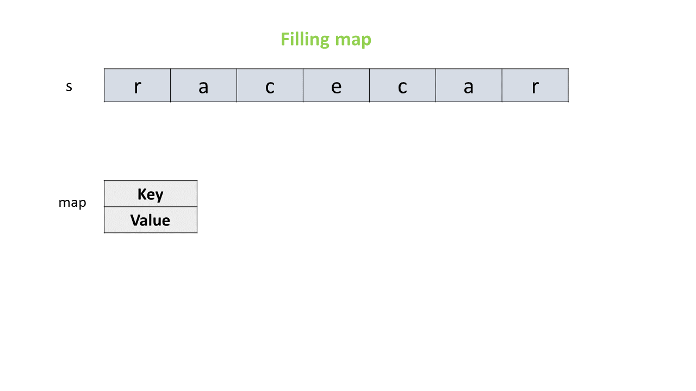

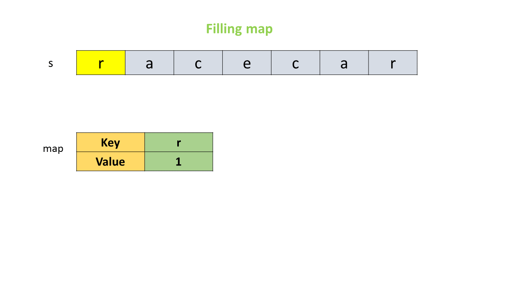

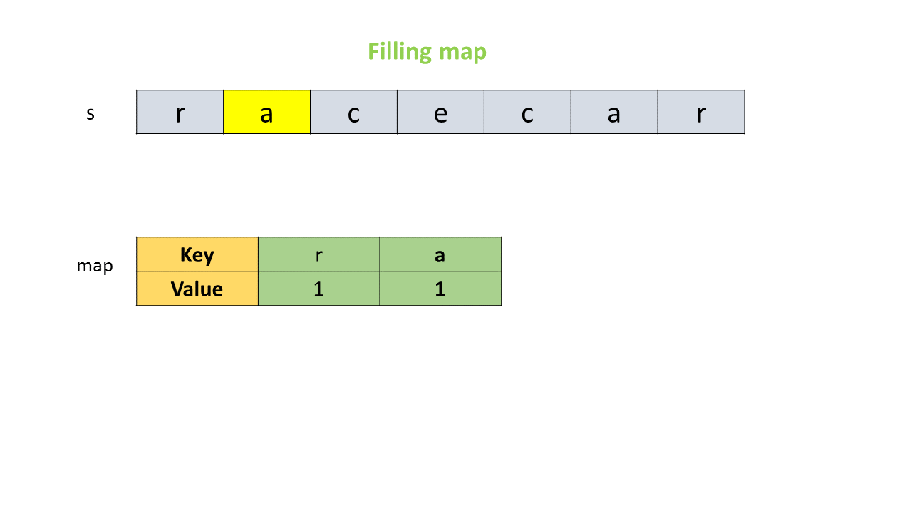

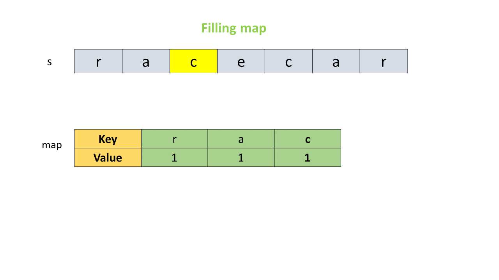

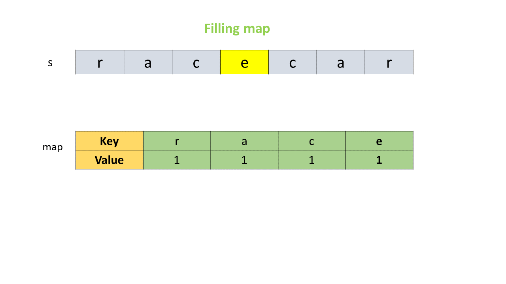

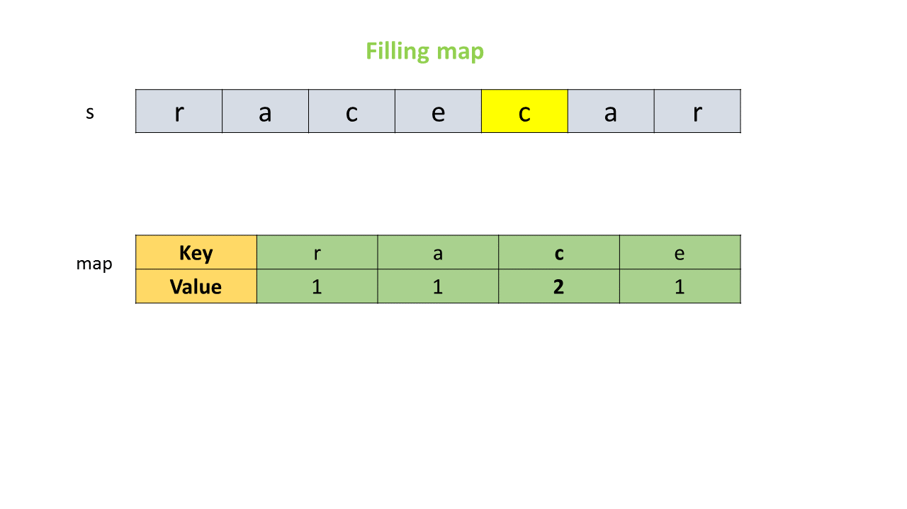

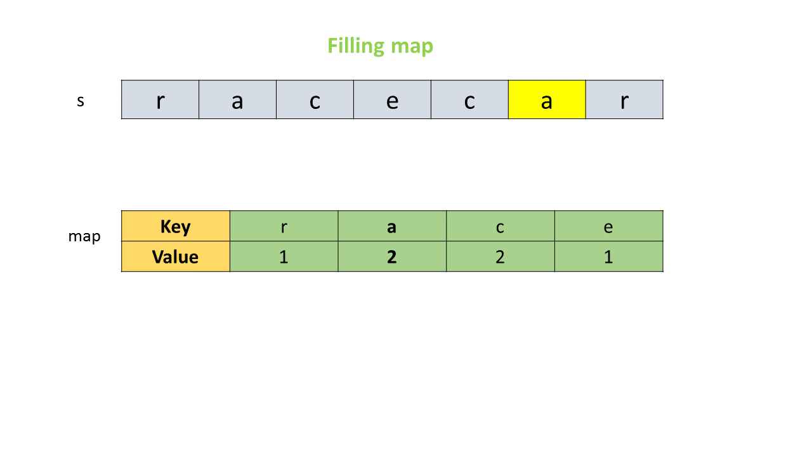

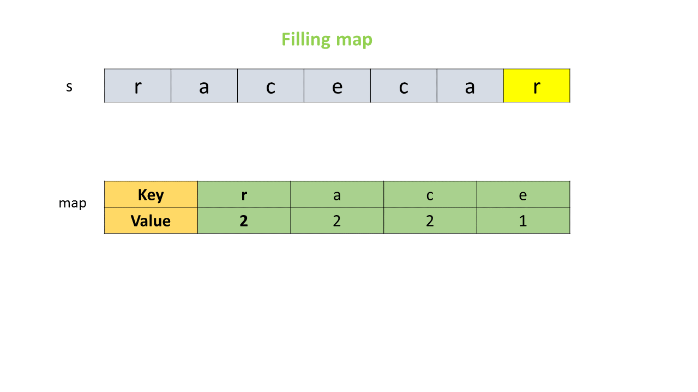

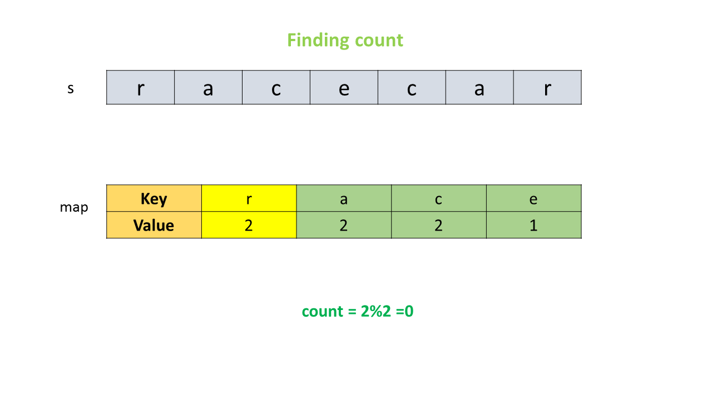

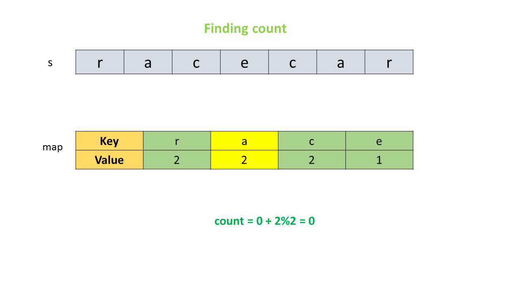

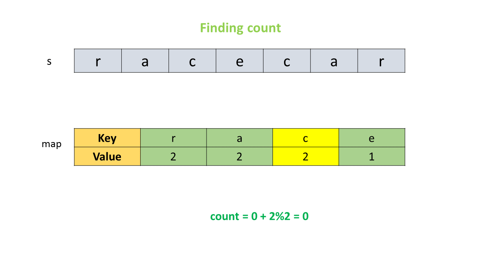

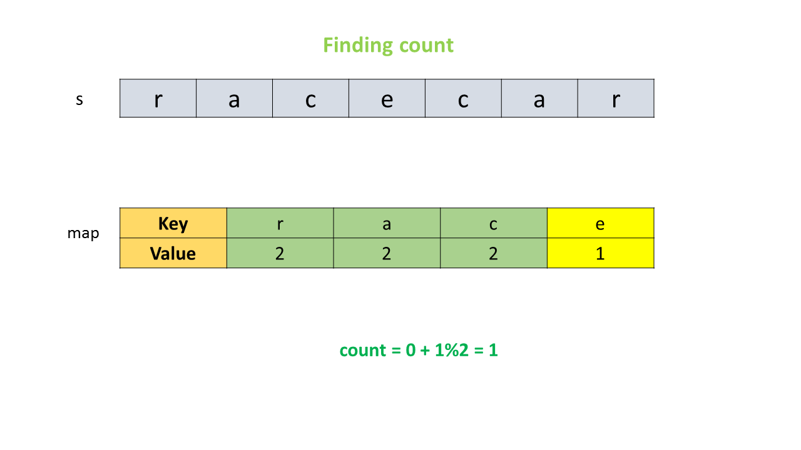

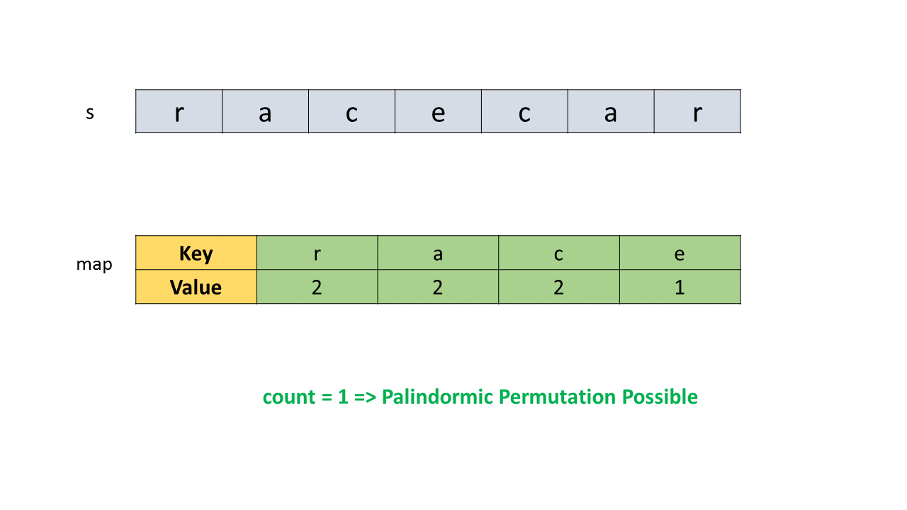

#### Algorithm

- Initialize a hash map to store frequency of each character in the string.
- Iterate over the string:
  - For each character, update its count in the hash map using `getOrDefault`.
- Initialize `count` as `0` to track characters with odd frequencies.
- Iterate over the hash map keys:
  - For each key, add `frequency % 2` to `count` (track odd frequencies).
- Return `true` if $count \le 1$ (palindrome permutation possible), else `false`.

#### Implementation

```python
class Solution:
    def canPermutePalindrome(self, s: str) -> bool:
        from collections import Counter

        count = Counter(s)
        odds = sum(val % 2 for val in count.values())
        return odds <= 1
```

#### Complexity Analysis

Let $n$ be the size of the input string `s`.

- Time Complexity

1. If we assume the input string contains only ASCII characters:

        The first loop iterates over the string `s` once, performing operations (insertions or updates) on the `HashMap`. Since the number of unique ASCII characters is at most 128, the `HashMap` operations (insertions and lookups) take $O(1)$ time per operation. Therefore, the first loop runs in $O(n)$ time.

        The second loop iterates over the keys in the `HashMap`, which has at most 128 entries (for ASCII). Each operation in this loop also takes $O(1)$ time. Therefore, the second loop runs in $O(128)$ time, which simplifies to $O(1)$.

        The total time complexity is $O(n)$.

   2. If we generalize the solution to handle any Unicode character:

        The first loop iterates over the string `s` once, performing operations on the `HashMap`. Let $k$ be the number of unique characters in `s`. In the worst case, $k$ can be up to $n$ (if all characters are unique). Each `HashMap` operation (insertion or lookup) takes $O(1)$ time on average. Therefore, the first loop runs in $O(n)$ time.

        The second loop iterates over the keys in the `HashMap`, which has $k$ entries. Each operation in this loop takes $O(1)$ time. Therefore, the second loop runs in $O(k)$ time.

        The total time complexity is $O(n + k)$. In the worst case ($k = n$), this becomes $O(n)$.

- Space complexity

1. If we assume the input string contains only ASCII characters:

        The `HashMap` stores at most 128 key-value pairs (one for each ASCII character). Therefore, the space used by the `HashMap` is $O(128)$, which simplifies to $O(1)$.

2. If we generalize the solution to handle any Unicode character:

        The `HashMap` stores $k$ key-value pairs, where $k$ is the number of unique characters in `s`. In the worst case, $k$ can be up to $n$ (if all characters are unique). Therefore, the space used by the `HashMap` is $O(k)$. In the worst case, this becomes $O(n)$.

---

### Approach #3 Using Array [Accepted]

#### Intuition

Instead of making use of the inbuilt Hashmap, we can make use of an array as a hashmap. For this, we make use of an array $\text{map}$ with length 128. Each index of this $\text{map}$ corresponds to one of the 128 ASCII characters possible.

We traverse over the string $s$ and put in the number of occurrences of each character in this $\text{map}$ appropriately as done in the last case. Later on, we find the number of characters with odd number of occurrences to determine if a palindromic permutation is possible for the string $s$ or not as done in previous approaches.

#### Algorithm

- Initialize an array `map` of size 128 to store frequency of each character (ASCII range).
- Iterate over the string:
  - For each character, increment its count in the `map` array.
- Initialize `count` as `0` to track characters with odd frequencies.
- Iterate over the `map` array:
  - For each index, add $\text{map}[key] \% 2$ to `count` (track odd frequencies).
  - If `count > 1`, break early (no palindrome permutation possible).
- Return `true` if $count \le 1$ (palindrome permutation possible), else `false`.

#### Implementation

```python
class Solution:
    def canPermutePalindrome(self, s: str) -> bool:
        map = [0] * 128
        for ch in s:
            map[ord(ch)] += 1
        count = 0
        for c in map:
            if c % 2:
                count += 1
        return count <= 1
```

#### Complexity Analysis

Let $n$ be the size of the input string `s`.

- Time Complexity

1. If we assume the input string contains only ASCII characters:

        The first loop iterates over the string `s` once, updating the frequency of each character in the `map` array. Since the `map` array has a fixed size of 128 (for ASCII characters), each access and update operation takes $O(1)$ time. Therefore, the first loop runs in $O(n)$ time.

        The second loop iterates over the `map` array, which has a fixed size of 128. Each operation in this loop takes $O(1)$ time. Therefore, the second loop runs in $O(128)$ time, which simplifies to $O(1)$. Thus the total time complexity is $O(n)$.

2. If we generalize the solution to handle any Unicode character:

        This implementation uses a fixed-size array of size 128, which is specifically designed for ASCII characters. It cannot handle Unicode characters without modification. If we were to modify the solution to handle Unicode, we would need to use a different data structure (e.g., a `HashMap`), which would change the time and space complexity. However, as written, this solution is limited to ASCII characters.

- Space complexity

1. If we assume the input string contains only ASCII characters:

        The `map` array has a fixed size of 128, regardless of the input size. Therefore, the space complexity is $O(1)$.

2. If we generalize the solution to handle any Unicode character:

        As mentioned earlier, this implementation cannot handle Unicode characters without modification. If modified to handle Unicode, the space complexity would depend on the number of unique characters ($k$), leading to a space complexity of $O(k)$. In the worst case, this becomes $O(n)$.

---

### Approach #4 Single Pass [Accepted]:

#### Intuition

Instead of first traversing over the string $s$ for finding the number of occurrences of each element and then determining the $\text{count}$ of characters with odd number of occurrences in $s$, we can determine the value of $\text{count}$ on the fly while traversing over $s$.

For this, we traverse over $s$ and update the number of occurrences of the character just encountered in the $\text{map}$. But, whevenever we update any entry in $\text{map}$, we also check if its value becomes even or odd. We start of with a $\text{count}$ value of 0. If the value  of the entry just updated in $map$ happens to be odd, we increment the value of $\text{count}$ to indicate that one more character with odd number of occurrences has been found. But, if this entry happens to be even, we decrement the value of $\text{count}$ to indicate that the number of characters with odd number of occurrences has reduced by one.

But, in this case, we need to traverse till the end of the string to determine the final result, unlike the last approaches, where we could stop the traversal over $\text{map}$ as soon as the $\text{count}$ exceeded 1. This is because, even if the number of elements with odd number of occurrences may seem very large at the current moment, but their occurrences could turn out to be even when we traverse further in the string $s$.

At the end, we again check if the value of $\text{count}$ is lesser than 2 to conclude that a palindromic permutation is possible for the string $s$.

#### Algorithm

- Initialize an array `map` of size 128 to store frequency of each character (ASCII range).
- Initialize `count` as `0` to track the number of characters with odd frequencies.
- Iterate over the string:
  - For each character, increment its count in the `map` array.
  - If the updated count is even, decrement `count` (pair found).
  - If the updated count is odd, increment `count` (odd frequency).
- Return `true` if $count \le 1$ (palindrome permutation possible), else `false`.

#### Implementation

```python
class Solution:
    def canPermutePalindrome(self, s: str) -> bool:
        map = [0] * 128
        count = 0
        for i in range(len(s)):
            map[ord(s[i])] += 1
            if map[ord(s[i])] % 2 == 0:
                count -= 1
            else:
                count += 1
        return count <= 1
```

#### Complexity Analysis

Let $n$ be the size of the input string `s`.

- Time Complexity

  1. If we assume the input string contains only ASCII characters:

        The loop iterates over the string `s` once, performing operations on the `map` array. Since the `map` array has a fixed size of 128 (for ASCII characters), each access and update operation takes $O(1)$ time. Additionally, the `count` variable is updated in constant time for each character. Therefore, the loop runs in $O(n)$ time.

   2. If we generalize the solution to handle any Unicode character:

        This implementation uses a fixed-size array of size 128, which is specifically designed for ASCII characters. It cannot handle Unicode characters without modification. If we were to modify the solution to handle Unicode, we would need to use a different data structure (e.g., a `HashMap`), which would change the time complexity. However, as written, this solution is limited to ASCII characters.

- Space complexity

  1. If we assume the input string contains only ASCII characters:

        The `map` array has a fixed size of 128, regardless of the input size. Additionally, the `count` variable uses constant space. Therefore, the space complexity is $O(1)$.

   2. If we generalize the solution to handle any Unicode character:

        As mentioned earlier, this implementation cannot handle Unicode characters without modification. If modified to handle Unicode, the space complexity would depend on the number of unique characters ($k$), leading to a space complexity of $O(k)$. In the worst case, this becomes $O(n)$.

---

### Approach #5 Using Set [Accepted]:

#### Intuition

Another modification of the last approach could be by making use of a $\text{set}$ for keeping track of the number of elements with odd number of occurrences in $s$. For doing this, we traverse over the characters of the string $s$. Whenever the number of occurrences of a character becomes odd, we put its entry in the $\text{set}$. Later on, if we find the same element again, lead to its number of occurrences as even, we remove its entry from the $\text{set}$. Thus, if the element occurs again(indicating an odd number of occurrences), its entry won't exist in the $\text{set}$.

Based on this idea, when we find a character in the string $s$ that isn't present in the $\text{set}$(indicating an odd number of occurrences currently for this character), we put its corresponding entry in the $\text{set}$. If we find a character that is already present in the $\text{set}$(indicating an even number of occurrences currently for this character), we remove its corresponding entry from the $\text{set}$.

At the end, the size of $\text{set}$ indicates the number of elements with odd number of occurrences in $s$. If it is lesser than 2, a palindromic permutation of the string $s$ is possible, otherwise not.

#### Algorithm

- Initialize a set to track characters with odd frequencies.
- Iterate over the string:
  - For each character, try to add it to the set.
  - If the character is already in the set, remove it (pair found).
  - If the character is not in the set, add it (odd frequency).
- Return `true` if the size of the set is $\le 1$ (palindrome permutation possible), else `false`.

#### Implementation

```python
class Solution:
    def canPermutePalindrome(self, s: str) -> bool:
        chars = set()
        for c in s:
            if c in chars:
                chars.remove(c)
            else:
                chars.add(c)
        return len(chars) <= 1
```

#### Complexity Analysis

Let $n$ be the size of the input string `s`.

- Time Complexity

  1. If we assume the input string contains only ASCII characters:

        The loop iterates over the string `s` once, performing operations on the `HashSet`. Each operation (`add` and `remove`) on the `HashSet` takes $O(1)$ time on average. Therefore, the loop runs in $O(n)$ time.

  2. If we generalize the solution to handle any Unicode character:

        The loop iterates over the string `s` once, performing operations on the `HashSet`. Each operation (`add` and `remove`) on the `HashSet` takes $O(1)$ time on average. Therefore, the loop still runs in $O(n)$ time, regardless of the character set (ASCII or Unicode).

- Space complexity

  1. If we assume the input string contains only ASCII characters:

        The `HashSet` stores at most 128 unique characters (for ASCII). Therefore, the space used by the `HashSet` is $O(128)$, which simplifies to $O(1)$.

  1. If we generalize the solution to handle any Unicode character:

        The `HashSet` stores $k$ unique characters, where $k$ is the number of unique characters in `s`. In the worst case, $k$ can be up to $n$ (if all characters are unique). Therefore, the space used by the `HashSet` is $O(k)$. In the worst case, this becomes $O(n)$.

---