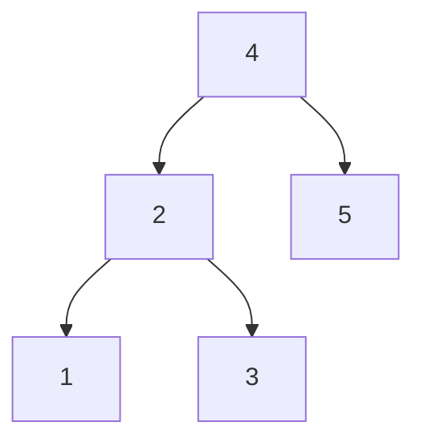

## Examples

**Example 1**

- Input: `root = [4,2,5,1,3], target = 3.714286`

The level-order input represents this BST:

- Output: `4`

**Example 2**

- Input: `root = [1], target = 4.428571`
- Output: `1`
