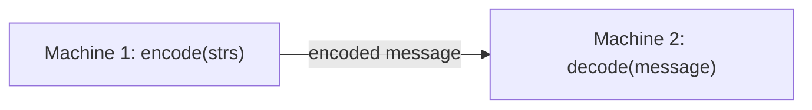

## Examples

**Example 1**

- Input: `dummy_input = ["Hello","World"]`
- Output: `["Hello","World"]`
- Explanation: Machine 1 creates a `Codec`, passes `strs` to `encode`, and sends the resulting message. Machine 2 creates its own `Codec` and calls `decode` on that message to recover the displayed list.

**Example 2**

- Input: `dummy_input = [""]`
- Output: `[""]`
