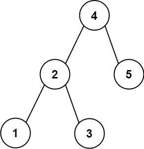

## Description

Given the `root` of a binary search tree, a `target` value, and an integer `k`, return *the *`k`* values in the BST that are closest to the* `target`. You may return the answer in **any order**.

You are **guaranteed** to have only one unique set of `k` values in the BST that are closest to the `target`.
### Function Contract

**Inputs**

- `root`: The nonempty root of a binary search tree.
- `target`: The numeric value to approximate.
- `k`: The number of closest tree values to return.

Let $n$ be the number of nodes in the tree, and let $h$ be its height.

**Return value**

Return the unique set of `k` closest BST values in any order.

### Examples
#### Example 1

- **Input:** `root = [4,2,5,1,3], target = 3.714286, k = 2`
- **Output:** `[4,3]`
#### Example 2

- **Input:** `root = [1], target = 0.000000, k = 1`
- **Output:** `[1]`
### Constraints

- The number of nodes in the tree is `n`.

- $1 \le k \le n \le 10^{4}$.

- $0 \le \text{Node.val} \le 10^{9}$

- $-10^{9} \le target \le 10^{9}$

**Follow up:** Assume that the BST is balanced. Could you solve it in less than `O(n)` runtime (where $n = total nodes$)?