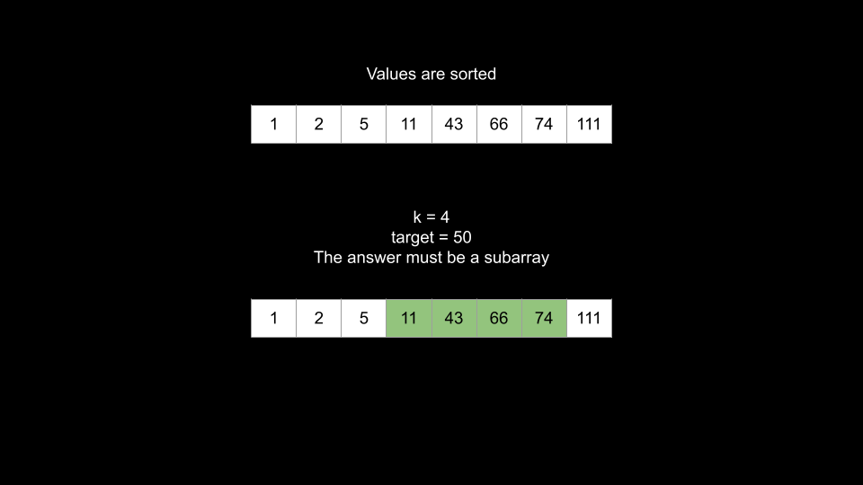
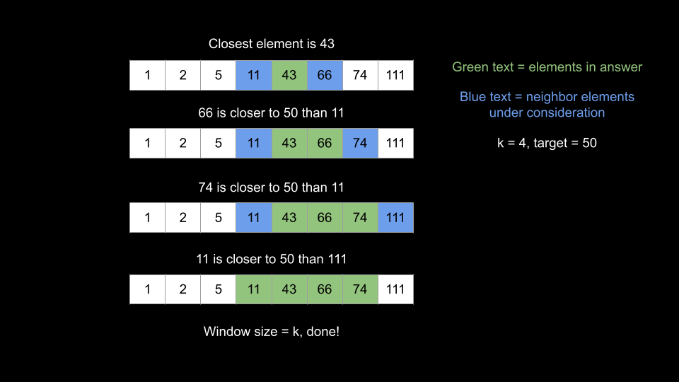
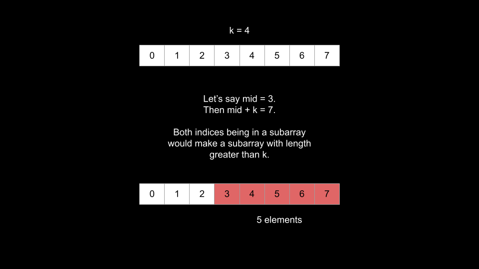

[TOC]

## Solution

---

### Approach 1: Sort With Custom Comparator

#### Intuition

Do exactly as the problem asks. First, traverse the tree and put all values in an array. Then sort the array according to distance from `target` and return the first `k` values.

#### Algorithm

1. Perform a DFS on `root` and put all values in an array.
2. Sort the array using a custom comparator: distance from `target`.
3. Return the first `k` values of the sorted array.

#### Implementation

```python
class Solution:
    def closestKValues(self, root: TreeNode, target: float, k: int) -> List[int]:
        def dfs(node, arr):
            if not node:
                return

            arr.append(node.val)
            dfs(node.left, arr)
            dfs(node.right, arr)

        arr = []
        dfs(root, arr)

        arr.sort(key = lambda x: (abs(x - target), x))
        return arr[:k]
```

#### Complexity Analysis

Given $n$ as the number of nodes in the tree,

* Time complexity: $O(n \cdot \log n)$

    We traverse the tree and collect all values in $O(n)$. Then, we sort the values which costs $O(n \cdot \log n)$.

* Space complexity: $O(n)$

    Both `arr` and the recursion call stack use $O(n)$ space. Depending on the language, some space is also used for sorting, but not more than $O(n)$.

<br/>

---

### Approach 2: Traverse With Heap

#### Intuition

"Find the K best elements" is a common type of problem. The most common way to solve these problems is by using a heap that eliminates "worse" elements (according to whatever criteria the problem description gives). If we limit the size of this heap to `k`, then the heap will hold the answer after we process all elements.

We can perform a traversal over the tree and push all values onto a max heap. We will use a value's distance from `target` as the key in the heap. Because we are using a max heap, larger distances will be popped.

#### Algorithm

1. Declare a max `heap` that judges elements based on their distance from `target`.
2. Perform a DFS on the tree:
- At each `node`, push `node.val` onto the `heap`.
- If the heap's size exceeds `k`, pop from `heap`.
3. Return the elements in `heap`.

#### Implementation

> Note: Python's `heapq` module only implements min heaps, so we will make the keys negative to emulate a max heap.

```python
class Solution:
    def closestKValues(self, root: TreeNode, target: float, k: int) -> List[int]:
        def dfs(node, heap):
            if not node:
                return

            if len(heap) < k:
                heappush(heap, (-abs(node.val - target), node.val))
            else:
                if abs(node.val - target) <= abs(heap[0][0]):
                    heappop(heap)
                    heappush(heap, (-abs(node.val - target), node.val))

            dfs(node.left, heap)
            dfs(node.right, heap)

        heap = []
        dfs(root, heap)
        return [x[1] for x in heap]

```

#### Complexity Analysis

Given $n$ as the number of nodes in the tree,

* Time complexity: $O(n \cdot \log k)$

    A heap operation's cost is a function of the size of the heap. We are limiting the size of our heap to $k$, so heap operations will cost $O(\log k)$.

    We visit each node once. At each node, we perform up to two heap operations. Therefore, we perform a maximum of $2n$ heap operations, giving us a time complexity of $O(n \cdot \log k)$.

* Space complexity: $O(n + k)$

    We need $O(n)$ space for the recursion call stack, and $O(k)$ space for the heap.

<br/>

---

### Approach 3: Inorder Traversal + Sliding Window

#### Intuition

The previous two approaches didn't take advantage of the fact that the given tree is a binary search tree. Both approaches would have worked given any arbitrary binary tree.

An important thing to know is that an inorder traversal on a BST handles the nodes in sorted order. This is because in a BST, at a given `node`, all nodes in the left subtree have a value less than `node`, and all values in the right subtree have a value greater than `node`. Inorder traversal handles all nodes in the left subtree, then `node`, then all nodes in the right subtree, and thus nodes will be handled in sorted order.

In the previous two approaches, we performed DFS solely to collect the values. In this approach, we will do an in-order traversal so that the values will be collected in sorted order. How does having the values in sorted order help us?

In a sorted array, all answer values would form a subarray.

 <br>

We can find this subarray efficiently by first identifying the element closest to `target`. Naturally, this element must be in the answer. The next element in the answer must be a neighbor of this element - we check both left and right and add the one that is closer to `target`. We continue this sliding window process until the window has a size of $k$, at which point we can return the elements in the window.

 <br>

The initial (closest) element can be found using binary search, although you could also do a linear scan since we need $O(n)$ to traverse the tree anyways, and thus a binary search would not improve the complexity (although it is still a good optimization to consider in an interview).

#### Algorithm

1. Perform an inorder DFS on the tree to obtain the sorted values in `arr`.
2. Identify the element closest to `target`. Initialize two pointers `left` and `right` at this location.
3. While the window has less than `k` elements:
- If $\text{arr}[left]$ is closer to `target` than $\text{arr}[right]$, add $\text{arr}[left]$ to the window and decrement `left`.
- Otherwise, add $\text{arr}[right]$ to the window and increment `right`.
- Be careful not to go out of bounds.
4. Return the window.

#### Implementation

```python
class Solution:
    def closestKValues(self, root: TreeNode, target: float, k: int) -> List[int]:
        def dfs(node, arr):
            if not node:
                return

            dfs(node.left, arr)
            arr.append(node.val)
            dfs(node.right, arr)

        arr = []
        dfs(root, arr)

        left = bisect_left(arr, target) - 1
        right = left + 1
        ans = []

        while len(ans) < k:
            if right == len(arr) or abs(arr[left] - target) <= abs(arr[right] - target):
                ans.append(arr[left])
                left -= 1
            else:
                ans.append(arr[right])
                right += 1

        return ans
```

#### Complexity Analysis

Given $n$ as the number of nodes in the tree,

* Time complexity: $O(n + k)$

    First, we perform a DFS on the tree to build `arr` which costs $O(n)$.

    Next, we perform either a binary search or linear scan on `arr` which costs $O(\log n)$ or $O(n)$. Neither will change the complexity.

    Finally, we perform a sliding window process that costs $O(k)$ since we add an element to the window at each iteration and stop when the window has a size of `k`.

* Space complexity: $O(n)$

    Both `arr` and the recursion call stack use $O(n)$ space.

<br/>

---

### Approach 4: Binary Search The Left Bound

#### Intuition

In approach 3, we first created a sorted `arr` and then did a sliding window process that cost $O(k)$.

We can identify the window without the sliding window process, and independent of `k`!

Binary search is typically used to find if an element exists or where an element belongs in a sorted array. However, we can use it in a different manner here with some clever thinking. We will try to find the left bound of the window using binary search. If we know the left bound, we also know the right bound since we know the window's size must be $k$.

What is the biggest index the left bound could be? It is $\text{arr.length} - k$. If it were any greater, then there wouldn't be room for the window to have $k$ elements, you would go out of bounds. The smallest index is `0`, so this is where we will begin our binary search bounds.

Consider indices $mid = (left + right) / 2$ and $mid + k$. Why do we care about $mid + k$? Because indices `mid` and $mid + k$ **cannot both be in the answer**. We already established that the answer must be a subarray, and indices `mid` and $mid + k$ are too far apart.

 <br>

If the element at $\text{arr}[mid]$ is closer to `target` than $arr[mid + k]$, there is no chance $arr[mid + k]$ could be in the answer while $\text{arr}[mid]$ isn't. Therefore, we can discard $arr[mid + k]$ and every element to the right of it (move the right pointer).

Vice-versa, if the element at $arr[mid + k]$ is closer to `target`, then we can discard $\text{arr}[mid]$ and every element to the left of it (move the left pointer).

This binary search will find the left bound of the answer. We can find the answer as the subarray of `arr` starting at `left` with a length of `k`.

#### Algorithm

1. Perform an inorder DFS on the tree to obtain the sorted values in `arr`.
2. Perform a binary search. Initialize $left = 0$ and $right = \text{arr.length} - k$.
3. While `left < right`:
- Calculate $mid = (left + right) / 2$.
- If $arr[mid + k]$ is closer to `target` than $\text{arr}[mid]$, move `left`.
- Otherwise, move `right`.
4. Return the subarray of `arr` starting at `left` of length `k`.

#### Implementation

```python
class Solution:
    def closestKValues(self, root: TreeNode, target: float, k: int) -> List[int]:
        def dfs(node, arr):
            if not node:
                return

            dfs(node.left, arr)
            arr.append(node.val)
            dfs(node.right, arr)

        arr = []
        dfs(root, arr)

        left = 0
        right = len(arr) - k

        while left < right:
            mid = (left + right) // 2
            if abs(target - arr[mid + k]) < abs(target - arr[mid]):
                left = mid + 1
            else:
                right = mid

        return arr[left:left + k]
```

#### Complexity Analysis

Given $n$ as the number of nodes in the tree,

* Time complexity: $O(n)$ in Java, $O(n + k)$ in Python

    First, we perform a DFS on the tree to build `arr` which costs $O(n)$.

    Next, we perform a binary search on `arr` which costs $O(\log {(n - k)})$.

    Finally, we return the answer. In Java, `arr.subList()` is an $O(1)$ operation. In Python, we spend $O(k)$ to create the answer.

    Note that an interviewer may find it reasonable to ignore the $O(k)$ to build the answer, thus giving this algorithm a time complexity of $O(n)$.

* Space complexity: $O(n)$

    Both `arr` and the recursion call stack use $O(n)$ space.

<br/>

---

### Approach 5: Build The Window With Deque

#### Intuition

This approach combines ideas from approaches 2 and 3. We will build the window during the traversal.

When we used the heap, we could visit the nodes in any order - we didn't take advantage of the tree being a BST. Here, we will again use an in-order traversal to handle the nodes in sorted order.

During the traversal, we can build the window using a deque (double-ended queue). Because we visit the nodes in sorted order, values will be added to the deque in ascending order. When the deque's size exceeds `k`, we need to remove either the first or last element. We will remove the one that is farther from `target`.

> Why do we need to remove the first or last element? It's the exact same idea as the previous approach! Elements at indices `i` and $i + k$ cannot both exist in a subarray of size `k`. Because the deque currently has a size greater than `k`, one of the edges must be removed.

If we find that the last element (the most recently added one) is farther, then all future elements will be even larger. This means that the window is currently positioned correctly, and we can end the DFS early.

This approach is similar to approach 3 because the deque represents a sliding window. It slides along the sorted values, growing until it reaches a size of `k`. Once it reaches a size of `k`, we remove it from the left so that we can continue sliding if the left element is farther than the right element. If the right element is farther, we find our window.

#### Algorithm

1. Initialize a double-ended queue `queue`.
2. Perform an inorder traversal on the tree. To handle each `node`:
- Add `node.val` to the end of `queue`.
- If the size of `queue` exceeds `k`:
- Compare the first and last value.
- If the last value is farther from `target`, remove it and end the DFS with `return`.
- Otherwise, remove the first element.
3. Return the `queue`.

#### Implementation

```python
class Solution:
    def closestKValues(self, root: TreeNode, target: float, k: int) -> List[int]:
        def dfs(node, queue):
            if not node:
                return

            dfs(node.left, queue)
            queue.append(node.val)
            if len(queue) > k:
                if (abs(target - queue[0]) <= abs(target - queue[-1])):
                    queue.pop()
                    return
                else:
                    queue.popleft()

            dfs(node.right, queue)

        queue = deque()
        dfs(root, queue)
        return list(queue)
```

#### Complexity Analysis

Given $n$ as the number of nodes in the tree,

* Time complexity: $O(n)$

    We visit each node at most once during the traversal. With an efficient `deque` implementation, the work done at each node is $O(1)$.

* Space complexity: $O(n + k)$

    We use $O(n)$ space for the recursion call stack and $O(k)$ space for `queue`.

<br/>

---