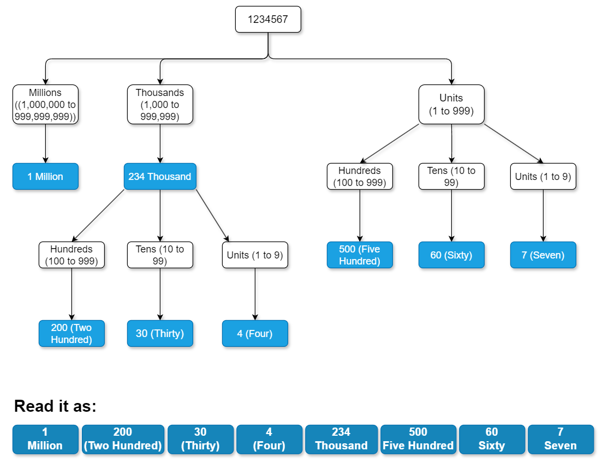

[TOC]

## Solution

---

### Overview

We need to create a program that converts any non-negative integer into its English word representation. The program must handle the English numbering system accurately, including terms like thousands, millions, and billions, and must follow the rules for numbers below one hundred to ensure correct phrasing.

**Key Points:**
- The input can range from `0` to `2,147,483,647` (i.e., the maximum value for a 32-bit signed integer).
- The first letter of each word must be capitalized.
- Words should be separated by a single space, with no trailing spaces.

Observe the tree diagram below to understand how numbers are spelled out in English, along with their corresponding units and scales. This will help us see the repetitive patterns and their resemblance to a tree data structure, which lends itself to a recursive approach.



---

### Approach 1: Recursive Approach

#### Intuition

In the recursive approach, we break down the number into smaller parts based on place values such as ones, tens, hundreds, thousands, millions, and so on.

We start with the largest place value and proceed downward. For example, with the number `1234567`, we first handle the millions part (`1 Million`).

We use a helper function that recursively breaks down the number. If the number is less than `10`, we return the corresponding word from a predefined list (`belowTen`). For numbers less than `20`, we use another list (`belowTwenty`) due to their unique names.

For numbers below `100`, we combine the word for the tens place (from `belowHundred`) with the word for the ones place, using further recursive calls. For numbers below `1000`, we break the number into hundreds and the remainder, processing each part recursively.

For larger numbers like `1234567`, the function handles the millions part (`1 Million`), then the thousands (`234 Thousand`), and finally the hundreds and smaller units (`567`). Each chunk is processed using recursive calls, building the final English representation from smallest to largest units.

The recursive function works as follows:
- **Base Case**: For numbers less than 10, the function directly maps to a word using `belowTen`. For numbers between 10 and 19, `belowTwenty` handles these unique cases. For numbers between 20 and 99, it combines words from `belowHundred` for tens and recursively processes the remainder for units.
- **Recursive Case**: For numbers 100 and above, the function processes hundreds, thousands, millions, and billions by breaking the number into smaller parts. For example, for `1234567`, it processes the millions part (`1 Million`), then the thousands part (`234 Thousand`), and finally the remainder (`567`). Each part is processed recursively to ensure accurate conversion.

After processing each chunk, we combine the results, handling the hierarchical structure from the smallest unit up to the largest (like billions), ensuring that each segment is correctly represented in English.

#### Algorithm

- Initialize arrays to store words for different ranges of numbers:
  - `belowTen` for numbers 1-9.
  - `belowTwenty` for numbers 10-19.
  - `belowHundred` for multiples of ten from 20-90.

- Define the main function `numberToWords` to handle the conversion:
  - If the number is zero, return `"Zero"`.
  - Otherwise, call the helper function `convertToWords` to start the conversion process.

- Implement the helper function `convertToWords` to convert numbers to words recursively:
  - Base Case 1: Numbers less than 10:
- Return the corresponding word from `belowTen`.
  - Base Case 2: Numbers less than 20:
- Return the corresponding word from `belowTwenty`.
  - Numbers from 20 to 99:
- Combine the word for the tens place from `belowHundred` with the recursive result for the units place.
  - Numbers from 100 to 999:
- Combine the recursive result for the hundreds place with `"Hundred"`, and the recursive result for the remaining part.
  - Numbers from 1000 to 999,999:
- Combine the recursive result for thousands with `"Thousand"`, and the recursive result for the remaining part.
  - Numbers from 1,000,000 to 999,999,999:
- Combine the recursive result for millions with `"Million"`, and the recursive result for the remaining part.
  - Numbers 1,000,000,000 and above:
- Combine the recursive result for billions with `"Billion"`, and the recursive result for the remaining part.

#### Implementation

```python
class Solution:
    # Arrays to store words for numbers less than 10, 20, and 100
    below_ten = ["", "One", "Two", "Three", "Four", "Five", "Six", "Seven", "Eight", "Nine"]
    below_twenty = ["Ten", "Eleven", "Twelve", "Thirteen", "Fourteen", "Fifteen", "Sixteen", "Seventeen", "Eighteen", "Nineteen"]
    below_hundred = ["", "Ten", "Twenty", "Thirty", "Forty", "Fifty", "Sixty", "Seventy", "Eighty", "Ninety"]

    # Main function to convert a number to English words
    def numberToWords(self, num: int) -> str:
        # Handle the special case where the number is zero
        if num == 0:
            return "Zero"
        # Call the helper function to start the conversion
        return self._convert_to_words(num)

    # Recursive function to convert numbers to words
    # Handles numbers based on their ranges: <10, <20, <100, <1000, <1000000, <1000000000, and >=1000000000
    def _convert_to_words(self, num: int) -> str:
        if num < 10:
            return self.below_ten[num]
        if num < 20:
            return self.below_twenty[num - 10]
        if num < 100:
            return self.below_hundred[num // 10] + (" " + self._convert_to_words(num % 10) if num % 10 != 0 else "")
        if num < 1000:
            return self._convert_to_words(num // 100) + " Hundred" + (" " + self._convert_to_words(num % 100) if num % 100 != 0 else "")
        if num < 1000000:
            return self._convert_to_words(num // 1000) + " Thousand" + (" " + self._convert_to_words(num % 1000) if num % 1000 != 0 else "")
        if num < 1000000000:
            return self._convert_to_words(num // 1000000) + " Million" + (" " + self._convert_to_words(num % 1000000) if num % 1000000 != 0 else "")
        return self._convert_to_words(num // 1000000000) + " Billion" + (" " + self._convert_to_words(num % 1000000000) if num % 1000000000 != 0 else "")
```

#### Complexity Analysis

Let $N$ be the number.

- Time complexity: $O(\log_{10} N)$

    The time complexity is $O(\log_{10} N)$ because the number of recursive calls is proportional to the number of digits in the number, which grows logarithmically with the size of the number.

- Space complexity: $O(\log_{10} N)$

    The space complexity is $O(\log_{10} N)$, mainly because of the recursion stack. Each recursive call adds a frame to the stack until the base case is reached, leading to space usage proportional to the number of digits in the number.

---

### Approach 2: Iterative Approach

#### Intuition

In the iterative approach, we convert a number into English words by processing it in chunks of three digits, corresponding to thousands, millions, billions, etc.

We initialize arrays for place value words (like thousand, million, billion) and for digit and tens names. A loop processes the number from the least significant chunk (ones, tens, hundreds) to the most significant chunk (thousands, millions, billions).

For instance, with the number `1234567`, we repeatedly use the modulus operation `% 1000` to extract chunks of three digits. We start by using `1234567 % 1000` to get `567`, then `1234 % 1000` to get `234`, and finally `1 % 1000` to get `1`. Each chunk is then converted to English words."

To convert each chunk:
1. Handle the hundreds place if present (e.g., `567` becomes "Five Hundred").
2. Process the tens and ones (e.g., `67` becomes "Sixty-Seven").
3. Append the appropriate scale word (e.g., thousand, million) based on the chunk's position (e.g., `234` becomes "Two Hundred Thirty-Four Thousand").

We track the scale by using an index (`groupIndex`) that increments with each chunk processed. This index is used to fetch the correct scale word (thousand, million, billion) from the thousands array. For example:

- $groupIndex = 0$: No scale word (ones place).
- $groupIndex = 1$: "Thousand".
- $groupIndex = 2$: "Million".
- $groupIndex = 3$: "Billion".

We build the final result by concatenating the words for each chunk, starting from the least significant chunk and moving to the most significant. This ensures the correct placement of scale words and produces the final English representation of the entire number.

#### Algorithm

- Handle the special case where the number is zero by returning `"Zero"`.
- Initialize arrays to store words for single digits, tens, and thousands:
  - `ones` for numbers 1-19.
  - `tens` for multiples of ten from 20-90.
  - `thousands` for scales (`"Thousand"`, `"Million"`, `"Billion"`).
- Process the number in chunks of 1000.
  - Extract the last three digits of the number and handle hundreds, tens, and units:
- Handle hundreds place by adding the corresponding word from `ones` and `"Hundred"`.
- Handle tens and units place by combining the word from `tens` and `ones`.
  - Append the scale (`"Thousand"`, `"Million"`, `"Billion"`) for the current group.
  - Insert the group result at the beginning of the final result.
- Move to the next chunk of 1000 by dividing the number by 1000.
- Return the result after removing trailing spaces.

#### Implementation

```python
class Solution:
    def numberToWords(self, num: int) -> str:
        # Handle the special case where the number is zero
        if num == 0:
            return "Zero"

        # Arrays to store words for single digits, tens, and thousands
        ones = ["", "One", "Two", "Three", "Four", "Five", "Six", "Seven", "Eight", "Nine", "Ten", "Eleven", "Twelve", "Thirteen", "Fourteen", "Fifteen", "Sixteen", "Seventeen", "Eighteen", "Nineteen"]
        tens = ["", "", "Twenty", "Thirty", "Forty", "Fifty", "Sixty", "Seventy", "Eighty", "Ninety"]
        thousands = ["", "Thousand", "Million", "Billion"]

        # StringBuilder to accumulate the result
        result = ""
        group_index = 0

        # Process the number in chunks of 1000
        while num > 0:
            # Process the last three digits
            if num % 1000 != 0:
                group_result = ""
                part = num % 1000

                # Handle hundreds
                if part >= 100:
                    group_result += ones[part // 100] + " Hundred "
                    part %= 100

                # Handle tens and units
                if part >= 20:
                    group_result += tens[part // 10] + " "
                    part %= 10

                # Handle units
                if part > 0:
                    group_result += ones[part] + " "

                # Append the scale (thousand, million, billion) for the current group
                group_result += thousands[group_index] + " "
                # Insert the group result at the beginning of the final result
                result = group_result + result
            # Move to the next chunk of 1000
            num //= 1000
            group_index += 1

        return result.strip()
```

#### Complexity Analysis

Let $N$ be the number.

* Time complexity: $O(\log_{10} N)$

    $O(\log_{10} N)$, because the number is divided by 1000 in each iteration, making the number of iterations proportional to the number of chunks, which is logarithmic.

* Space complexity: $O(1)$

    $O(1)$, constant space. The space used is independent of the number's size, as it involves only a few string builders and arrays.

---

### Approach 3: Pair-Based Approach

#### Intuition

In the pair-based approach, we use a predefined list of numeric values and their corresponding English words to convert a number. We process the number by matching it against these pairs from largest to smallest, dividing the number, and converting each part recursively.

We start by defining a list of pairs where each pair consists of a numeric value and its English word, such as `1000000000` for "Billion", `1000000` for "Million", and down to `1` for "One". This list facilitates conversion by identifying which value fits into the current number.

For a number like `1234567`, we iterate through the list from the largest value to the smallest. We check if the number is greater than or equal to each value. If it is:
- **Divide the Number**: Determine how many times the value fits into the number (the quotient) and calculate the remainder. For `1234567`, we match `1 Million`, resulting in "One Million", and then process the remainder (`234567`).
- **Recursive Conversion**: Convert the quotient to words and recursively process the remainder using the same list of pairs.

We concatenate the word for the current pair with the results from the recursive call for the remainder. This process builds the final English word representation from the largest units (like billion) to the smallest (like one), ensuring an accurate representation of every part of the number.

#### Algorithm

- Initialize a pair `numberToWordsMap` that maps numeric values to their corresponding English words:
  - Includes large scales (`"Billion"`, `"Million"`, `"Thousand"`, `"Hundred"`) and individual numbers (1-19, and multiples of ten from 20 to 90).

- Handle the special case where the number is zero by returning `"Zero"`.

- Call the function `numberToWords` to convert the number to English words:
  - Iterate over the `numberToWordsMap`:
- For each pair `(value, word)` in `numberToWordsMap`, check if the number `num` is greater than or equal to `value`.
      - If `num` is greater than or equal to `value`:
- Compute the `prefix`:
          - If `num` is 100 or greater, recursively convert the quotient ($num / value$) to words and append `" "` (a space). If `num` is less than 100, set `prefix` to an empty string.
- Get the `unit` as the current `word` from `numberToWordsMap`.
- Compute the `suffix`:
          - If the remainder (`num % value`) is zero, set `suffix` to an empty string. Otherwise, recursively convert the remainder to words and prepend `" "` (a space).
- Return the combined result: $prefix + unit + suffix$.

- If the number is not zero, the function will return the complete English representation by combining the `prefix`, `unit`, and `suffix`.

#### Implementation

```python
class Solution:
    # Dictionary to store words for numbers
    number_to_words_map = {
        1000000000: "Billion", 1000000: "Million", 1000: "Thousand",
        100: "Hundred", 90: "Ninety", 80: "Eighty", 70: "Seventy",
        60: "Sixty", 50: "Fifty", 40: "Forty", 30: "Thirty",
        20: "Twenty", 19: "Nineteen", 18: "Eighteen", 17: "Seventeen",
        16: "Sixteen", 15: "Fifteen", 14: "Fourteen", 13: "Thirteen",
        12: "Twelve", 11: "Eleven", 10: "Ten", 9: "Nine", 8: "Eight",
        7: "Seven", 6: "Six", 5: "Five", 4: "Four", 3: "Three",
        2: "Two", 1: "One"
    }

    def numberToWords(self, num: int) -> str:
        if num == 0:
            return "Zero"

        for value, word in self.number_to_words_map.items():
            # Check if the number is greater than or equal to the current unit
            if num >= value:
                # Convert the quotient to words if the current unit is 100 or greater
                prefix = (self.numberToWords(num // value) + " ") if num >= 100 else ""

                # Get the word for the current unit
                unit = word

                # Convert the remainder to words if it's not zero
                suffix = "" if num % value == 0 else " " + self.numberToWords(num % value)

                return prefix + unit + suffix

        return ""
```

#### Complexity Analysis

Let $K$ be the number of pairs in `numberToWordsMap` and $N$ be the number.

- Time complexity: $O(K)$

    The time complexity is $O(K)$ because the loop iterates through the pairs until it finds a match. This complexity is linear with respect to the number of pairs, which is constant in practice as the number of pairs is fixed.

- Space complexity: $O(\log_{10} N)$

    $O(\log_{10} N)$, mainly due to the recursion stack in the `convert` function. The space used is proportional to the number of recursive calls made.

---