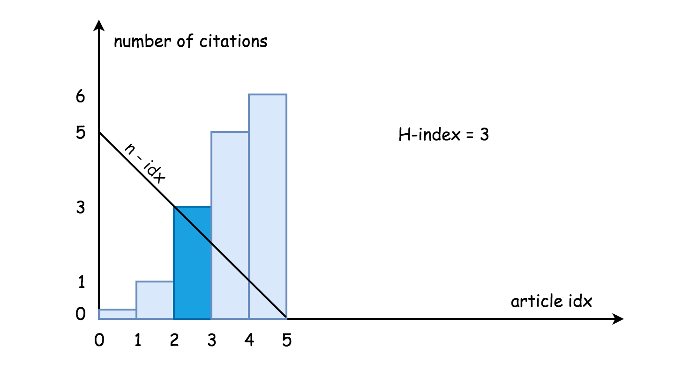
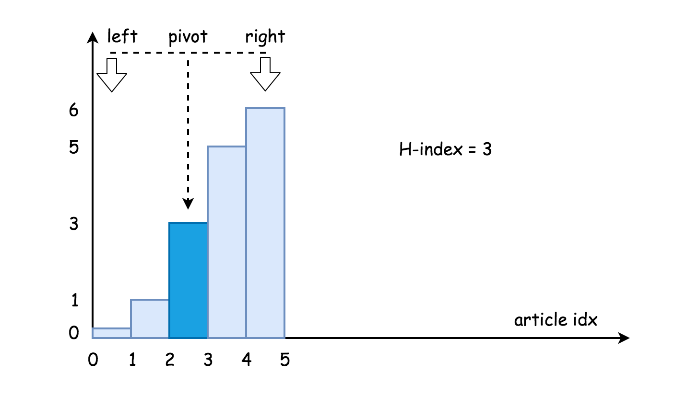

## Solution

---

### Approach 1: Linear search, $\mathcal{O}(k)$ time

**Intuition**

Since the list of citation numbers is sorted in ascending order, we can solve the problem in a single pass.

Consider a paper with citation number `c` at index `i`, _i.e_ $c = \text{citations}[i]$. The number of papers with a citation number larger than `c` is $n - i - 1$. Hence, including the current paper, there are $n - i$ papers that are cited at least `c` times.

Per the definition of H-Index, we need to find the first paper at index `i` where citation number $c = \text{citation}[i]$ is greater than or equal to $n - i$, _i.e._ $c \ge n - i$. Since all papers after paper `i` are cited at least `c` times, there are $n - i$ papers (including paper `i`) that are cited at least `c` times. In other words, the H-Index is $n - i$.



**Implementation**

```python
class Solution:
    def hIndex(self, citations):
        """
        :type citations: List[int]
        :rtype: int
        """
        n = len(citations)
        for idx, c in enumerate(citations):
            if c >= n - idx:
                return n - idx
        return 0
```

**Complexity Analysis**

- Time complexity: $O(N)$ where N is the length of the input list, since in the worst case, we would have to iterate the entire list.

- Space complexity: $O(1)$, because no additional data structures were used.
  <br />
  <br />

---

### Approach 2: Binary Search, $\mathcal{O}(\log N)$ time

**Intuition**

As mentioned earlier, the problem can be re-phrased like so:

> Given a sorted list `citations` of size `n`,
> find the _first_ number $\text{citations}[i]$
> that meets the constraint: $\text{citations}[i] \ge n - i$.

Since this is a sorted list, we can leverage binary search by reducing the search space by half at each iteration. This leads to a better optimized $O(\log N)$ time complexity (compared to $O(N)$ for linear search).



**Algorithm**

1. Find a pivot (middle of list), _i.e._ $\text{citations}[mid]$, which divides the original list into two sublists: $citations[0: mid - 1]$ and $citations[mid + 1: n]$.

2. Compare $n - mid$ to $\text{citations}[mid]$, to determine the next step as one of the following 3 options:

   - $\text{citations}[mid] = n - mid$: We found our target!
     There's (n - mid) papers with an equal or higher citation count than citations[mid]. If (citations[mid] == n - mid), it's the optimal result since if we move to the right, the next paper is going to have max(0, n - mid - 1) papers with equal or higher citations and citations[mid + 1] > (n - mid - 1), which won't work as the h-index. If we move to the left, we'll have a smaller (or equal) h-index - a sub-optimal result. So, if found, this can be returned right away.

   - $\text{citations}[mid] < n - mid$:
     Since the target needs to be greater than or equal to $n - mid$, we need to look at the sublist on the right, _i.e._ $citations[mid + 1: n]$.

   - $\text{citations}[mid] > n - mid$:
     In this case, look at the sublist on the left, _i.e._ $citations[0: mid - 1]$.

One difference from the textbook binary search algorithm is that here we return $n - mid$ (the count of indices beginning at `mid` through the end of the array), instead of a value at some position in the array.

**Implementation**

```python
class Solution:
    def hIndex(self, citations):
        """
        :type citations: List[int]
        :rtype: int
        """
        n = len(citations)
        left, right = 0, n - 1

        # We need to find the rightmost 'index' such that: (citations[index] <= n - index)
        while left <= right:
            mid = left + (right - left) // 2

            # There are (n - mid) papers with an equal or higher citation count than citations[mid]
            # If (citations[mid] == n - mid) it's the optimal result and can be returned right away
            if citations[mid] == n - mid:
                return n - mid

            # If citations[mid] are less than (n - mid), narrow down on the right half to look for a paper
            # at a future index that meets the h-index criteria. Otherwise, narrow down on the left half
            if citations[mid] < n - mid:
                left = mid + 1
            else:
                right = mid - 1

        # We didn't find an exact match, so there are exactly (n - left) papers that have citations
        # greater than or equal to citations[left] and that is our answer
        return n - left
```

**Complexity Analysis**

- Time complexity: $O(\log N)$ since we apply binary search, which reduces the search space by half at each iteration.

- Space complexity : $O(1)$, because no additional data structures were used.