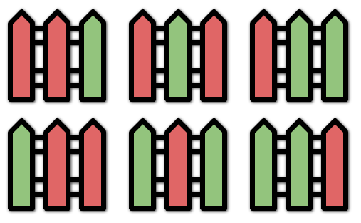

### 1. Description

You are painting a fence of `n` posts with `k` different colors. You must paint the posts following these rules:

- Every post must be painted **exactly one** color.

- There **cannot** be three or more **consecutive** posts with the same color.

Given the two integers `n` and `k`, return *the **number of ways** you can paint the fence*.

### 2. Function Contract

**Inputs**

- `n`: The number of fence posts.
- `k`: The number of available colors.

**Return value**

Return the number of color assignments in which no three consecutive posts have the same color.

### 3. Examples

#### Example 1

- **Input:** $n = 3, k = 2$
- **Output:** `6`
- **Explanation:** All the possibilities are shown.
Note that painting all the posts red or all the posts green is invalid because there cannot be three posts in a row with the same color.
#### Example 2

- **Input:** $n = 1, k = 1$
- **Output:** `1`
#### Example 3

- **Input:** $n = 7, k = 2$
- **Output:** `42`

### 4. Constraints

- $1 \le n \le 50$

- $1 \le k \le 10^{5}$

- The testcases are generated such that the answer is in the range $[0, 2^{31} - 1]$ for the given `n` and `k`.