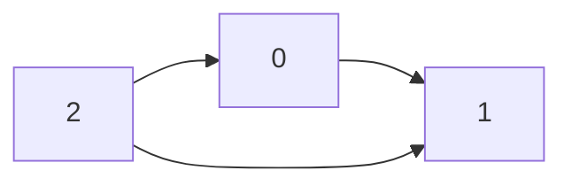
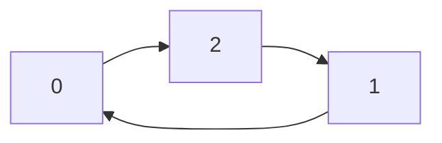

## Examples

**Example 1**

- Input: `graph = [[1,1,0],[0,1,0],[1,1,1]]`

Ignoring self-relationships, the directed “knows” edges are:

- Output: `1`
- Explanation: The attendees are labeled `0`, `1`, and `2`. Both `0` and `2` know person `1`, while person `1` knows neither of them, so `1` is the celebrity.

**Example 2**

- Input: `graph = [[1,0,1],[1,1,0],[0,1,1]]`

Ignoring self-relationships, the directed edges form a cycle:

- Output: `-1`
- Explanation: No attendee is a celebrity.
