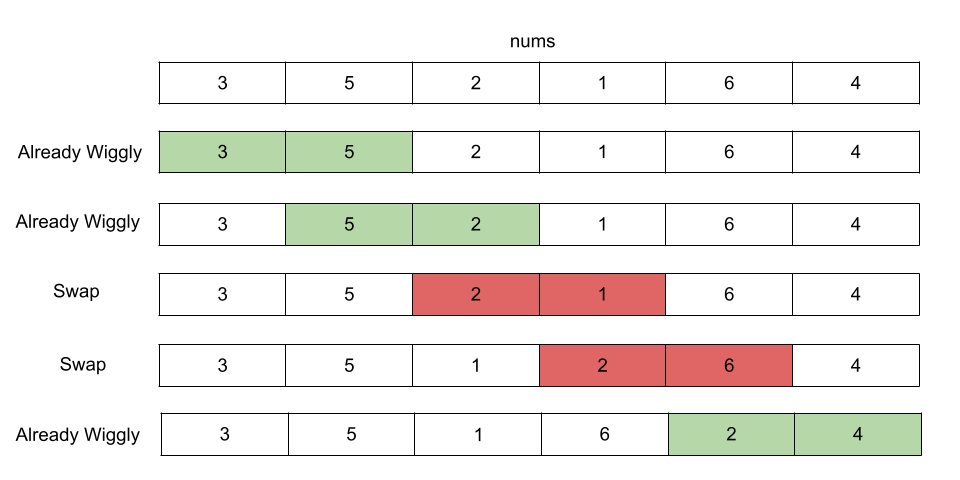

[TOC]

## Video Solution
---

<div>
    <div class="video-container">
        <iframe src="https://player.vimeo.com/video/846416998" width="640" height="360" frameborder="0" allow="autoplay; fullscreen" allowfullscreen></iframe>
    </div>
</div>

<div>
</div>

## Solution Article

---

### Overview

We are given an integer array `nums`. Our task is to reorder it such that $\text{nums}[0] \le \text{nums}[1] \ge \text{nums}[2] \le \text{nums}[3]...$.

---

### Approach 1: Sorting

#### Intuition

Our task is to reorder the given array in such a way that every element at an odd index is greater than or equal to its two adjacent elements at even indices.

An intuitive approach is to sort the `nums` array, and then for every element at an odd index, say `i` we do a swap with its adjacent element at index $i + 1$.

Let's take an example to understand it better. Assume we have a sorted array with the following five elements: `[a, b, c, d, e]`. As the array is sorted, we have $a \le b \le c \le d \le e$. We swap the first element at an odd index (0-based indexing), which is `b` at index 1, with its adjacent element `c`. As $a \le b$ and $b \le c$, we have $a \le c$. Furthermore, $b \le c$ and $c \le d$, so $b \le d$. The array after swapping `b` and `c` has the order $a \le c \ge b \le d \le e$. `a, b, c` are wiggly sorted. We move to the next element at an odd index, which is `d` at index 3, and swap it with `e`. As $b \le d$ and $d \le e$, we have $b \le e$. The order of the array now becomes $a \le c \ge b \le e \ge d$, which is a wiggly sorted array. Notice, swapping `d` and `e` preserved the wiggly sorted order for `a, b, c`.

#### Algorithm

1. Sort the `nums` array.
2. Iterate over every odd index of `nums` starting from index $i = 1$ until $\text{nums.length} - 2$. We iterate until the second last element because the last element has no next element to swap with. We keep incrementing the index by 2 to move only over odd indices.
-  Swap the element at odd index `i` with the adjacent element at index $i + 1$.

#### Implementation

```cpp
class Solution {
public:
    void swap(int& a, int& b) {
        int temp = a;
        a = b;
        b = temp;
    }

    void wiggleSort(vector<int>& nums) {
        sort(nums.begin(), nums.end());
        for (int i = 1; i < nums.size() - 1; i += 2) {
            swap(nums[i], nums[i + 1]);
        }
    }
};
```

#### Complexity Analysis

Let, $n$ be the size of `nums`.

* Time complexity: $O(n \cdot \log(n))$

- The time it takes to sort `nums` is $O(n \cdot \log(n))$.
- We iterate over all the odd indices in $O(n)$ time, then use the `swap` method to swap every odd index element with its next adjacent element in $O(1)$ time per swap operation.

* Space complexity: $O(1)$

- For sorting, it depends on which algorithm we use to determine the space. However, sorting algorithms like heapsort take $O(1)$ space.
- Other than a few integers `i`, `j`, and `temp`, we do not need any space.

---

### Approach 2: Greedy

#### Intuition

As we know, the idea is ensure that every odd position is greater than or equal to its two adjacent even positions. For any odd index `i`, we need to ensure the $nums[i-1] \le \text{nums}[i]$ and $nums[i+1] \le \text{nums}[i]$.

Let's take an example. Suppose, we have the `nums` array that has five elements. If $\text{nums}[0] \le \text{nums}[1]$, the first two elements are already wiggly sorted. We don't do anything here and move to the next element. Otherwise, if $\text{nums}[0] > \text{nums}[1]$, we swap $\text{nums}[0]$ and $\text{nums}[1]$.

Let us now proceed to the next element, $\text{nums}[2]$. So far, we have $\text{nums}[0] \le \text{nums}[1]$. If $\text{nums}[1] \ge \text{nums}[2]$, the first three elements of `nums` are already sorted wiggly. Otherwise, if $\text{nums}[1] < \text{nums}[2]$, it implies $\text{nums}[0] < \text{nums}[2]$ (because $\text{nums}[0] \le \text{nums}[1]$). We swap $\text{nums}[1]$ and $\text{nums}[2]$ which reorders `nums` to follow $\text{nums}[0] \le \text{nums}[1] \ge \text{nums}[2]$, which is a wiggly sorted order. Notice how the second swap has no effect on $\text{nums}[0]$.

Now, we've got the following: $\text{nums}[0] \le \text{nums}[1] \ge \text{nums}[2]$ after all the required swaps, and $\text{nums}[3]$ is our next element. If $\text{nums}[2] \le \text{nums}[3]$, the elements are already wiggly sorted. Otherwise, if $\text{nums}[2] > \text{nums}[3]$, it implies $\text{nums}[1] > \text{nums}[3]$ (because $\text{nums}[1] \ge \text{nums}[2]$). We swap $\text{nums}[2]$ and $\text{nums}[3]$ so that the array follows $\text{nums}[0] \le \text{nums}[1] \ge \text{nums}[2] \le \text{nums}[3]$, which is a wiggly sorted array. Again, notice that in this third swap, the array until the second element, $\text{nums}[1]$ is unaffected. It preserves the wiggly sorted property until $\text{nums}[1]$.

Similarly, we can add $\text{nums}[4]$ and observe that the array is unaffected until the third element, preserving the wiggly property.

The pattern that we can observe in the above example is that elements at indices 0 and 2 (i.e., elements at even indices) are swapped with the next adjacent element if they are greater than the next adjacent element. Similarly, we see in the above example that elements at index 1 and 3 (i.e., elements at odd indices) are swapped with the next adjacent element if they are smaller than the next adjacent element. The example also shows that, given any array, we can always arrange them in wiggly sort order.

This leads to our solution. We greedily check for each index `i`. If `i` is even, $\text{nums}[i]$ should be smaller than or equal to $nums[i + 1]$. If it is larger, i.e., $\text{nums}[i] > nums[i + 1]$, we swap $\text{nums}[i]$ and $nums[i + 1]$.

Similarly, if `i` is odd, $\text{nums}[i]$ should be greater than or equal to $nums[i + 1]$. If it is smaller, i.e., $\text{nums}[i] < nums[i + 1]$, we swap $\text{nums}[i]$ and $nums[i + 1]$.

Here is a visual example with the steps:



<br>

#### Algorithm

1. Iterate over every element at index `i` in `nums` starting from 0 until $\text{nums.length} - 2$ as the last element has no next element to swap with.
2. Check if `i` is even and $\text{nums}[i] > nums[i + 1]$. If this is true, swap $\text{nums}[i]$ and $nums[i + 1]$.
3. Check if `i` is odd and $\text{nums}[i] < nums[i + 1]$. If this is true, swap $\text{nums}[i]$ and $nums[i + 1]$.

#### Implementation

```cpp
class Solution {
public:
    void swap(vector<int>& nums, int i, int j) {
        int temp = nums[i];
        nums[i] = nums[j];
        nums[j] = temp;
    }

    void wiggleSort(vector<int>& nums) {
        for (int i = 0; i < nums.size() - 1; i++) {
            if (((i % 2 == 0) && nums[i] > nums[i + 1]) ||
                ((i % 2 == 1) && nums[i] < nums[i + 1])) {
                swap(nums, i, i + 1);
            }
        }
    }
};
```

#### Complexity Analysis

Let, $n$ be the size of `nums`.

* Time complexity: $O(n)$

- We iterate over each `nums` element in $O(n)$ time and, if necessary, use the `swap` method to swap the current element with the next element in $O(1)$ time per swap operation.

* Space complexity: $O(1)$

- Other than a few integers `i`, `j`, and `temp`, we do not need any space.