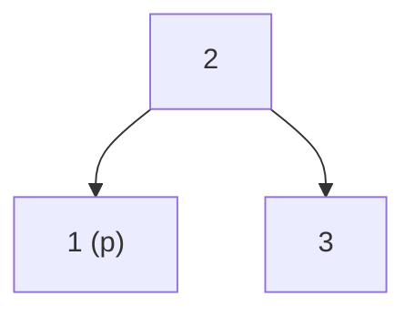
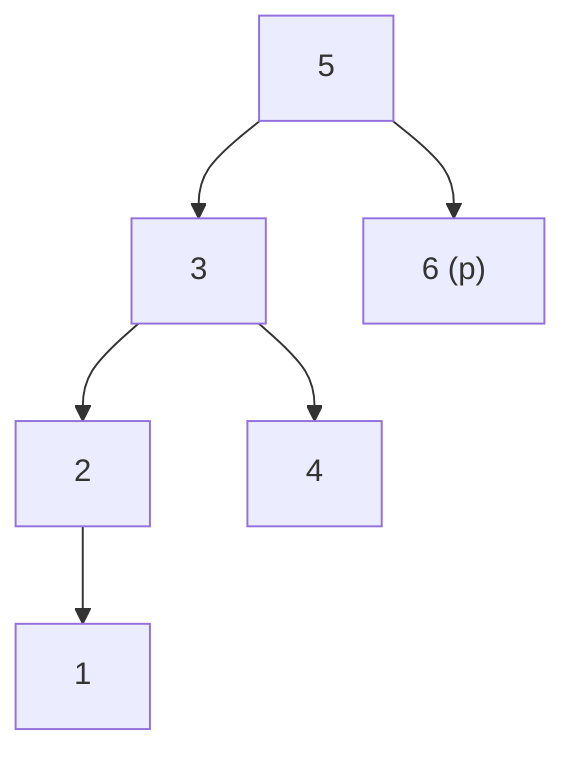

## Examples

**Example 1**

- Input: `root = [2,1,3], p = 1`
- Output: `2`
- Explanation: Node `2` is the first node after `p` in inorder order. Both `p` and the native return value are `TreeNode` objects, even though the example displays their values.

**Example 2**

- Input: `root = [5,3,6,2,4,null,null,1], p = 6`
- Output: `null`
- Explanation: Node `6` is the greatest node in the tree, so there is no inorder successor.

