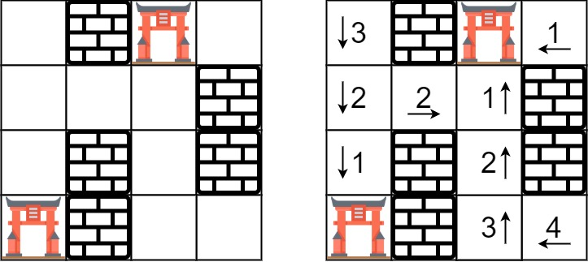

### 1. Description

You are given an `m x n` grid `rooms` initialized with these three possible values.

- `-1` A wall or an obstacle.

- `0` A gate.

- `INF` Infinity means an empty room. We use the value $2^{31} - 1 = 2147483647$ to represent `INF` as you may assume that the distance to a gate is less than `2147483647`.

Fill each empty room with the distance to *its nearest gate*. If it is impossible to reach a gate, it should be filled with `INF`.

### 2. Function Contract

**Inputs**

- `rooms`: A mutable rectangular grid containing only walls, gates, and `INF` empty rooms.

**Return value**

Return `None`. Update `rooms` in place so each reachable empty room stores the minimum number of horizontal or vertical steps to a gate.

### 3. Examples

#### Example 1

- **Input:** $rooms = [[2147483647,-1,0,2147483647],[2147483647,2147483647,2147483647,-1],[2147483647,-1,2147483647,-1],[0,-1,2147483647,2147483647]]$
- **Output:** `[[3,-1,0,1],[2,2,1,-1],[1,-1,2,-1],[0,-1,3,4]]`
#### Example 2

- **Input:** $rooms = [[-1]]$
- **Output:** `[[-1]]`

### 4. Constraints

- $m = \text{rooms.length}$

- $n = \text{rooms}[i].length$

- $1 \le m, n \le 250$

- $\text{rooms}[i][j]$ is `-1`, `0`, or $2^{31} - 1$.