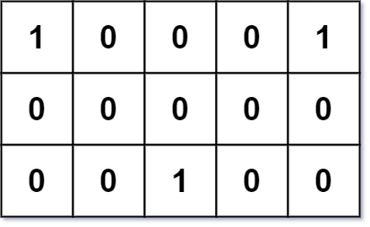

### 1. Description

Given an `m x n` binary grid `grid` where each `1` marks the home of one friend, return *the minimal **total travel distance***.

The **total travel distance** is the sum of the distances between the houses of the friends and the meeting point.

The distance is calculated using <a href="http://en.wikipedia.org/wiki/Taxicab_geometry" target="_blank">Manhattan Distance</a>, where $distance(p1, p2) = |\text{p2.x} - \text{p1.x}| + |\text{p2.y} - \text{p1.y}|$.

### 2. Function Contract

**Inputs**

- `grid`: A rectangular binary matrix containing at least two friend homes.

**Return value**

Return the smallest possible sum of Manhattan distances from all `1` cells to one meeting point.

### 3. Examples

#### Example 1

- **Input:** `grid = [[1,0,0,0,1],[0,0,0,0,0],[0,0,1,0,0]]`
- **Output:** `6`
- **Explanation:** Given three friends living at (0,0), (0,4), and (2,2).
The point (0,2) is an ideal meeting point, as the total travel distance of 2 + 2 + 2 = 6 is minimal.
So return 6.

#### Example 2

- **Input:** `grid = [[1,1]]`
- **Output:** `1`

### 4. Constraints

- $m = \text{grid.length}$

- $n = \text{grid}[i].length$

- $1 \le m, n \le 200$

- $\text{grid}[i][j]$ is either `0` or `1`.

- There will be **at least two** friends in the `grid`.
