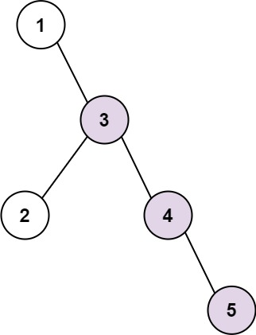
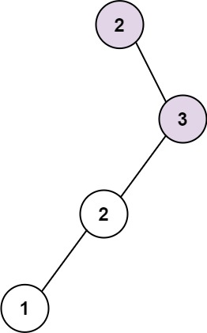

### 1. Description

Given the `root` of a binary tree, return *the length of the longest **consecutive sequence path***.

A **consecutive sequence path** is a path where the values **increase by one** along the path.

Note that the path can start **at any node** in the tree, and you cannot go from a node to its parent in the path.

### 2. Function Contract

**Inputs**

- `root`: The binary-tree root, represented by a level-order list in app cases.

**Return value**

Return the number of nodes in the longest downward path whose values increase by exactly one at every edge.

### 3. Examples

#### Example 1

- **Input:** `root = [1,null,3,2,4,null,null,null,5]`
- **Output:** `3`
- **Explanation:** Longest consecutive sequence path is 3-4-5, so return 3.

#### Example 2

- **Input:** `root = [2,null,3,2,null,1]`
- **Output:** `2`
- **Explanation:** Longest consecutive sequence path is 2-3, not 3-2-1, so return 2.

### 4. Constraints

- The number of nodes in the tree is in the range $[1, 3 * 10^{4}]$.

- $-3 * 10^{4} \le \text{Node.val} \le 3 * 10^{4}$
