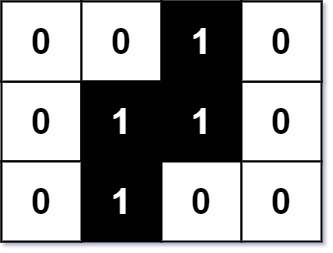

## Description

You are given an `m x n` binary matrix `image` where `0` represents a white pixel and `1` represents a black pixel.

The black pixels are connected (i.e., there is only one black region). Pixels are connected horizontally and vertically.

Given two integers `x` and `y` that represents the location of one of the black pixels, return *the area of the smallest (axis-aligned) rectangle that encloses all black pixels*.

You must write an algorithm with less than `O(mn)` runtime complexity
### Function Contract

**Inputs**

- `image`: The binary image, represented by one string per row in the app adapter.
- `x`: The row of a known black pixel.
- `y`: The column of that known black pixel.

**Return value**

Return the area of the tightest axis-aligned rectangle enclosing all black pixels.

### Examples

#### Example 1

- **Input:** $image = [["0","0","1","0"],["0","1","1","0"],["0","1","0","0"]], x = 0, y = 2$
- **Output:** `6`
#### Example 2

- **Input:** $image = [["1"]], x = 0, y = 0$
- **Output:** `1`
### Constraints

- $m = \text{image.length}$

- $n = \text{image}[i].length$

- $1 \le m, n \le 100$

- $\text{image}[i][j]$ is either `'0'` or `'1'`.

- $0 \le x < m$

- $0 \le y < n$

- $\text{image}[x][y] = '1'.$

- The black pixels in the `image` only form **one component**.