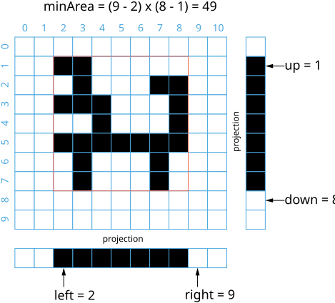

[TOC]

## Summary

This article is for intermediate readers. It introduces the following ideas:
Depth First Search (DFS), Breadth First Search (BFS) and Binary Search

## Solution

### Approach 1: Naive Linear Search

**Intuition**

Traversal all the pixels. Keep the maximum and minimum values of black pixels coordinates.

**Algorithm**

We keep four boundaries, `left`, `right`, `top` and `bottom` of the rectangle.
Note that `left` and `top` are inclusive while `right` and `bottom` are exclusive.
We then traversal all the pixels and update the four boundaries accordingly.

The recipe is following:

* Initialize left, right, top and bottom
* Loop through all `(x, y)` coordinates
  * if $\text{image}[x][y]$ is black
* $left = min(left, x)$
* $right = max(right, x + 1)$
* $top = min(top, y)$
* $bottom = max(bottom, y + 1)$
* Return $(right - left) * (bottom - top)$

```java
public class Solution {
    public int minArea(char[][] image, int x, int y) {
        int top = x, bottom = x;
        int left = y, right = y;
        for (x = 0; x < image.length; ++x) {
            for (y = 0; y < image[0].length; ++y) {
                if (image[x][y] == '1') {
                    top = Math.min(top, x);
                    bottom = Math.max(bottom, x + 1);
                    left = Math.min(left, y);
                    right = Math.max(right, y + 1);
                }
            }
        }
        return (right - left) * (bottom - top);
    }
}
```

**Complexity Analysis**

* Time complexity : $O(mn)$. $m$ and $n$ are the height and width of the image.

* Space complexity : $O(1)$. All we need to store are the four boundaries.

**Comment**
* One may optimize this algorithm to stop early. But it doesn't change the asymptotic performance.
* This naive approach is certainly not the best answer to this problem. However, it gives you a good entry point to tackle the problem. Most of the time the good algorithms come from identifying the repeat calculation a naive approach. And it also sets up a baseline of the time and space complexity, so that one can see whether or not other approaches are better than it.

---
### Approach 2: DFS or BFS

**Intuition**

Explore all the connected black pixel from the given pixel and update the boundaries.

**Algorithm**

The naive approach did not use the condition that all the black pixels are connected and that one of the black pixels is given.

A simple way to use these facts is to do an exhaustive search starting from the given pixel. Since all the black pixels are connected, DFS or BFS will visit all of them starting from the given black pixel. The idea is similar to what we did for [200. Number of Island](https://leetcode.com/problems/number-of-islands/). Instead of many islands, we have only one island here, and we know one pixel of it.

```java
public class Solution {
    private int top, bottom, left, right;
    public int minArea(char[][] image, int x, int y) {
        if(image.length == 0 || image[0].length == 0) return 0;
        top = bottom = x;
        left = right = y;
        dfs(image, x, y);
        return (right - left) * (bottom - top);
    }
    private void dfs(char[][] image, int x, int y){
        if(x < 0 || y < 0 || x >= image.length || y >= image[0].length ||
          image[x][y] == '0')
            return;
        image[x][y] = '0'; // mark visited black pixel as white
        top = Math.min(top, x);
        bottom = Math.max(bottom, x + 1);
        left = Math.min(left, y);
        right = Math.max(right, y + 1);
        dfs(image, x + 1, y);
        dfs(image, x - 1, y);
        dfs(image, x, y - 1);
        dfs(image, x, y + 1);
    }
}
```

**Complexity Analysis**

* Time complexity : $O(E) =$\mathcal{O}(B)$= O(mn)$.

Here $E$ is the number of edges in the traversed graph. $B$ is the total number of black pixels. Since each pixel have four edges at most, $O(E) = O(B)$. In the worst case, $O(B) = O(mn)$.

* Space complexity : $O(V) =$\mathcal{O}(B)$= O(mn)$.

The space complexity is $O(V)$ where $V$ is the number of vertices in the traversed graph. In this problem $O(V) = O(B)$. Again, in the worst case, $O(B) = O(mn)$.

**Comment**

Although this approach is better than naive approach when $B$ is much smaller than $mn$, it is asymptotically the same as approach #1 when $B$ is comparable to $mn$. And it costs a lot more auxiliary space.

---
### Approach 3: Binary Search

**Intuition**

Project the 2D image into a 1D array and use binary search to find the boundaries.

**Algorithm**

{:width="539px"}

*Figure 1. Illustration of image projection.

Suppose we have a $10 \times 11$ image as shown in figure 1, if we project each column of the image into an entry of row vector `v` with the following rule:

* $v[i] = 1$   if exists `x` such that $\text{image}[x][i] = 1$
* $v[i] = 0$   otherwise

That is

> If a column has any black pixel it's projection is black otherwise white.

Similarly, we can do the same for the rows, and project the image into a 1D column vector. The two projected vectors are shown in figure 1.

Now, we claim the following lemma:

*Lemma*
>If there are only one black pixel region, then in a projected 1D array all the black pixels are connected.

*Proof by contradiction*
>Assume to the contrary that there are disconnected black pixels at `i` and `j` where `i < j` in the 1D projection array. Thus, there exists one column `k`, `k` in `(i, j)` and the column `k` in the 2D array has no black pixel. Therefore, in the 2D array there exist at least two black pixel regions separated by column `k` which contradicting the condition of "only one black pixel region".
Therefore, we conclude that all the black pixels in the 1D projection array are connected.

With this lemma, we have the following algorithm:

* Project the 2D array into a column array and a row array
* Binary search to find `left` in the row array within `[0, y)`
* Binary search to find `right` in the row array within $[y + 1, n)$
* Binary search to find `top` in the column array within `[0, x)`
* Binary search to find `bottom` in the column array within $[x + 1, m)$
* Return $(right - left) * (bottom - top)$

However, the projection step cost $O(mn)$ time which dominates the entire algorithm.If so, we gain nothing comparing with previous approaches.

The trick is that we do not need to do the projection step as a preprocess. We can do it on the fly, i.e. "don't project the column/row unless needed".

Recall the binary search algorithm in a 1D array, each time we only check one element, the pivot, to decide which half we go next.

In a 2D array, we can do something similar. The only difference here is that the element is not a number but a vector. For example, a `m` by `n` matrix can be seen as `n` column vectors.

In these `n` elements/vectors, we do a binary search to find `left` or `right`. Each time we only check one element/vector, the pivot, to decide which half we go next.
In total it checks $O(\log n)$ vectors, and each check is $O(m)$ (we simply traverse all the `m` entries of the pivot vector).

So it costs $O(m \log n)$ to find `left` and `right`.
Similarly it costs $O(n \log m)$ to find `top` and `bottom`. The entire algorithm has a time complexity of $O(m \log n + n \log m)$

```java
public class Solution {
    public int minArea(char[][] image, int x, int y) {
        int m = image.length, n = image[0].length;
        int left = searchColumns(image, 0, y, 0, m, true);
        int right = searchColumns(image, y + 1, n, 0, m, false);
        int top = searchRows(image, 0, x, left, right, true);
        int bottom = searchRows(image, x + 1, m, left, right, false);
        return (right - left) * (bottom - top);
    }
    private int searchColumns(char[][] image, int i, int j, int top, int bottom, boolean whiteToBlack) {
        while (i != j) {
            int k = top, mid = (i + j) / 2;
            while (k < bottom && image[k][mid] == '0') ++k;
            if (k < bottom == whiteToBlack) // k < bottom means the column mid has black pixel
                j = mid; //search the boundary in the smaller half
            else
                i = mid + 1; //search the boundary in the greater half
        }
        return i;
    }
    private int searchRows(char[][] image, int i, int j, int left, int right, boolean whiteToBlack) {
        while (i != j) {
            int k = left, mid = (i + j) / 2;
            while (k < right && image[mid][k] == '0') ++k;
            if (k < right == whiteToBlack) // k < right means the row mid has black pixel
                j = mid;
            else
                i = mid + 1;
        }
        return i;
    }
}
```

**Complexity Analysis**

* Time complexity : $O(m \log n + n \log m)$.

Here, $m$ and $n$ are the height and width of the image. We embedded a linear search for every iteration of binary search. See previous sections for details.

* Space complexity : $O(1)$.

Both binary search and linear search used only constant extra space.