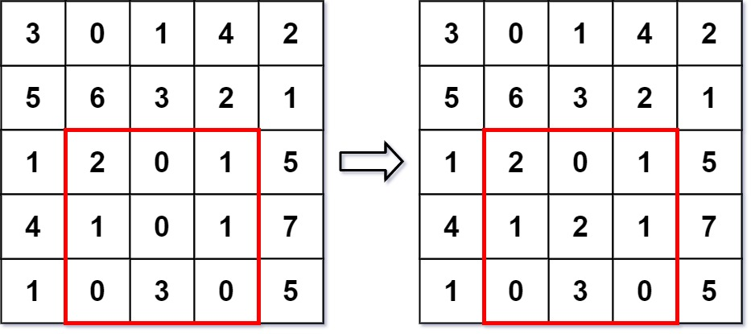

### 1. Description

Given a 2D matrix `matrix`, handle multiple queries of the following types:

- **Update** the value of a cell in `matrix`.

- Calculate the **sum** of the elements of `matrix` inside the rectangle defined by its **upper left corner** `(row1, col1)` and **lower right corner** `(row2, col2)`.

Implement the NumMatrix class:

- `NumMatrix(int[][] matrix)` Initializes the object with the integer matrix `matrix`.

- `void update(int row, int col, int val)` **Updates** the value of $\text{matrix}[row][col]$ to be `val`.

- `int sumRegion(int row1, int col1, int row2, int col2)` Returns the **sum** of the elements of `matrix` inside the rectangle defined by its **upper left corner** `(row1, col1)` and **lower right corner** `(row2, col2)`.

### 2. Function Contract

**Inputs**

- `matrix`: The initial rectangular integer matrix.
- `operations`: The app adapter's ordered operations, either `["update", row, col, val]` or `["sum", row1, col1, row2, col2]`.

**Return value**

Return the results of all `sum` operations in order. An update changes subsequent sums and contributes no item to the returned list.

### 3. Examples

#### Example 1



```
**Input**
["NumMatrix", "sumRegion", "update", "sumRegion"]
[[[[3, 0, 1, 4, 2], [5, 6, 3, 2, 1], [1, 2, 0, 1, 5], [4, 1, 0, 1, 7], [1, 0, 3, 0, 5]]], [2, 1, 4, 3], [3, 2, 2], [2, 1, 4, 3]]
**Output**
[null, 8, null, 10]

**Explanation**
NumMatrix numMatrix = new NumMatrix([[3, 0, 1, 4, 2], [5, 6, 3, 2, 1], [1, 2, 0, 1, 5], [4, 1, 0, 1, 7], [1, 0, 3, 0, 5]]);
numMatrix.sumRegion(2, 1, 4, 3); // return 8 (i.e. sum of the left red rectangle)
numMatrix.update(3, 2, 2);       // matrix changes from left image to right image
numMatrix.sumRegion(2, 1, 4, 3); // return 10 (i.e. sum of the right red rectangle)
```

### 4. Constraints

- $m = \text{matrix.length}$

- $n = \text{matrix}[i].length$

- $1 \le m, n \le 200$

- $-1000 \le \text{matrix}[i][j] \le 1000$

- $0 \le row < m$

- $0 \le col < n$

- $-1000 \le val \le 1000$

- $0 \le row1 \le row2 < m$

- $0 \le col1 \le col2 < n$

- At most `5000` calls will be made to `sumRegion` and `update`.