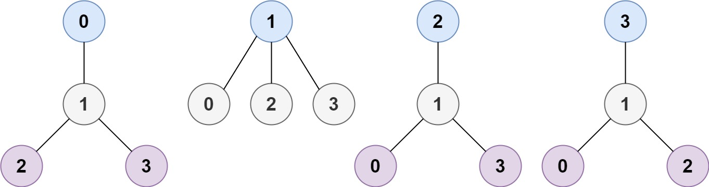

## Description

A tree is an undirected graph in which any two vertices are connected by *exactly* one path. In other words, any connected graph without simple cycles is a tree.

Given a tree of `n` nodes labelled from `0` to $n - 1$, and an array of $n - 1$ `edges` where $\text{edges}[i] = [a_{i}, b_{i}]$ indicates that there is an undirected edge between the two nodes $a_{i}$ and $b_{i}$ in the tree, you can choose any node of the tree as the root. When you select a node `x` as the root, the result tree has height `h`. Among all possible rooted trees, those with minimum height (i.e. `min(h)`)  are called **minimum height trees** (MHTs).

Return *a list of all **MHTs'** root labels*. You can return the answer in **any order**.

The **height** of a rooted tree is the number of edges on the longest downward path between the root and a leaf.
### Function Contract

**Inputs**

- `n`: The number of nodes labeled from `0` to $n - 1$.
- `edges`: The tree's distinct undirected edges $[a_{i}, b_{i}]$.

**Return value**

Return every node label that produces minimum height when chosen as the root, in any order.

### Examples

#### Example 1

- **Input:** $n = 4, edges = [[1,0],[1,2],[1,3]]$
- **Output:** `[1]`
- **Explanation:** As shown, the height of the tree is 1 when the root is the node with label 1 which is the only MHT.
#### Example 2

- **Input:** $n = 6, edges = [[3,0],[3,1],[3,2],[3,4],[5,4]]$
- **Output:** `[3,4]`
### Constraints

- $1 \le n \le 2 * 10^{4}$

- $\text{edges.length} = n - 1$

- $0 \le a_{i}, b_{i} < n$

- $a_{i} \neq b_{i}$

- All the pairs $(a_{i}, b_{i})$ are distinct.

- The given input is **guaranteed** to be a tree and there will be **no repeated** edges.