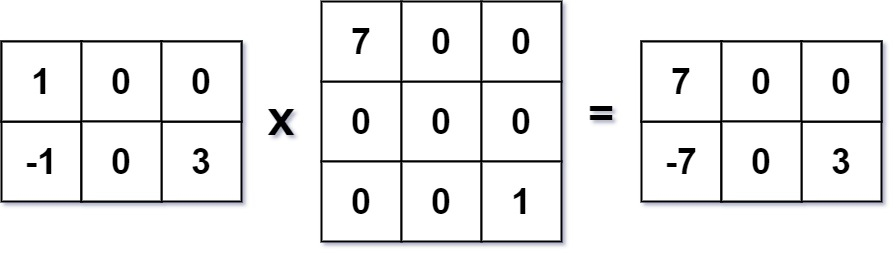

## Description

Given two <a href="https://en.wikipedia.org/wiki/Sparse_matrix" target="_blank">sparse matrices</a> `mat1` of size `m x k` and `mat2` of size `k x n`, return the result of `mat1 x mat2`. You may assume that multiplication is always possible.
### Function Contract

**Inputs**

- `mat1`: An $m \times k$ integer matrix.
- `mat2`: A $k \times n$ integer matrix.

**Return value**

Return the dense $m \times n$ product matrix `mat1 x mat2`.

### Examples

#### Example 1

- **Input:** $mat1 = [[1,0,0],[-1,0,3]], mat2 = [[7,0,0],[0,0,0],[0,0,1]]$
- **Output:** `[[7,0,0],[-7,0,3]]`
#### Example 2

- **Input:** $mat1 = [[0]], mat2 = [[0]]$
- **Output:** `[[0]]`
### Constraints

- $m = \text{mat1.length}$

- $k = \text{mat1}[i].length = \text{mat2.length}$

- $n = \text{mat2}[i].length$

- $1 \le m, n, k \le 100$

- $-100 \le \text{mat1}[i][j], \text{mat2}[i][j] \le 100$