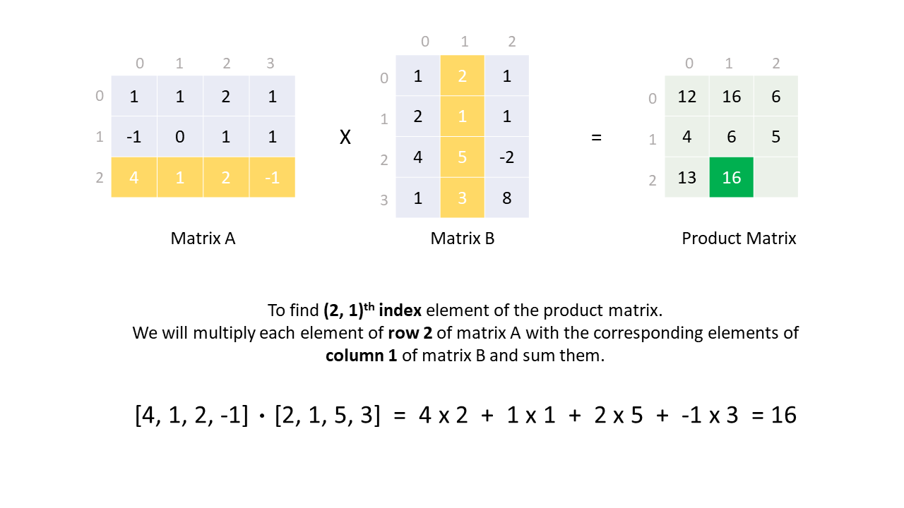
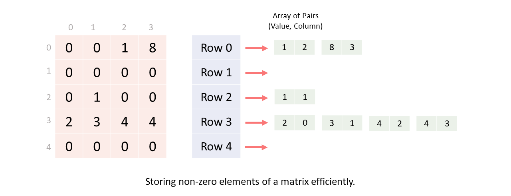

[TOC]

## Solution

---

### Overview

A matrix is a 2-dimensional array, and its size is denoted as $a \times b$, where $a$ and $b$ are the numbers of rows and columns respectively.
We have to multiply two matrices $A$ and $B$ of size $m \times k$ and $k \times n$ respectively.

> **Matrix multiplication** is a binary operation whose output is another matrix when two matrices are multiplied. To multiply two matrices both **matrices must be compatible**, here compatibility means if we have two matrices $A$ and $B$, then to calculate $A \cdot B$, $\text{the number of columns in A}$ should be equal to $\text{the number of rows in B}$.  <br />
And the resultant matrix will have a size equal to $\text{(number of rows in A} \times  \text{number of columns in B)}$.

**How to multiply?**
Let's define, matrices $A = [a_{ij}]$ of size $m \times k$ and $B = [b_{ij}]$ of size $k \times n$.
Then, the product matrix $X = A \cdot B$ will be of size $m \times n$.
$X = [x_{ij}]$ where, $x_{ij} = a_{i1}b_{1j} + a_{i2}b_{2j} + ..... + a_{i(k-1)}b_{(k-1)j} + a_{ik}b_{kj}$ $= \sum_{N=1}^{k} a_{iN}b_{Nj}$

Each element $x[i][j]$ is the sum of product of elements of $i^{th}$ row of matrix $A$ and $j^{th}$ column of matrix $B$.
Thus, to multiply two matrices $A$ and $B$, we multiply elements of each row of the matrix $A$ with the respective element of each column of the matrix $B$ and add them.

    <br />

If you are not familiar with matrix multiplication, this may seem unintuitive, but it is how matrix multiplication is done. We will not dive deep into the explanation of this method and will try to focus this article on implementation only.

</br>

---

### Approach 1: Naive Iteration

**Intuition**

> Given two matrices, $mat1 = [a_{ij}]$ of size $m \times k$ and $mat2 = [b_{ij}]$ of size $k \times n$.
> $ans = mat1 \cdot mat2$, a matrix of size $m \times n$.

To find each element $\text{ans}[i][j]$ of matrix $ans$, we need to multiply $i^{th}$ row elements of the matrix $mat1$ with $j^{th}$ column elements of the matrix $mat2$ and add them.

A simple way to implement this will be using some for loops to iterate over all rows and columns of matrices and multiply them.

We keep one pointer to point to each row of the matrix $mat1$, another pointer to point to each column of the matrix $mat2$, and a third pointer to point to each element in the row of the matrix $mat1$ (there are the same number of elements ($k$) in one row of $mat1$ as there are in one column of $mat2$).

```
for (row = 0 to n) {
    for (col = 0 to m) {
        for (elementPos = 0 to k) {
            ans[row][col] += mat1[row][elementPos] * mat2[elementPos][col];
        }
    }
}
```

!?!../Documents/311/slideshow1.json:960,540!?!

<br />

Here, we can implement one optimization. Let's say the $elementPos^{th}$ element of $i^{th}$ row is $0$. Then there is no need to iterate over all columns of the second matrix for this element because after multiplication, it is guaranteed that $0$ will be added in the $ans$ matrix.

If we first check whether this element of $mat1$ is zero or not. Then we can save one iteration over $m$ columns of $mat2$. Thus, when there are many zeros in $mat1$, this optimization will reduce the number of computations we need to do.
To accomplish this, we will iterate over $row$ and $elementPos$ in the outer for loops so that we can check if $\text{mat1}[row][elementPos]$ equals zero before iterating over all columns of $mat2$

```
for (row = 0 to n) {
    for (elementPos = 0 to k) {
        // If current element of mat1 is non-zero then iterate over 'm' columns of mat2.
        if (mat1[row][elementPos] != 0)  {
            for (col = 0 to m) {
                ans[row][col] += mat1[row][elementPos] * mat2[elementPos][col];
            }
        }
    }
}
```

!?!../Documents/311/slideshow2.json:960,540!?!

<br />

**Algorithm**

1. Initialize some variables:
- $m$, number of rows in $mat1$
- $k$, number of columns in $mat1$
- $n$, number of columns in $mat2$
- $ans$, matrix of size $m \times n$ to store multiplication result.

2. Iterate over each row of the matrix $mat1$.

3. For each element in the current row of matrix $mat1$, if the element is non-zero:
- Iterative over each column of $mat2$ multiply the elements and add them in the $ans$ matrix at their respective place.

4. Return the $ans$ matrix.

**Implementation**

```python
class Solution:
    def multiply(self, mat1: List[List[int]], mat2: List[List[int]]) -> List[List[int]]:

        # Product matrix.
        ans = [[0] * len(mat2[0]) for _ in range(len(mat1))]

        for row_index, row_elements in enumerate(mat1):
            for element_index, row_element in enumerate(row_elements):
                # If current element of mat1 is non-zero then iterate over all columns of mat2.
                if row_element:
                    for col_index, col_element in enumerate(mat2[element_index]):
                        ans[row_index][col_index] += row_element * col_element

        return ans
```

**Complexity Analysis**

Let $m$ and $k$ represent the number of rows and columns in $mat1$, respectively. Likewise, let $k$ and $n$ represent the number of rows and columns in $mat2$, respectively.

* Time complexity: $O(m \cdot k \cdot n)$.

  - We iterate over all $m \cdot k$ elements of the matrix $mat1$.
  - For each element of matrix $mat1$, we iterate over all $n$ columns of the matrix $mat2$.
  - Thus, it leads to a time complexity of $m \cdot k \cdot n$.

* Space complexity: $O(1)$.

  We use a matrix $ans$ of size $m \times n$ to output the multiplication result which is not included in auxiliary space.

<br/>

---

### Approach 2: List of Lists

**Intuition**

In the previous approach, we were checking for the non-zero elements in the matrix $mat1$, but what if the matrix $mat2$ is sparse and $mat1$ is dense?
We could handle that condition by counting non-zero elements in both matrices and using some checks before multiplying. However, the purpose of this problem is more than just converting a mathematical formula to a code.

The **interviewer's follow-up** could be, what if the matrix is too big to store in the memory, but there are only a few non-zero elements. Here, he wants to see how we handle huge space waste. He expects us to store the matrix efficiency and do multiplication using that.

> Naturally, some of you may wonder how we are passing $mat1$ and $mat2$ to the function if the matrices can't be stored in memory. For this approach, let's assume that we will read those matrices from an external source and then store them in an efficient way. But for convenience, right now, we will read them from function arguments because our main focus will be on **efficient storage**, not on how to read from a file.

Thus, we have to use some data structure to only store the non-zero elements of both matrices.

We will create some buckets where each bucket denotes one $row$ and that bucket contains an array of pairs of $(value, \space column)$. Zero valued elements will be missing from our data structure. Since the matrices are sparse, we will only store a few elements in our data structure.

    <br />

In the slideshow, in the previous approach, we saw that any element with index $(row1, \space col1)$ of $mat1$ is multiplied with all the elements of $col1^{th}$ row of $mat2$. Thus, we can use this method to multiply only the non-zero elements of $mat1$ with the non-zero elements of a particular row of $mat2$.

!?!../Documents/311/slideshow3.json:960,540!?!

<br />

**Algorithm**

1. Create a function $compressMatrix(matrix)$, which inputs $matrix$ and returns $compressedMatrix$ with only non-zero elements. To build $compressedMatrix$ we iterate over each element of $matrix$ and if the element is non-zero push the $(value, \space col)$ pair in the respective $row$ of $compressedMatrix$.

2. Initialize some variables:
- $m$, number of rows in $mat1$.
- $k$, number of columns in $mat1$.
- $n$, number of columns in $mat2$.
- $A$ and $B$, data structure to store matrices $mat1$ and $mat2$ in compressed form.
- $ans$, matrix of size $m \times n$ to store multiplication result.

3. For each row in $A$, iterate over all its elements. These represent the non-zero elements from $mat1$.
- For each element, we get $(value, \space col)$ pair and iterate over all the elements of $col^{th}$ row in $B$. For each pair of elements, we add their product to the $ans$ matrix.

4. Return the $ans$ matrix.

**Implementation**

```python
class Solution:
    def multiply(self, mat1: List[List[int]], mat2: List[List[int]]) -> List[List[int]]:
        def compress_matrix(matrix: List[List[int]]) -> List[List[int]]:
            rows, cols = len(matrix), len(matrix[0])
            compressed_matrix = [[] for _ in range(rows)]
            for row in range(rows):
                for col in range(cols):
                    if matrix[row][col]:
                        compressed_matrix[row].append([matrix[row][col], col])
            return compressed_matrix

        m = len(mat1)
        k = len(mat1[0])
        n = len(mat2[0])

        # Store the non-zero values of each matrix.
        A = compress_matrix(mat1)
        B = compress_matrix(mat2)

        ans = [[0] * n for _ in range(m)]

        for mat1_row in range(m):
            # Iterate on all current 'row' non-zero elements of mat1.
            for element1, mat1_col in A[mat1_row]:
                # Multiply and add all non-zero elements of mat2
                # where the row is equal to col of current element of mat1.
                for element2, mat2_col in B[mat1_col]:
                    ans[mat1_row][mat2_col] += element1 * element2

        return ans
```

**Complexity Analysis**

Let $m$ and $k$ represent the number of rows and columns in $mat1$, respectively. Likewise, let $k$ and $n$ represent the number of rows and columns in $mat2$, respectively.

* Time complexity: $O(m \cdot k \cdot n)$.

  - We iterate over all non-zero elements of the matrix $mat1$. And for each non-zero element, we iterate over one row of the matrix $mat2$.
  - In the worst-case, $mat1$ can have $m \cdot k$ elements and $mat2$ can have $n$ elements in each row.
  - Thus, it leads to the time complexity of $m \cdot k \cdot n$.

* Space complexity: $O(m \cdot k + k \cdot n)$.

  - We use a data structure (an array of arrays) to efficiently store elements of both matrices.
    In the worst-case, we will store all $m \cdot k$ elements of $mat1$ and $k \cdot n$ elements of $mat2$ in our data structures.
  - We use a matrix $ans$ of size $m \times n$ to output the multiplication result which is not included in auxiliary space.

<br/>

---

### Approach 3: Yale Format

**Intuition**

Another way to efficiently store a matrix is using [Yale format](https://en.wikipedia.org/wiki/Sparse_matrix#:~:text=matrix%20construction.%5B6%5D-,Compressed%20sparse%20row%20(CSR%2C%20CRS%20or%20Yale%20format),-%5Bedit%5D).
Yale format or **Compressed Sparse Row (CSR)** represents a matrix using $3$ (one dimensional) arrays: $values$, $rowIndex$, and $colIndex$.
- $values$ array contains all the non-zero elements of the matrix.
- $colIndex$ array contains the column index of all the non-zero elements in $values$ array.
- $rowIndex$ array stores the start index of each row's elements in the $values$ array.

Length of $values$ and $colIndex$ arrays will be equal to the number of non-zero elements in the matrix.
Length of $rowIndex$ array will be, $\text{number of rows + 1}$, where $\text{rowIndex}[i]^{th}$ to $rowIndex[i+1]^{th}$ index (exclusive) will give us the index range where the $i^{th}$ row elements of the matrix are stored in $values$ and $colIndex$ arrays.

We can better understand this with the following slideshow.

!?!../Documents/311/slideshow4.json:960,540!?!

<br />

Thus, we are compressing our matrix row-wise, and all of the necessary information for each row can be stored in these three arrays.
So, for a $n \times m$ size matrix, memory used for storage will be $O(\max(NZ, \space n+1))$ where $NZ$ is the number of non-zero elements and for sparse matrices $NZ \ll n \cdot m$.

Similarly, we have **Compressed Sparse Column (CSC)** format, here we compress the matrix column-wise.
- $values$ array contains all the non-zero elements of the matrix.
- $rowIndex$ array contains the row index of all the non-zero elements in $values$ array.
- $colIndex$ array stores the start index of each column's elements in the $values$ array.

Now while multiplying two matrices we know to find one element of the product matrix we multiply one row of $mat1$ and one column of $mat2$.

> $mat1 = [a_{ij}]$ of size $m * k$ and $mat2 = [b_{ij}]$ of size $k * n$.
> $X = mat1 \cdot mat2 = [x_{ij}]$
> where, $x_{ij} = a_{i1}b_{1j} + a_{i2}b_{2j} + ..... + a_{i(k-1)}b_{(k-1)j} + a_{ik}b_{kj} = \sum_{N=1}^{k} a_{iN}b_{Nj}$

Thus, we can compress matrices $mat1$ using **CSR** and $mat2$ using **CSC** format so that we can easily fetch any row from the compressed form of $mat1$ and any column from the compressed form of $mat2$.

And, while multiplying one row of $mat1$ with one column of $mat2$, we can only multiply and add any two elements if, $\text{column index of mat1 element}$ is equal to $\text{row index of mat2 element}$.

Now, what if these indices don't match?
This can be a bit tricky to understand but we will approach this problem with a 2-pointer approach where two pointers point to both arrays and the smaller element pointer is incremented until both pointer's elements are equal. We can visualize how we find similar indices using this slideshow.

!?!../Documents/311/slideshow5.json:960,540!?!

<br />

**Algorithm**

1. Create a class `SparseMatrix` which stores a matrix in Yale format:
   - $cols, \space rows$: variables to store dimensions of the original matrix.
   - $values, \space rowIndex, \space colIndex$: three arrays as discussed previously and represent the compressed form of a sparse matrix.
   - Compress the matrix into CSR or CSC format (as shown in the first slideshow in this approach) and store the compressed matrix in the $values$, $rowIndex$, and $colIndex$ arrays.

2. Initialize some variables:
- $A$, which is a `SparseMatrix` object that stores $mat1$ in compressed sparse row format.
- $B$, which is a `SparseMatrix` object that stores $mat2$ in compressed sparse column format.
- $ans$, which is a matrix of size $m \times n$ that stores the multiplication result.

3. Iterate over each element $(row, \space col)$ of the matrix $ans$.
- Get current $row's$ element's range from $A$ and current $col's$ element's range from $B$.
- Multiply and add all the same index elements from the $mat1's$ row and $mat2's$ column at the current position in $ans$ using the 2-pointer approach as discussed above.

4. Return the $ans$ matrix.

**Implementation**

```python
class SparseMatrix:
    def __init__(self, matrix: List[List[int]], col_wise: bool):
        self.values, self.row_index, self.col_index = self.compress_matrix(matrix, col_wise)

    def compress_matrix(self, matrix: List[List[int]], col_wise: bool):
        return self.compress_col_wise(matrix) if col_wise else self.compress_row_wise(matrix)

    # Compressed Sparse Row
    def compress_row_wise(self, matrix: List[List[int]]):
        values = []
        row_index = [0]
        col_index = []

        for row in range(len(matrix)):
            for col in range(len(matrix[0])):
                if matrix[row][col]:
                    values.append(matrix[row][col])
                    col_index.append(col)
            row_index.append(len(values))

        return values, row_index, col_index

    # Compressed Sparse Column
    def compress_col_wise(self, matrix: List[List[int]]):
        values = []
        row_index = []
        col_index = [0]

        for col in range(len(matrix[0])):
            for row in range(len(matrix)):
                if matrix[row][col]:
                    values.append(matrix[row][col])
                    row_index.append(row)
            col_index.append(len(values))

        return values, row_index, col_index

class Solution:
    def multiply(self, mat1: List[List[int]], mat2: List[List[int]]) -> List[List[int]]:
            A = SparseMatrix(mat1, False)
            B = SparseMatrix(mat2, True)

            ans = [[0] * len(mat2[0]) for _ in range(len(mat1))]

            for row in range(len(ans)):
                for col in range(len(ans[0])):

                    # Row element range indices
                    mat1_row_start = A.row_index[row]
                    mat1_row_end = A.row_index[row + 1]

                    # Column element range indices
                    mat2_col_start = B.col_index[col]
                    mat2_col_end = B.col_index[col + 1]

                    # Iterate over both row and column.
                    while mat1_row_start < mat1_row_end and mat2_col_start < mat2_col_end:
                        if A.col_index[mat1_row_start] < B.row_index[mat2_col_start]:
                            mat1_row_start += 1
                        elif A.col_index[mat1_row_start] > B.row_index[mat2_col_start]:
                            mat2_col_start += 1
                        # Row index and col index are same so we can multiply these elements.
                        else:
                            ans[row][col] += A.values[mat1_row_start] * B.values[mat2_col_start]
                            mat1_row_start += 1
                            mat2_col_start += 1

            return ans
```

**Complexity Analysis**

Let $m$ and $k$ represent the number of rows and columns in $mat1$, respectively. Likewise, let $k$ and $n$ represent the number of rows and columns in $mat2$, respectively.

* Time complexity: $O(m \cdot n \cdot k)$.

  - We iterate over all $m \cdot n$ elements of $ans$ matrix.
  - For each element we iterate over $k$ row elements in $mat1$, and $k$ column elements in $mat2$. In the worst-case scenario, none of the elements in either matrix is zero.
  - Thus, the time complexity is $\mathcal{O}($m \cdot n \cdot k$)$.

* Space complexity: $O(m \cdot k + k \cdot n)$.

  - We use a data structure to efficiently store the non-zero elements of both matrices.
    In the worst-case scenario we will store all $m \cdot k$ elements of $mat1$ and all $k \cdot n$ elements of $mat2$ in one dimensional arrays.
  - We use a matrix $ans$ of size $m \times n$ to output the multiplication result which is not included in auxiliary space.