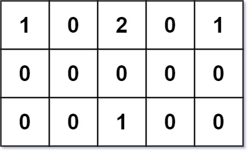

### 1. Description

You are given an `m x n` grid `grid` of values `0`, `1`, or `2`, where:

- each `0` marks **an empty land** that you can pass by freely,

- each `1` marks **a building** that you cannot pass through, and

- each `2` marks **an obstacle** that you cannot pass through.

You want to build a house on an empty land that reaches all buildings in the **shortest total travel** distance. You can only move up, down, left, and right.

Return *the **shortest travel distance** for such a house*. If it is not possible to build such a house according to the above rules, return `-1`.

The **total travel distance** is the sum of the distances between the houses of the friends and the meeting point.

### 2. Function Contract

**Inputs**

- `grid`: The rectangular grid of passable empty land, buildings, and impassable obstacles.

**Return value**

Return the minimum sum of distances from one reachable empty cell to every building, or `-1` when no such cell exists.

### 3. Examples

#### Example 1

- **Input:** `grid = [[1,0,2,0,1],[0,0,0,0,0],[0,0,1,0,0]]`
- **Output:** `7`
- **Explanation:** Given three buildings at (0,0), (0,4), (2,2), and an obstacle at (0,2).
The point (1,2) is an ideal empty land to build a house, as the total travel distance of 3+3+1=7 is minimal.
So return 7.
#### Example 2

- **Input:** `grid = [[1,0]]`
- **Output:** `1`
#### Example 3

- **Input:** `grid = [[1]]`
- **Output:** `-1`

### 4. Constraints

- $m = \text{grid.length}$

- $n = \text{grid}[i].length$

- $1 \le m, n \le 50$

- $\text{grid}[i][j]$ is either `0`, `1`, or `2`.

- There will be **at least one** building in the `grid`.