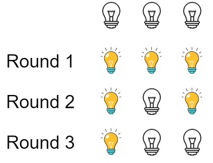

## Description

There are `n` bulbs that are initially off. You first turn on all the bulbs, then you turn off every second bulb.

On the third round, you toggle every third bulb (turning on if it's off or turning off if it's on). For the $$i^{\text{th}}$$ round, you toggle every `i` bulb. For the $$n^{\text{th}}$$ round, you only toggle the last bulb.

Return *the number of bulbs that are on after `n` rounds*.
### Function Contract

**Inputs**

- `n`: The number of bulbs and the number of rounds.

**Return value**

Return the count of bulbs that remain on after rounds `1` through `n`.

### Examples

#### Example 1

- **Input:** $n = 3$
- **Output:** `1`
- **Explanation:** At first, the three bulbs are [off, off, off].
After the first round, the three bulbs are [on, on, on].
After the second round, the three bulbs are [on, off, on].
After the third round, the three bulbs are [on, off, off].
So you should return 1 because there is only one bulb is on.
#### Example 2

- **Input:** $n = 0$
- **Output:** `0`
#### Example 3

- **Input:** $n = 1$
- **Output:** `1`
### Constraints

- $0 \le n \le 10^{9}$