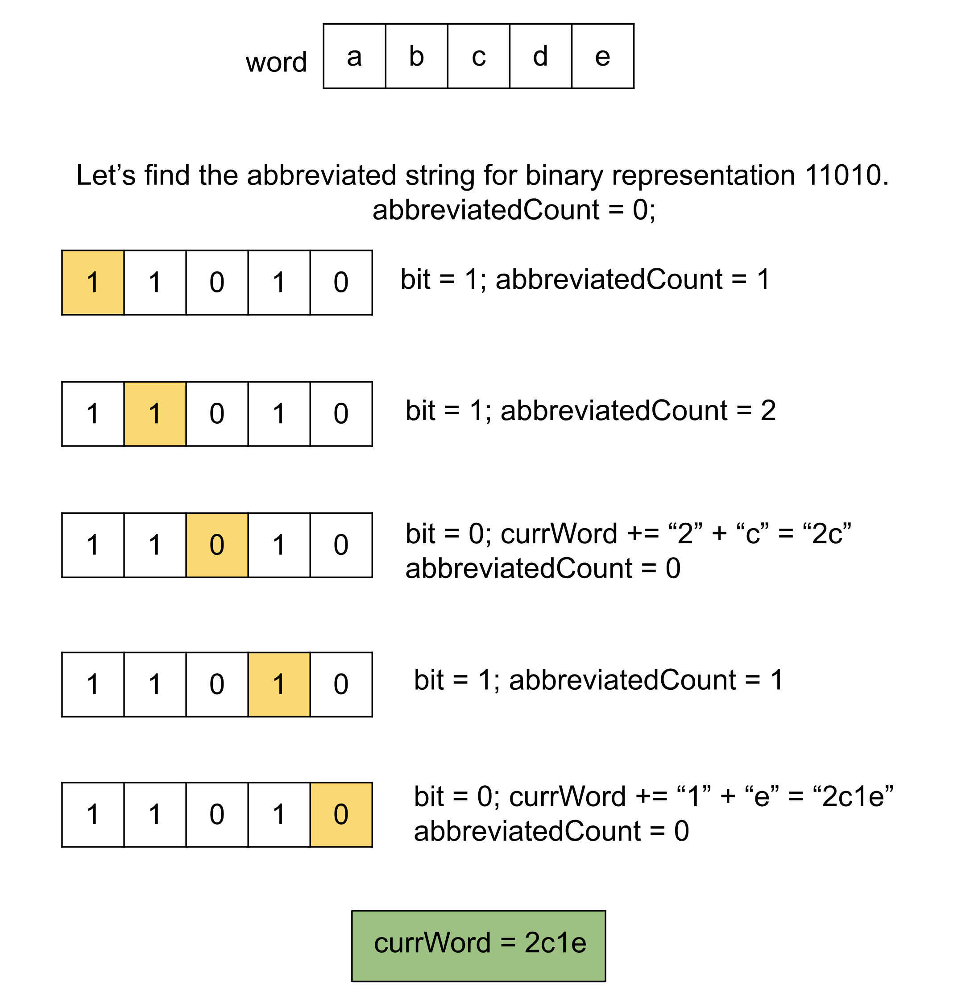

## Solution

---

### Approach 1: Backtracking

#### Intuition

We are given a string `word` of $N$ lowercase English letters. Our task is to choose any number of non-overlapping and non-adjacent substrings from the string and replace them with their length, resulting in an abbreviated string of the original one.

For example, given the string `abcde`, we can choose substrings `bc` and `e`, replacing `bc` with `2` and `e` with `1`, resulting in the abbreviated string `a2d1`. Note that substrings like `bc` and `cd` are invalid because they are adjacent, and substrings like `abc` and `cd` are invalid because they overlap.

An important observation is that the length of the string `word` will be less than 15. To generate all possible abbreviated strings, we need to explore all options. Each character in `word` can either be part of an abbreviated substring or remain as a separate character. We will explore both options for each character and store the resulting strings in a list.

For each character, the first option is to keep it as part of the current string without abbreviation. The second option is to abbreviate it. We track three things: the current string being constructed (`currWord`), the current index in `word` (`index`), and the length of the current substring being abbreviated (`abbreviatedCount`).

When we choose to abbreviate a character, we increment the `abbreviatedCount` by 1 and move to the next index. When we choose not to abbreviate, we add the `abbreviatedCount` to `currWord` (since the current substring ends), then add the character $\text{word}[index]$ to `currWord`, and reset `abbreviatedCount` to 0.

After iterating over all characters in `word`, we add the final `abbreviatedCount` to `currWord` and store the resulting string in a list of all possible abbreviations.

#### Algorithm

1. Initialize an empty list of strings `abbreviations`.

2. Define the method `storeAbbreviations` that has three parameters to track `currWord`, `index`, and `abbreviatedCount`. Do the following:
- If the `index` is equal to the `word` size, store the abbreviated integer corresponding to the last substring to `currWord` and then store it in the list `abbreviations`.
- Define the string `abbreviatedString` as the `abbreviatedCount` in the form of a string or an empty string if the integer is `0`.
- Recursively call the method when we choose not to abbreviate the current character with $index = index + 1$, $abbreviatedCount = 0$, add the`abbreviatedString` and $\text{word}[index]$ to `currWord`.
- When we choose to abbreviate the current character, make a recursive call with $index = index + 1$, $abbreviatedCount = abbreviatedCount + 1$.

3. Call the method `storeAbbreviations` with $index = 0$ and $abbreviatedCount = 0$.
4. Return `abbreviations`.

#### Implementation

```python
class Solution:
    def store_abbreviations(
        self, abbreviations, word, curr_word, index, abbreviated_count
    ):
        if index == len(word):
            # If the length of the last abbreviated substring is 0, add an empty string.
            if abbreviated_count > 0:
                curr_word += str(abbreviated_count)
            abbreviations.append(curr_word)
            return

        # Option 1: Keep the current character.
        self.store_abbreviations(
            abbreviations,
            word,
            curr_word
            + (str(abbreviated_count) if abbreviated_count > 0 else "")
            + word[index],
            index + 1,
            0,
        )

        # Option 2: Abbreviate the current character.
        self.store_abbreviations(
            abbreviations, word, curr_word, index + 1, abbreviated_count + 1
        )

    def generateAbbreviations(self, word):
        abbreviations = []
        self.store_abbreviations(abbreviations, word, "", 0, 0)
        return abbreviations
```

#### Complexity Analysis

Here, $N$ is the length of the string `word`.

* Time complexity: $O(N \times 2^N)$.

  Each of the $N$ characters in the string `word` has two choices that we will make until we do it for all the characters. Also, for each string produced, we are appending the `abbreviatedString` during the process which adds another $O(N)$ time. Since we are going to generate $2^N$ strings, therefore the time complexity is equal to $O(2^N)$.

* Space complexity: $O(N)$.

    The space used to store the output is generally not considered part of the space complexity. Thus, the only space required is the stack space, the maximum number of active function calls in the stack will be equal to $N$ one for each character in the string `word`. Hence, the space complexity is equal to $O(N)$.

---

### Approach 2: Bit Manipulation

#### Intuition

This approach is very similar to the previous one, following the same procedure but in an iterative manner. From the previous approach, we know that each character has two choices, and we will expand each choice for all characters to generate all $2^N$ strings. Another way to view this is by using bits: consider the numbers from `0` to $2^N - 1$ and their binary representation. If a bit in the binary representation is `0`, it means we are not going to abbreviate the corresponding character; if the bit is `1`, it means this character will be abbreviated.

The starting number `0` has all bits as `0`, meaning none of the characters should be abbreviated, while the last number $2^N - 1$ has all bits as `1`, meaning all characters should be abbreviated as a single substring. The integers in between represent the different combinations of choices for each character.

To represent all possible combinations for choices of all characters, we convert these binary numbers to strings that represent the abbreviated form of the original string. When a bit is `1`, we need to add it to the abbreviated string and hence we keep an integer `abbreviatedCount` to track the length of the current substring that is being abbreviated. We increment this counter when the bit is `1`. When the bit is `0`, we append the current character as it is to the current word we are preparing, `currWord`. However, before appending the character, we append the abbreviated string of the last substring length represented by `abbreviatedCount`, then reset `abbreviatedCount` to `0`.

For each of the integers from `0` to $2^N - 1$, we repeat this process and store the `currWord` in the list of strings `abbreviations`, which we can return at the end.



#### Algorithm

1. Initialize an empty list of strings `abbreviations`.
2. Iterate over each number from `0` to $$2^N$ - 1$ and for each such integer `mask` do the following:

- Initialize an empty string `currWord` and integer `abbreviatedCount` to `0`.
- Iterate over the integers from `0` to $N - 1$ `Index` that represents the bits, for each `Index`
- If the bit at `Index` is `1`, increment the counter `abbreviatedCount`
- If the bit at `Index` is `0`, append the integer `abbreviatedCount` (if not `0`) and then append the character $\text{word}[Index]$ to `currWord`. Reset `abbreviatedCount` to `0`.
- After iterating over all bits, append the last substring length (if not `0`) using the variable `abbreviatedCount` to `currWord`.
- Add the string `currWord` to `abbreviations`.

3. Return `abbreviations`.

#### Implementation

```python
class Solution:
    def generateAbbreviations(self, word):
        N = len(word)
        abbreviations = []

        for mask in range(1 << N):
            curr_word = []
            abbreviated_count = 0

            for index in range(N):
                # If the bit at the position index is 1, increment the abbreviated substring.
                if mask & (1 << index):
                    abbreviated_count += 1
                else:
                    # Append the last substring and then the current character.
                    if abbreviated_count > 0:
                        curr_word.append(str(abbreviated_count))
                        abbreviated_count = 0
                    curr_word.append(word[index])

            if abbreviated_count > 0:
                curr_word.append(str(abbreviated_count))

            abbreviations.append("".join(curr_word))

        return abbreviations
```

#### Complexity Analysis

Here, $N$ is the length of the string `word`.

* Time complexity: $O(N \times 2^N)$.

    We iterate over the integers from `0` to $$2^N$ - 1$and for each one of these we will iterate over the bits from `0` to `N`, hence the total time complexity is equal to$O(N \times 2^N)$.

* Space complexity: $O(1)$.

    The space used to store the output is generally not considered part of the space complexity. Thus no extra space is required. Hence, the space complexity is constant.

---