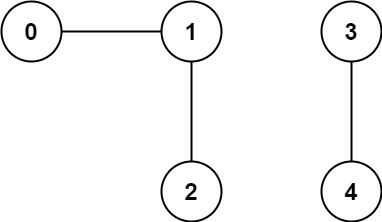
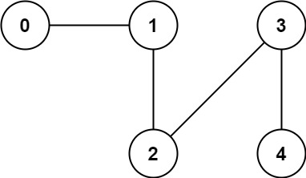

### 1. Description

You have a graph of `n` nodes. You are given an integer `n` and an array `edges` where $\text{edges}[i] = [a_{i}, b_{i}]$ indicates that there is an edge between $a_{i}$ and $b_{i}$ in the graph.

Return *the number of connected components in the graph*.

### 2. Function Contract

**Inputs**

- `n`: The number of graph nodes, labeled from `0` through $n - 1$.
- `edges`: The undirected edges represented as endpoint pairs.

**Return value**

Return the number of maximal groups of nodes connected by paths.

### 3. Examples

#### Example 1

- **Input:** $n = 5, edges = [[0,1],[1,2],[3,4]]$
- **Output:** `2`

#### Example 2

- **Input:** $n = 5, edges = [[0,1],[1,2],[2,3],[3,4]]$
- **Output:** `1`

### 4. Constraints

- $1 \le n \le 2000$

- $1 \le \text{edges.length} \le 5000$

- $\text{edges}[i] = [a_{i}, b_{i}]$

- $a_{i} \neq b_{i}$

- There are no repeated edges.
