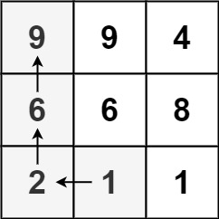
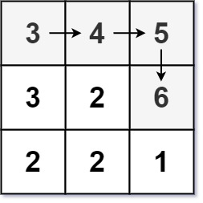

## Description

Given an `m x n` integers `matrix`, return *the length of the longest increasing path in *`matrix`.

From each cell, you can either move in four directions: left, right, up, or down. You **may not** move **diagonally** or move **outside the boundary** (i.e., wrap-around is not allowed).
### Function Contract

**Inputs**

- `matrix`: An $m \times n$ integer matrix.

**Return value**

Return the number of cells in the longest path whose orthogonally adjacent values are strictly increasing.

### Examples

#### Example 1

- **Input:** $matrix = [[9,9,4],[6,6,8],[2,1,1]]$
- **Output:** `4`
- **Explanation:** The longest increasing path is [1, 2, 6, 9].
#### Example 2

- **Input:** $matrix = [[3,4,5],[3,2,6],[2,2,1]]$
- **Output:** `4`
- **Explanation:** The longest increasing path is [3, 4, 5, 6]. Moving diagonally is not allowed.
#### Example 3

- **Input:** $matrix = [[1]]$
- **Output:** `1`
### Constraints

- $m = \text{matrix.length}$

- $n = \text{matrix}[i].length$

- $1 \le m, n \le 200$

- $0 \le \text{matrix}[i][j] \le 2^{31} - 1$