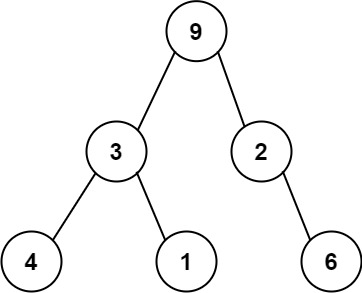

### 1. Description

One way to serialize a binary tree is to use **preorder traversal**. When we encounter a non-null node, we record the node's value. If it is a null node, we record using a sentinel value such as `'#'`.

For example, the above binary tree can be serialized to the string `"9,3,4,#,#,1,#,#,2,#,6,#,#"`, where `'#'` represents a null node.

Given a string of comma-separated values `preorder`, return `true` if it is a correct preorder traversal serialization of a binary tree.

It is **guaranteed** that each comma-separated value in the string must be either an integer or a character `'#'` representing null pointer.

You may assume that the input format is always valid.

- For example, it could never contain two consecutive commas, such as `"1,,3"`.

### 2. Function Contract

**Inputs**

- `preorder`: A validly formatted comma-separated sequence of integer and `#` tokens.

**Return value**

Return `true` if the entire token sequence is exactly one valid binary-tree preorder serialization; otherwise return `false`.

### 3. Note

You are not allowed to reconstruct the tree.

### 4. Examples

#### Example 1

- **Input:** `preorder = "9,3,4,#,#,1,#,#,2,#,6,#,#"`
- **Output:** `true`

#### Example 2

- **Input:** `preorder = "1,#"`
- **Output:** `false`

#### Example 3

- **Input:** `preorder = "9,#,#,1"`
- **Output:** `false`

### 5. Constraints

- $1 \le \text{preorder.length} \le 10^{4}$

- `preorder` consist of integers in the range `[0, 100]` and `'#'` separated by commas `','`.
