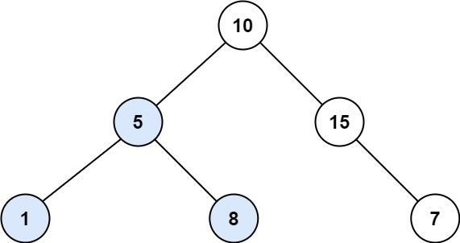

## Description

Given the root of a binary tree, find the largest subtree, which is also a Binary Search Tree (BST), where the largest means subtree has the largest number of nodes.

A **Binary Search Tree (BST)** is a tree in which all the nodes follow the below-mentioned properties:

- The left subtree values are less than the value of their parent (root) node's value.

- The right subtree values are greater than the value of their parent (root) node's value.

**Note:** A subtree must include all of its descendants.
### Function Contract

**Inputs**

- `root`: The binary-tree root; app cases encode the tree in level order.

**Return value**

Return the number of nodes in the largest complete subtree that satisfies the strict BST ordering rules.

### Examples

#### Example 1

**

**

- **Input:** `root = [10,5,15,1,8,null,7]`
- **Output:** `3`
- **Explanation:** The Largest BST Subtree in this case is the highlighted one. The return value is the subtree's size, which is 3.
#### Example 2

- **Input:** `root = [4,2,7,2,3,5,null,2,null,null,null,null,null,1]`
- **Output:** `2`
### Constraints

- The number of nodes in the tree is in the range $[0, 10^{4}]$.

- $-10^{4} \le \text{Node.val} \le 10^{4}$

**Follow up:** Can you figure out ways to solve it with `O(n)` time complexity?