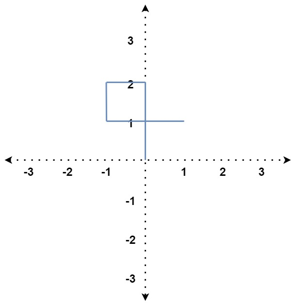
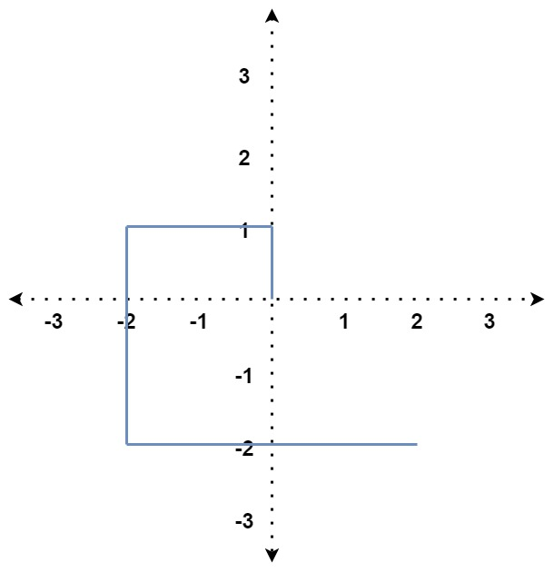
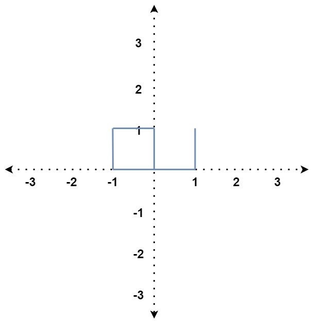

## Description

You are given an array of integers `distance`.

You start at the point `(0, 0)` on an **X-Y plane,** and you move $\text{distance}[0]$ meters to the north, then $\text{distance}[1]$ meters to the west, $\text{distance}[2]$ meters to the south, $\text{distance}[3]$ meters to the east, and so on. In other words, after each move, your direction changes counter-clockwise.

Return `true` *if your path crosses itself or *`false`* if it does not*.
### Function Contract

**Inputs**

- `distance`: The positive lengths of successive north, west, south, and east moves, with that direction cycle repeated as needed.

**Return value**

Return `true` if any part of the path crosses an earlier part; otherwise return `false`.

### Examples

#### Example 1

- **Input:** $distance = [2,1,1,2]$
- **Output:** `true`
- **Explanation:** The path crosses itself at the point (0, 1).
#### Example 2

- **Input:** $distance = [1,2,3,4]$
- **Output:** `false`
- **Explanation:** The path does not cross itself at any point.
#### Example 3

- **Input:** $distance = [1,1,1,2,1]$
- **Output:** `true`
- **Explanation:** The path crosses itself at the point (0, 0).
### Constraints

- $1 \le \text{distance.length} \le 10^{5}$

- $1 \le \text{distance}[i] \le 10^{5}$