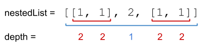
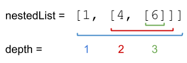

### 1. Description

You are given a nested list of integers `nestedList`. Each element is either an integer or a list whose elements may also be integers or other lists.

The **depth** of an integer is the number of lists that it is inside of. For example, the nested list `[1,[2,2],[[3],2],1]` has each integer's value set to its **depth**.

Return *the sum of each integer in *`nestedList`* multiplied by its **depth***.

### 2. Function Contract

**Inputs**

- `nestedList`: A list of `NestedInteger` objects. Each object either stores one integer or a nested list of more `NestedInteger` objects.

JSON cases use ordinary nested arrays and integers. The runner reconstructs the `NestedInteger` interface objects before calling `solve(nestedList)`.

**Return value**

Return the sum of each stored integer multiplied by the number of enclosing lists around it.

### 3. Examples

#### Example 1

- **Input:** $nestedList = [[1,1],2,[1,1]]$
- **Output:** `10`
- **Explanation:** Four 1's at depth 2, one 2 at depth 1. 1*2 + 1*2 + 2*1 + 1*2 + 1*2 = 10.
#### Example 2

- **Input:** $nestedList = [1,[4,[6]]]$
- **Output:** `27`
- **Explanation:** One 1 at depth 1, one 4 at depth 2, and one 6 at depth 3. 1*1 + 4*2 + 6*3 = 27.
#### Example 3

- **Input:** $nestedList = [0]$
- **Output:** `0`

### 4. Constraints

- $1 \le \text{nestedList.length} \le 50$

- The values of the integers in the nested list is in the range `[-100, 100]`.

- The maximum **depth** of any integer is less than or equal to `50`.