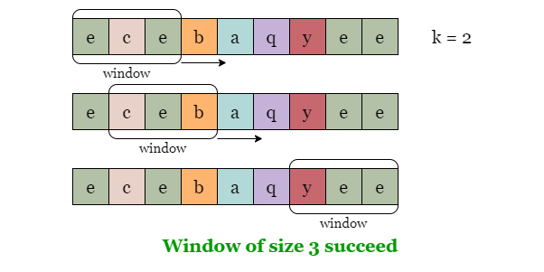
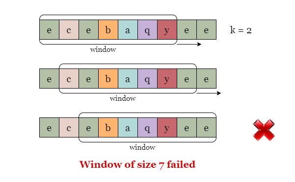
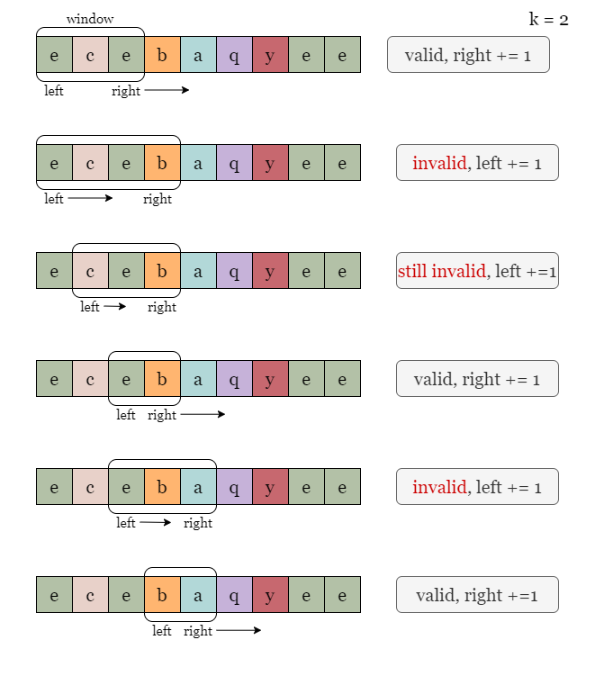
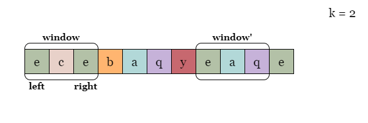
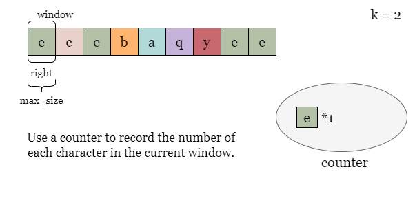
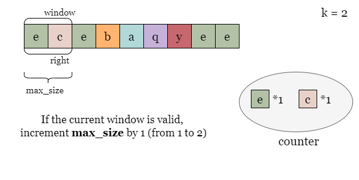
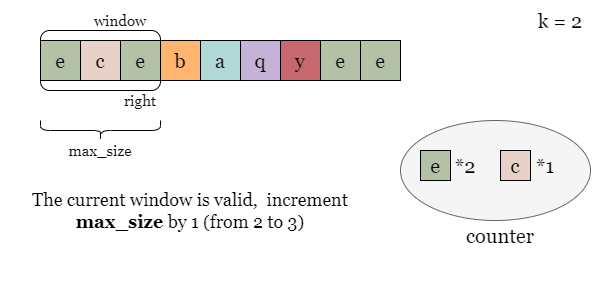
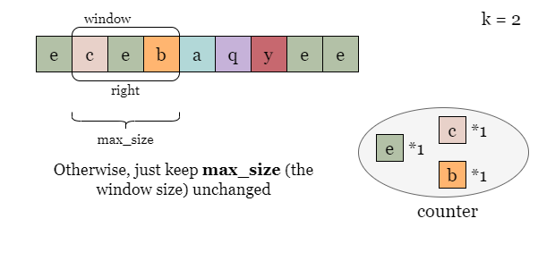
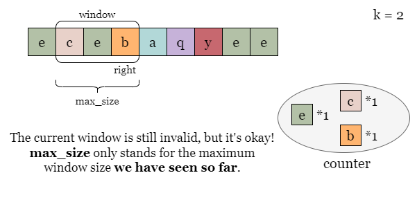

## Solution

---

### Approach 1: Binary Search + Fixed Size Sliding Window

#### Intuition

Since we are asked to find the longest substring of identical characters, we could first set up a target length $\text{max}_{size}$. To check if a valid substring with this length exists, we iterate over `s` and check each substring of length $\text{max}_{size}$.  If we find a substring that contains `k` or fewer unique characters, then this substring is considered valid.

The method described in this solution is also known as the fixed sliding window algorithm. As we traverse the sequence from left to right, we maintain a fixed length $\text{max}_{size}$ for the subarray, which can be visualized as moving a window of that length over the input. As shown in the pictures below, if we set the window length to $\text{max}_{size} = 3$, we can find some valid windows that only contain `2` or fewer unique characters.



However, if we set the length to $\text{max}_{size} = 7$, we will not find any valid windows, since the only 3 windows of size `7` contain more than `2` distinct characters.



<br>

During the iteration, when we move the right boundary of the window from $right - 1$ to `right`, we don't need to recalculate the count of each character over again, note that two adjacent windows only differ by two characters ($s[right]$, $s[right - \text{max}_{size}]$). We only need to increment the count of $s[right]$ by 1 and decrement the count of $s[right - \text{max}_{size}]$ by `1`, based on the result of the previous window.

> To keep track of the counts, we can use a hash map `counter`. The size of `counter` can be used to represent the number of distinct characters in the window, thus after decrementing the count $s[right - \text{max}_{size}]$ by `1`, we need to check the value of $s[right - \text{max}_{size}]$. If its value equals 0, it implies that the current window does not contain $s[right - \text{max}_{size}]$, but the key-value pair $(s[right - \text{max}_{size}], 0)$ is still taking up space in the hash map. Thus we need to delete this key-value pair from `counter`.

<br>

To quickly find the maximum valid window length, we can use binary search. To begin, we need to define a search space that ensures the maximum window length we are looking for is in this range. We can set the left boundary of the search space to $left = k$ (a window of size `k` always contains no more than `k` unique characters) and the right boundary to $right = n$, which is the maximum possible window length.

We will now perform a binary search on the interval `[left, right]`. In each iteration, we compute the midpoint of the interval, which we denote as `mid`. Then, we slide a window of length `mid` using the previous approach to check whether there exists at least one valid window. If we find a valid window, we then continue to search for a larger window length in `[mid, right]`, the right half of the interval. Otherwise, if `mid` is still too large, we continue our search in `[left, mid - 1]`, the left half of the search space.

<br>

#### Algorithm

1) If $k \ge n$, we don't need to perform the binary search, just return `n`.
2) Initialize the search space as $left = k$, $right = n$.

3) Define a function `isValid` to help verify if there exists a valid subarray of length `size`:

- Count the number of each character in `s[:size]` in a hash map `counter`, return true if $len(counter) \le k$

- Iterate the index of the right boundary of the window from $size - 1$ to `n`. At each step `i`, increment $counter[s[i]]$ by 1 and decrement $counter[s[i - size]]$ by 1, if $counters[s[i - size]] = 0$, we delete this item from `counter`.
- Return true if $len(counter) \le k$ at any point in this iteration
- Return false if we finish iterating without finding a valid window.

4) While `left < right`:
- Compute the middle value as $mid = right - (right - left) / 2$.
- Check if the window of size `mid` is valid using the helper method.

- If `isValid(mid)` is true, let $left = mid$ and repeat.

- If `isValid(mid)` is false, let $right = mid - 1$ and repeat.

5) Return `left` once the binary search ends.

#### Implementation

```python
class Solution:
    def lengthOfLongestSubstringKDistinct(self, s: str, k: int) -> int:
        n = len(s)
        if k >= n:
            return n
        left, right = k, n

        def isValid(size):
            counter = collections.Counter(s[:size])
            if len(counter) <= k:
                return True
            for i in range(size, n):
                counter[s[i]] += 1
                counter[s[i - size]] -= 1
                if counter[s[i - size]] == 0:
                    del counter[s[i - size]]
                if len(counter) <= k:
                    return True
            return False

        while left < right:
            mid = (left + right + 1) // 2

            if isValid(mid):
                left = mid
            else:
                right = mid - 1

        return left
```

#### Complexity Analysis

Let $n$ be the length of the input string `s`.

* Time complexity: $O(n \cdot\log n)$

- We set the search space as `[k, n]`, it takes at most $O(\log n)$ binary search steps.
- At each step, we iterate over `s` which takes $O(n)$ time.

* Space complexity: $O(n)$

- We need to update the boundary indices `left` and `right`.

- During the iteration, we use a hash map `counter` which could contain at most $O(n)$ distinct characters.

<br/>

---

### Approach 2: Sliding Window

#### Intuition

We can also find the longest valid window with fewer traversals. Unlike the previous fixed-length sliding window solution, this time we can adjust the window length based on the situation. We will still use the counter `counter` to record the counter of each type of character within the window.

Specifically, if the current window is valid, we can try to expand the window by moving the right boundary one position to the right, $right = right + 1$. On the other hand, if the current window is invalid, we keep moving the left boundary to the right (equivalent to removing the leftmost character from the window) until the window becomes valid, that is $left = left + 1$. During this process, we constantly record the longest valid window seen so far.

As shown in the following figure, we keep adjusting the size of the window and recording the maximum size of the valid window.



> Similiarly, we delete the key $s[i]$ from `counter` if $counter[s[i]] = 0$.

<br>

#### Algorithm

1) Use a hash map `counter` to record the number of each character in the current window.
2) Set $left = 0$ and $\text{max}_{size} = 0$, iterate `right` from `0` to $n - 1$, at each step `right`, increment $s[right]$ by 1:
- Increment $counter[s[right]]$ by 1.
- While `len(counter) > k`, decrement $counter[s[left]]$ by 1. Delete $s[left]$ from `counter` if $counter[s[left] = 0$, and increment `left` by 1.

- Now the window is valid, update the maximum size of valid window as $\text{max}_{size} = max(\text{max}_{size}, right - left + 1)$.
3) Return $\text{max}_{size}$ when the iteration ends.

#### Implementation

```python
class Solution:
    def lengthOfLongestSubstringKDistinct(self, s: str, k: int) -> int:
        n = len(s)
        max_size = 0
        counter = collections.Counter()

        left = 0
        for right in range(n):
            counter[s[right]] += 1

            while len(counter) > k:
                counter[s[left]] -= 1
                if counter[s[left]] == 0:
                    del counter[s[left]]
                left += 1

            max_size = max(max_size, right - left + 1)

        return max_size
```

#### Complexity Analysis

Let $n$ be the length of the input string `s` and $k$ be the maximum number of distinct characters.

* Time complexity: $O(n)$

- In the iteration of the right boundary `right`, we shift it from `0` to $n - 1$. Although we may move the left boundary `left` in each step, `left` always stays to the left of `right`, which means `left` moves at most $n - 1$ times.
- At each step, we update the value of an element in the hash map `counter`, which takes constant time.
- To sum up, the overall time complexity is $O(n)$.

* Space complexity: $O(k)$

- We need to record the occurrence of each distinct character in the valid window. During the iteration, there might be at most $O(k + 1)$ unique characters in the window, which takes $O(k)$ space.

<br/>

---

### Approach 3: Sliding Window II

#### Intuition

In the previous solution, we need to ensure that the current window is always valid. If the window contains more than `k` distinct characters, we need to continuously remove the leftmost character in the window. During this process, the size of the window may decrease, even smaller than the previous valid window. Taking the figure below as an example, the `window` on the left is valid, but the `window'` on the right is not valid, and we need to remove the left characters from it to make it valid.



<br>

However, we don't need to decrease the size of the window.

If we have already found a window of length $\text{max}_{size}$, then what we need to do next is to search for a larger valid window, for example, a window with length $\text{max}_{size} + 1$. Therefore, in the following sliding window process, even if the current window with size $\text{max}_{size}$ is not valid, there is no problem, because we have already found a window of length $\text{max}_{size}$ before, so we may as well continue looking for a larger window.

<br>

Understanding this, we can simplify the solution in approach 2:

Again, we use a hash map `counter` to keep track of the frequency of each letter in the current window. When we increase the window length by 1, we need to increase the count of the character at the current right boundary $counter[s[right]]$ by 1.



If the expanded window is still valid, it means that we get a larger valid window with length $\text{max}_{size} + 1$ (from `2` to `3`). We can continue to move the boundary `right`.




However, if the expanded window is invalid, we only need to remove the leftmost character in the window to keep the window length still at $\text{max}_{size}$ (from `4` to `3`), that is, decrease $counter[s[right - \text{max}_{size}]]$ by 1.

> Similiarly, we delete the key $s[i]$ from `counter` if $counter[s[i]] = 0$.



Since the expanded window of length `4` was invalid, we removed a character from the leftmost side of the window to make its length `3` again. Although the current window is still invalid, we don't need to keep shrinking it because we have previously found a valid window of length `3`. We can continue to shift the boundary `right` to try the next window of size `4`.



Once this iteration is over, $\text{max}_{size}$ represents the maximum size of the valid window.

<br>

#### Algorithm

1) Use a hash map `counter` to keep track of the number of each character in the current window.
2) Set $\text{max}_{size} = 0$, iterate `right` from `0` to $n - 1$, at each step `right`, increment $s[right]$ by 1, and increment $counter[s[right]]$ by 1.
- If `len(counter) > k`, decrement $counter[s[right - \text{max}_{size}]]$ by 1. Delete $counter[s[right - \text{max}_{size}]]$ if its value equals 0.
- Otherwise, increment $\text{max}_{size}$ by 1.

3) Return $\text{max}_{size}$ when the iteration ends.

#### Implementation

```python
class Solution:
    def lengthOfLongestSubstringKDistinct(self, s: str, k: int) -> int:
        max_size = 0
        counter = collections.Counter()

        for right in range(len(s)):
            counter[s[right]] += 1

            if len(counter) <= k:
                max_size += 1
            else:
                counter[s[right - max_size]] -= 1
                if counter[s[right - max_size]] == 0:
                    del counter[s[right - max_size]]

        return max_size
```

#### Complexity Analysis

Let $n$ be the length of the input string `s` and $k$ be the maximum number of distinct characters.

* Time complexity: $O(n)$

- In the iteration of the right boundary `right`, we shift it from `0` to $n - 1$.
- At each step, we update the number of $s[right]$ and/or the number of $s[right - \text{max}_{size}]$ in the hash map `counter`, which takes constant time.
- To sum up, the overall time complexity is $O(n)$.

* Space complexity: $O(n)$

- We need to record the occurrence of each distinct character in the valid window. Since we do not shrink the window, the sliding window can accumulate characters as it moves along the string. In the worst case, if we encounter a long substring with many distinct characters, the space required can grow up to $O(n)$, where $n$ is the length of the input string.

<br/>