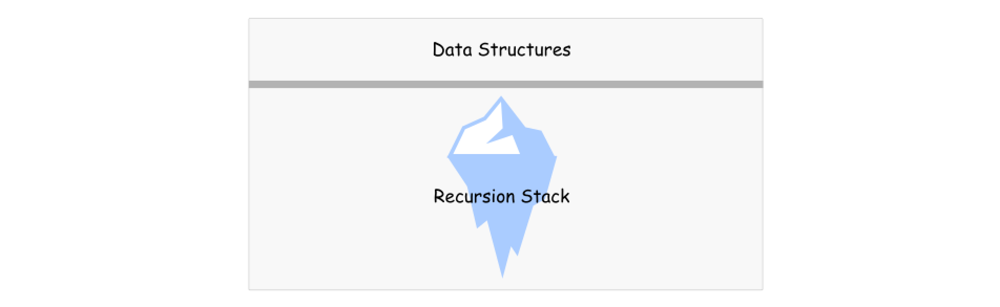
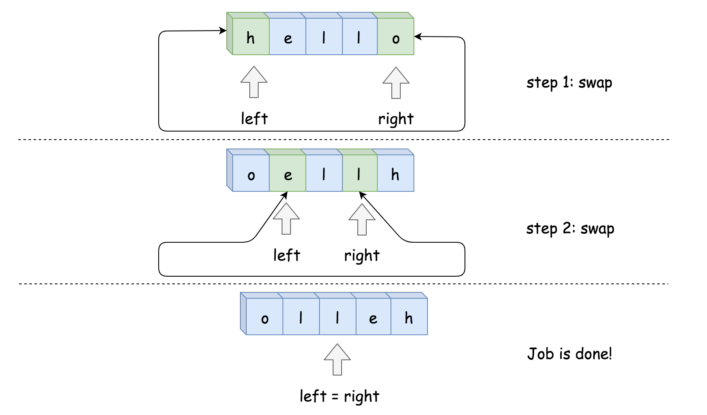

## Solution Article

---

### Overview

_Life is short, use Python._ (c)

```python
class Solution:
    def reverseString(self, s):
        s.reverse()
```

Speaking seriously, let's use this problem to discuss two things:

- Does _in-place_ mean constant space complexity?

- Two pointers approach.
<br />
<br />

---
### Approach 1: Recursion, In-Place, $\mathcal{O}(N)$ Space

**Does _in-place_ mean constant space complexity?**

No. [By definition](https://en.wikipedia.org/wiki/In-place_algorithm), an in-place algorithm is an algorithm that transforms input using no auxiliary data structure.

The tricky part is that space is used by many actors, not only by data structures. The classical example is to use a recursive function without any auxiliary data structures.

Is it in place? Yes.

Is it constant space? No, because of the recursion stack.



**Algorithm**

Here is an example. Let's implement the recursive function `helper` which receives two pointers, left and right, as arguments.

- Base case: if $left \ge right$, do nothing.

- Otherwise, swap $s[left]$ and $s[right]$ and call $helper(left + 1, right - 1)$.

To solve the problem, call the helper function passing the head and tail indexes as arguments: $return helper(0, len(s) - 1)$.

**Implementation**

```python
class Solution:
    def reverseString(self, s):
        def helper(left, right):
            if left < right:
                s[left], s[right] = s[right], s[left]
                helper(left + 1, right - 1)

        helper(0, len(s) - 1)
```

**Complexity Analysis**

* Time complexity : $\mathcal{O}(N)$ time to perform $N/2$ swaps.

* Space complexity : $\mathcal{O}(N)$ to keep the recursion stack.
<br />
<br />

---
### Approach 2: Two Pointers, Iteration, $\mathcal{O}(1)$ Space

**Two Pointers Approach**

In this approach, two pointers are used to process two array elements at the same time. Usual implementation is to set one pointer in the beginning and one at the end and then to move them until they both meet.

Sometimes one needs to generalize this approach in order to use three-pointers, like for classical [Sort Colors problem](https://leetcode.com/articles/sort-colors/).

**Algorithm**

- Set the pointer left at index 0, and the pointer right at index $n - 1$, where n is the number of elements in the array.

- While left < right:

- Swap $s[left]$ and $s[right]$.

- Move the left pointer one step right, and the right pointer one step left.



**Implementation**

```python
class Solution:
    def reverseString(self, s):
        left, right = 0, len(s) - 1
        while left < right:
            s[left], s[right] = s[right], s[left]
            left, right = left + 1, right - 1
```

**Complexity Analysis**

* Time complexity : $\mathcal{O}(N)$ to swap $N/2$ element.

* Space complexity : $\mathcal{O}(1)$, it's a constant space solution.