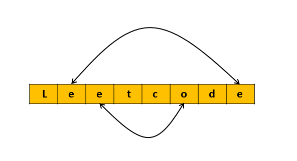

## Solution Article

---

### Overview

This problem is an extension to the problem [344 Reverse String](https://leetcode.com/problems/reverse-string/). In this problem, we have to reverse only the vowels instead of every character as in the original problem.
</br>

---

### Approach 1: Two Pointers

#### Intuition

we will initialize two pointers, one pointer (referred as `left`) pointing to the left end of the input string and the other pointer (named as `right`) pointing to the right end of the string.

The only difference compared to the problem [344 Reverse String](https://leetcode.com/problems/reverse-string/) is that we don't want to swap all characters instead we want to swap just the vowels. So the `left` and `right` pointers as we discussed should be pointing to the vowels only.

To achieve this, we would initialize a `left` pointer to `0` and keep incrementing it until we get a vowel. Similarly, we initialize the `right` pointer to the last index and keep decrementing it until it points to a vowel. At each such iteration where both the pointers are pointing to the vowel, we would swap the characters at these pointers.



#### Algorithm
1. Initialize the left pointer `start` to `0`, and the right pointer `end` to $\text{s.size}() - 1$.
2. Keep iterating until the left pointer catches up with the right pointer:
   1. Keep incrementing the left pointer `start` until it's pointing to a vowel character.
   2. Keep decrementing the right pointer `end` until it's pointing to a vowel character.
   3. Swap the characters at the `start` and `end`.
   4. Increment the `start` pointer and decrement the `end` pointer.
3. Return the string `s`.

#### Implementation

```cpp
class Solution {
public:
    // Return true if the character is a vowel (case-insensitive)
    bool isVowel(char c) {
        return c == 'a' || c == 'i' || c == 'e' || c == 'o' || c == 'u'
            || c == 'A' || c == 'I' || c == 'E' || c == 'O' || c == 'U';
    }

    string reverseVowels(string s) {
        int start = 0;
        int end  = s.size() - 1;

        // While we still have characters to traverse
        while (start < end) {
            // Find the leftmost vowel
            while (start < s.size() && !isVowel(s[start])) {
                start++;
            }
            // Find the rightmost vowel
            while (end >= 0 && !isVowel(s[end])) {
                end--;
            }
            // Swap them if start is left of end
            if (start < end) {
                swap(s[start++], s[end--]);
            }
        }

        return s;
    }
};
```

#### Complexity Analysis

 Here, $N$ is the length of the string `s`.

* Time complexity: $O(N)$

   It might be tempting to say that there are two nested loops and hence the complexity would be $O(N^2)$. However, if we observe closely the pointers `start` and `end` will only traverse the index once. Each element of the string `s` will be iterated only once either by the left or right pointer and not both. We swap characters when both pointers point to vowels which are $O(1)$ operation. Hence the total time complexity will be $O(N)$.

  Note that in Java we need to convert the string to a char array as strings are immutable and hence it would take $O(N)$ time.

* Space complexity: $O(N)$

  In C++ we only need an extra temporary variable to perform the swap and hence the space complexity is $O(1)$. However, in Java, we need to convert the string to a char array that would take $O(N)$ space, and therefore the space complexity for Java would be $O(N)$.

<br/>

---