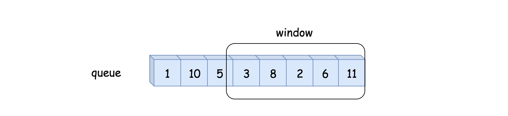
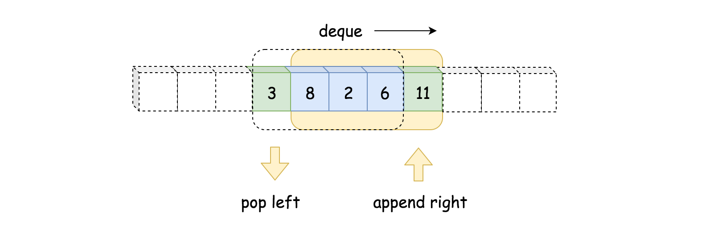
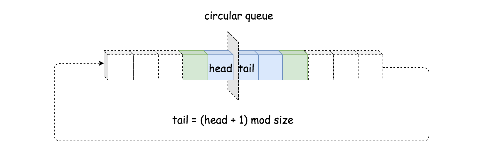
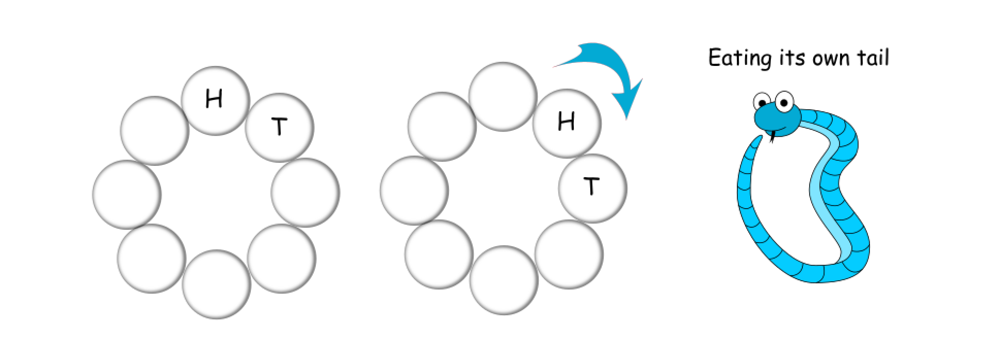

[TOC]

## Video Solution
---

<div>
    <div class="video-container">
        <iframe src="https://player.vimeo.com/video/782769732" width="640" height="360" frameborder="0" allow="autoplay; fullscreen" allowfullscreen></iframe>
    </div>
</div>

<div>
</div>

## Solution Article

---

### Approach 1: Array or List

#### Intuition

Following the description of the problem, we could simply keep track of all the incoming values with the data structure of *Array* or *List*. Then from the data structure, later we retrieve the necessary elements to calculate the average.



#### Algorithm

- First, we initialize a variable `queue` to store the values from the data stream, and the variable `n` for the size of the moving window.

- At each invocation of `next(val)`, we first append the value to the queue. We then retrieve the last `n` values from the queue, in order to calculate the average.

#### Implementation

```python
class MovingAverage:
    def __init__(self, size: int):
        self.size = size
        self.queue = []

    def next(self, val: int) -> float:
        size, queue = self.size, self.queue
        queue.append(val)
        # calculate the sum of the moving window
        window_sum = sum(queue[-size:])

        return window_sum / min(len(queue), size)
```

#### Complexity Analysis

Let $N$ be the size of the moving window and $M$ be the number of calls made to `next`.

- Time complexity: $O(N \cdot M)$

    The `next` method is called $M$ times. In each call, the method iterates over the last $N$ elements of the queue to calculate the sum of the moving window. Since the maximum number of elements in the window is $N$, the loop runs in $O(N)$ time for each call to `next`. Therefore, the total time complexity for $M$ calls is $O(N \cdot M)$.

    Additionally, the `queue.add(val)` operation is $O(1)$ on average for an `ArrayList`, so it does not significantly affect the overall time complexity.

- Space complexity: $O(M)$

    The space complexity is dominated by the storage of the queue, which can grow up to the size of the total number of elements added to it. Since `next` is called $M$ times, the queue can store up to $M$ elements. Therefore, the space complexity is $O(M)$.

    The auxiliary space used for variables like `windowSum` and loop indices is constant, so it does not affect the overall space complexity.

---

### Approach 2: Double-ended Queue

#### Intuition

We could do better than the first approach in both time and space complexity.

>First of all, one might notice that we do not need to keep all values from the data stream, but rather the last `n` values which falls into the moving window.

By definition of the moving window, at each step, we add a new element to the window, and at the same time we remove the oldest element from the window. Here, we could apply a data structure called *double-ended queue* (_a.k.a_ deque) to implement the moving window, which would have the constant time complexity ($\mathcal{O}(1)$) to add or remove an element from both its ends. With the deque, we could reduce the space complexity down to $\mathcal{O}(N)$ where $N$ is the size of the moving window.



>Secondly, to calculate the sum, we do not need to reiterate the elements in the moving window.

We could keep the sum of the previous moving window, then in order to obtain the sum of the new moving window, we simply add the new element and deduce the oldest element. With this measure, we then can reduce the time complexity to constant.

#### Algorithm

Here is the definition of the _deque_ from Python. We have similar implementation of deque in other programming languages such as Java.

>Deques are a generalization of stacks and queues (the name is pronounced `deck` and is short for `double-ended queue`). Deques support thread-safe, memory efficient appends and pops from either side of the deque with approximately the same $\mathcal{O}(1)$ performance in either direction.

Follow the intuition, we replace the queue with the _deque_ and add a new variable $\text{window}_{sum}$ in order to calculate the sum of moving window in constant time.

#### Implementation

```python
from collections import deque

class MovingAverage:
    def __init__(self, size: int):
        self.size = size
        self.queue = deque()
        # number of elements seen so far
        self.window_sum = 0
        self.count = 0

    def next(self, val: int) -> float:
        self.count += 1
        # calculate the new sum by shifting the window
        self.queue.append(val)
        tail = self.queue.popleft() if self.count > self.size else 0

        self.window_sum = self.window_sum - tail + val

        return self.window_sum / min(self.size, self.count)
```

#### Complexity Analysis

- Time complexity: $O(M)$

    The `next` method is called $M$ times. In each call, the operations performed include adding an element to the `Deque` (`queue.add(val)`), potentially removing an element from the front of the `Deque`, and updating the `windowSum`. All these operations are $O(1)$ since deque supports constant-time add and poll operations. Therefore, the total time complexity for $M$ calls is $O(M)$.

    Unlike the previous implementation, this approach avoids iterating over the entire window for each call, making it a bit more efficient.

- Space complexity: $O(N)$

    The space complexity is dominated by the storage of the `Deque`, which stores at most $N$ elements (the size of the moving window). Even if `next` is called $M$ times, the `Deque` will never grow beyond $N$ elements because elements are removed when the window size exceeds $N$. Therefore, the space complexity is $O(N)$.

    The auxiliary space used for variables like `windowSum`, `count`, and `tail` is constant, so it does not affect the overall space complexity.

---

### Approach 3: Circular Queue with Array

#### Intuition

Other than the _deque_ data structure, one could also apply another fun data structure called `circular queue`, which is basically a queue with the circular shape.



- The major advantage of circular queue is that by adding a new element to a full circular queue, it automatically discards the oldest element. Unlike deque, we do not need to explicitly remove the oldest element.
<br/>
- Another advantage of circular queue is that a single index suffices to keep track of both ends of the queue, unlike deque where we have to keep a pointer for each end.

#### Algorithm

No need to resort to any library, one could easily implement a circular queue with a fixed-size array. The key to the implementation is the correlation between the index of `head` and `tail` elements, which we could summarize in the following formula:

$\text{tail} = (\text{head} + 1) \mod \text{size}$

In other words, the `tail` element is right next to the `head` element. Once we move the head forward, we would overwrite the previous tail element.



#### Implementation

```python
class MovingAverage:
    def __init__(self, size: int):
        self.size = size
        self.queue = [0] * self.size
        self.head = self.window_sum = 0
        # number of elements seen so far
        self.count = 0

    def next(self, val: int) -> float:
        self.count += 1
        # calculate the new sum by shifting the window
        tail = (self.head + 1) % self.size
        self.window_sum = self.window_sum - self.queue[tail] + val
        # move on to the next head
        self.head = (self.head + 1) % self.size
        self.queue[self.head] = val
        return self.window_sum / min(self.size, self.count)
```

#### Complexity Analysis

- Time complexity: $O(M)$

    The `next` method is called $M$ times. In each call, the operations performed include calculating the tail index, updating the `windowSum`, updating the `head` pointer, and storing the new value in the `queue` array. All these operations are $O(1)$ since they involve simple arithmetic operations and array accesses. Therefore, the total time complexity for $M$ calls is $O(M)$.

    This is highly efficient because it avoids iterating over the entire window and instead uses a circular buffer to manage the moving window.

- Space complexity: $O(N)$

    The space complexity is dominated by the storage of the `queue` array, which has a fixed size of $N$ (the size of the moving window). The array does not grow with the number of calls to `next`, so the space complexity is $O(N)$.

---