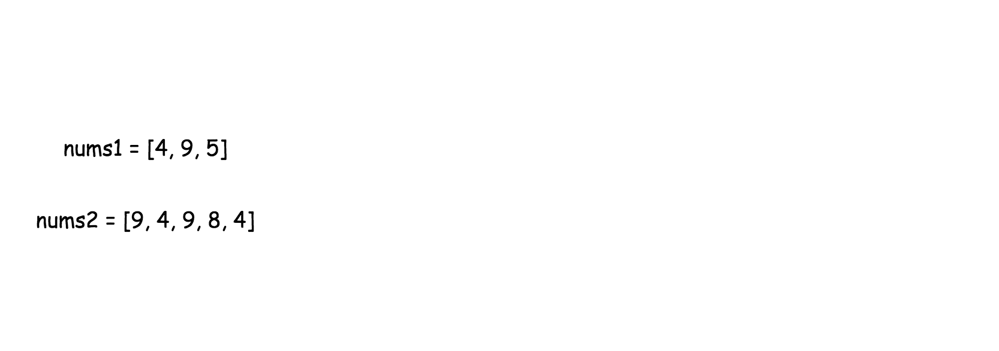
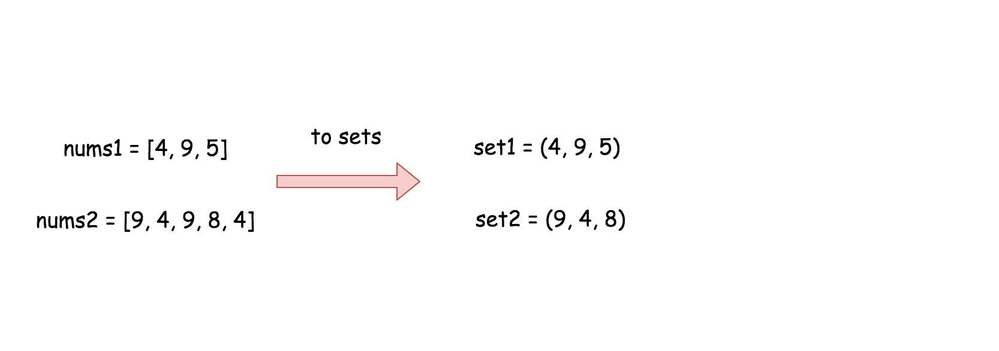
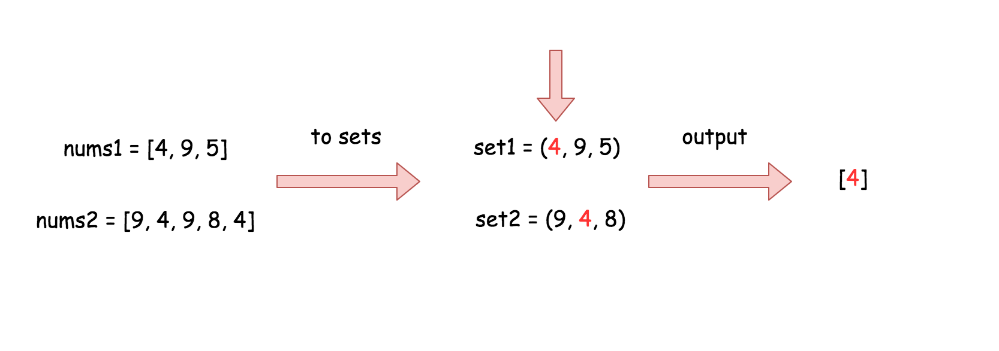
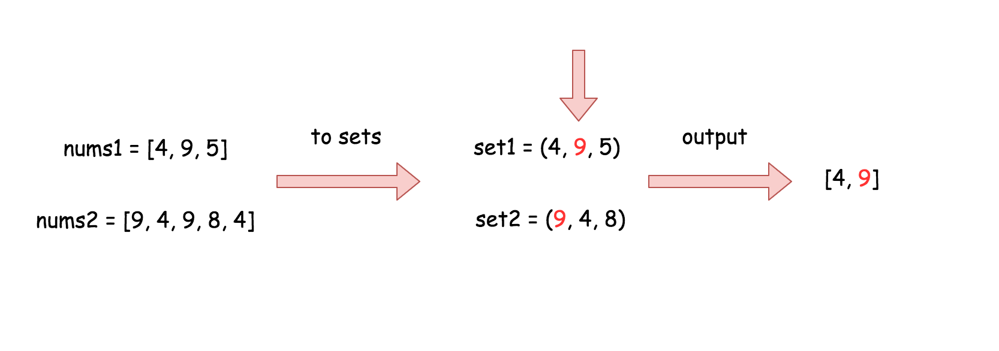
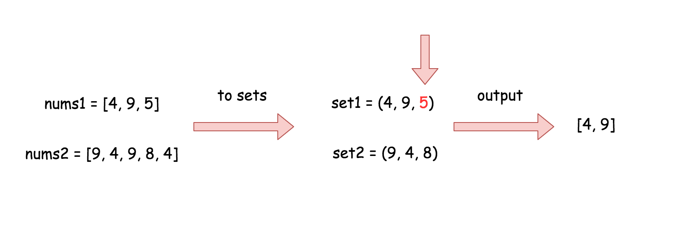
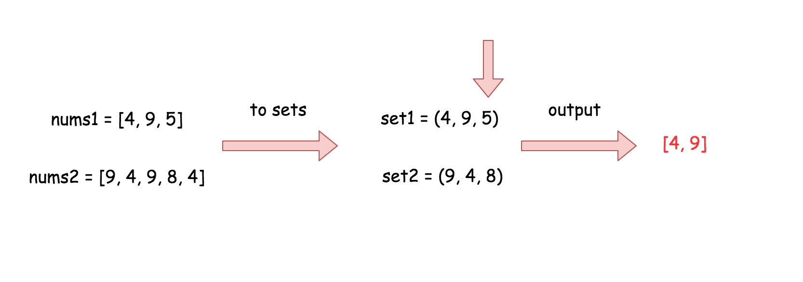

[TOC]

## Solution

---

### Approach 1: Sorting and Two Pointers

#### Intuition

If `nums1` and `nums2` are sorted, we can use a two pointers approach to find elements that appear in both arrays. Initialize one pointer for each array that starts at the smallest element.

If the numbers at both pointers are the same, add the number to a set that stores integers that appear in both arrays. Then, increase both pointers by $1$, since this element is already processed.

Otherwise, if the numbers at both pointers are not equal, the smaller of the two values cannot appear in the other array because both arrays are sorted. Therefore, we can increase the pointer of the smaller value.

#### Algorithm

1. Sort `nums1` and `nums2` arrays.
2. Create a pointer for each array, initially set to $0$.
3. Initialize an empty set that stores intersecting integers.
4. If the integers at both pointers equal the same value, add this value to the intersecting set and increment both pointers.
5. Otherwise, increment the pointer that points to the smaller integer value.
6. Repeat steps 4 and 5 until a pointer is out of bounds.
7. Convert the intersection set into an array.
8. Return the resulting array.

#### Implementation

```python
class Solution(object):
    def intersection(self, nums1, nums2):
        """
        :type nums1: List[int]
        :type nums2: List[int]
        :rtype: List[int]
        """
        # Sort both arrays
        nums1.sort()
        nums2.sort()

        # Initialize two pointers
        N = len(nums1)
        M = len(nums2)
        p1 = 0
        p2 = 0

        # Create set that stores integers appearing in both arrays
        intersection = set()

        while p1 < N and p2 < M:
            # Add a value to the set if values at both pointers equal
            if nums1[p1] == nums2[p2]:
                intersection.add(nums1[p1])
                p1 += 1
                p2 += 1
            elif nums1[p1] < nums2[p2]:
                p1 += 1
            else:
                p2 += 1

        # Convert intersection to an array
        result = []
        for x in intersection:
            result.append(x)

        # Return the result
        return result

```

#### Complexity Analysis

* Time complexity: $O(n \log n + m \log m)$, where $n$ and $m$ are the arrays' lengths. This dominating term comes from the need to sort both input arrays at the beginning of the solution.

* Space complexity: $O(\min(m, n))$ in the worst case when all elements in the smaller array are unique and present in the larger array. This space is necessary to store elements in the set `intersection`.

- The space used to store the result array is counted in the space complexity, making the worst case $O(\min(m, n))$.
- Some extra space is used when sorting the arrays in place, and the space complexity depends on the programming language:
- In Python, the `sort()` method uses the Timsort algorithm, which requires $\mathcal{O}(n)$ additional space in the worst case.
- In Java, `Arrays.sort()` for primitive types uses a Dual-Pivot QuickSort, which has a worst-case space complexity of $\mathcal{O}(\\log n)$ due to recursion.

---

### Approach 2: Built-in Set Intersection

#### Intuition

There are built-in intersection facilities, which provide $O(n + m)$ time complexity in the average case and $O(n \times m)$ time complexity in the worst case.

> In Python it's the [intersection operator](https://wiki.python.org/moin/TimeComplexity#set), and in Java it's the [retainAll() function](https://docs.oracle.com/javase/8/docs/api/java/util/AbstractCollection.html#retainAll-java.util.Collection-).

#### Algorithm

1. Initialize a set `set1` and add all elements of `nums1` to it.
2. Initialize a set `set2` and add all elements of `nums2` to it.
3. Call the built-in set intersection method (either `retainAll()` in Java, or `&` operator in Python).
4. Transform the resulting set into an array and return this result.

#### Implementation

```python
class Solution:
    def intersection(self, nums1, nums2):
        """
        :type nums1: List[int]
        :type nums2: List[int]
        :rtype: List[int]
        """
        set1 = set(nums1)
        set2 = set(nums2)
        return list(set2 & set1)
```

#### Complexity Analysis

* Time complexity: $O(n + m)$, where $n$ and $m$ are the arrays' lengths in the average case and $O(n \times m)$ [in the worst case when the load factor is high enough](https://wiki.python.org/moin/TimeComplexity#set).

* Space complexity: $O(m + n)$ because in the worst case, when all elements in the arrays are unique, $n$ space is used to store `set1` and $m$ space is used to store `set2`. The space used to store the result is not counted in the space complexity.

---

### Approach 3: Two Sets

#### Intuition

The naive approach would be to iterate through the values in the first array, `nums1`, and check whether each one is in `nums2`. If yes, add the value to the output. Such an approach would result in a less efficient solution.

> To solve the problem in linear time, let's use the data structure `set`, which provides `in/contains` operations in $O(1)$ time in the average case.

The idea is to convert both arrays into sets and then iterate over the smallest set while checking the presence of each element in the larger set.













#### Algorithm

1. Initialize a set `set1` and add all elements of `nums1` to it.
2. Initialize a set `set2` and add all elements of `nums2` to it.
3. If `set1` has more elements than `set2`, swap them.
4. For each element in `set1`, add it to the result array if it also appears in `set2`.
5. Result the result array.

#### Implementation

```python
class Solution:
    def set_intersection(self, set1, set2):
        return [x for x in set1 if x in set2]

    def intersection(self, nums1, nums2):
        """
        :type nums1: List[int]
        :type nums2: List[int]
        :rtype: List[int]
        """
        set1 = set(nums1)
        set2 = set(nums2)

        if len(set1) < len(set2):
            return self.set_intersection(set1, set2)
        else:
            return self.set_intersection(set2, set1)
```

#### Complexity Analysis

* Time complexity: $O(n + m)$, where $n$ and $m$ are the arrays' lengths. $O(n)$ time is used to convert `nums1` into a set, $O(m)$ time is used to convert `nums2`, and `contains/in` operations are $O(1)$ in the average case.

* Space complexity: $O(m + n)$ because in the worst case, when all elements in the arrays are unique, $n$ space is used to store `set1` and $m$ space is used to store `set2`.

---

### Approach 4: One Dictionary

#### Intuition

This approach uses only one additional data structure and one pass through each of `nums1` and `nums2`. The idea is to use a dictionary/map rather than a set to store information about values that appear in each array.

Define this dictionary as `seen`, where the key is an element that exists in one or both input arrays, and the value stores either $0$ or $1$. A number `x` appears as a key in this dictionary, indicating it is present in at least one array, and the value of the key indicates if `x` has been observed in both arrays and added to the `result` array.

#### Algorithm

1. Initialize a dictionary/map `seen` and the `result` array.
2. For each `x` in `nums1`, set $\text{seen}[x]$ to $1$.
3. For each `x` in `nums2`, add `x` to `result` if $\text{seen}[x]$ equals $1$. Then, set $\text{seen}[x]$ to $0$, as this element has already been included in the result.
4. Result the result array.

#### Implementation

```python
class Solution(object):
    def intersection(self, nums1, nums2):

        # Initialize seen dictionary and res array
        seen = {}
        result = []

        # mark values occurring in nums1
        for x in nums1:
          seen[x] = 1

        for x in nums2:
          # Check if x is in the dictionary and not in the result
          if x in seen and seen[x] == 1:
            result.append(x)
            seen[x] = 0

        # Return the result
        return result
```

#### Complexity Analysis

Let $n$ be the length of `nums1` and $m$ be the length of `nums2`.

* Time complexity: $O(n + m)$ in the average case and $O(n \times m)$ [in the worst case when the load factor is high enough](https://wiki.python.org/moin/TimeComplexity#set).

* Space complexity: $O(n)$ because we use a map of size $n$ store the elements from `nums1`. The `result` array is just used to store the result, so it is not counted in the space complexity.

---