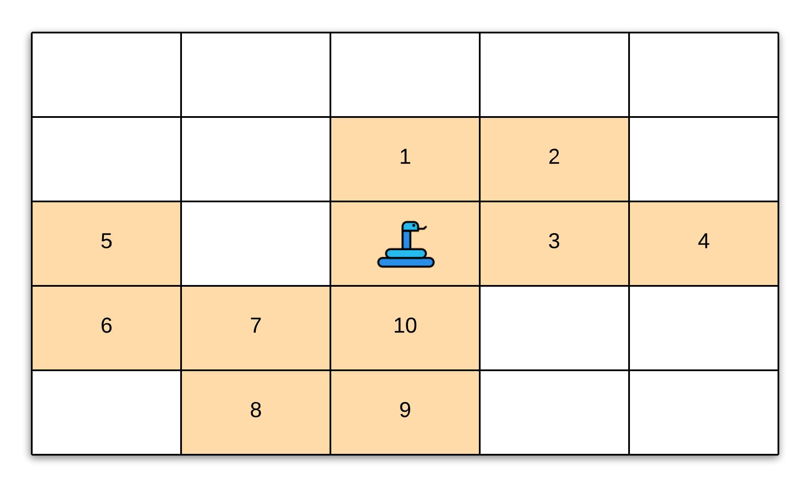
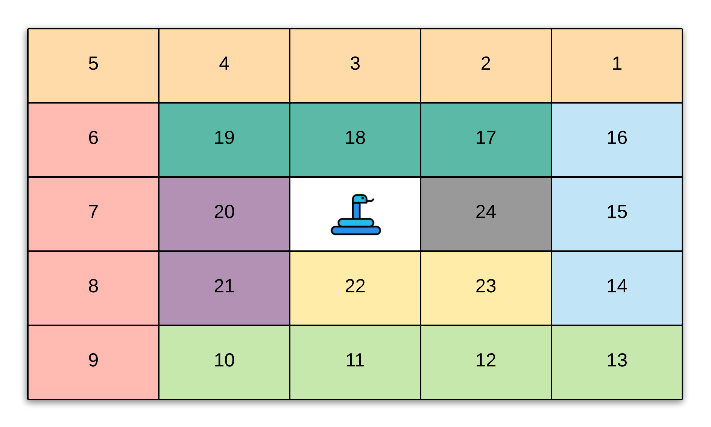
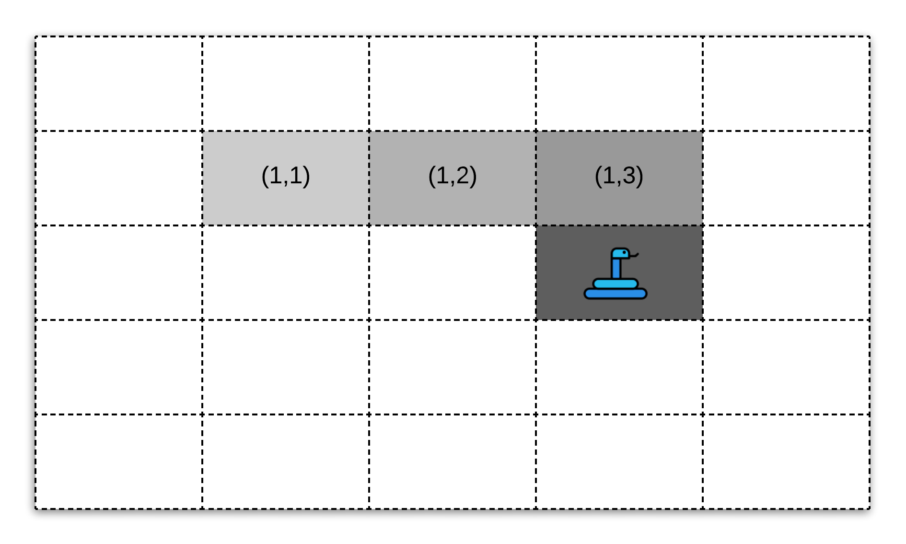
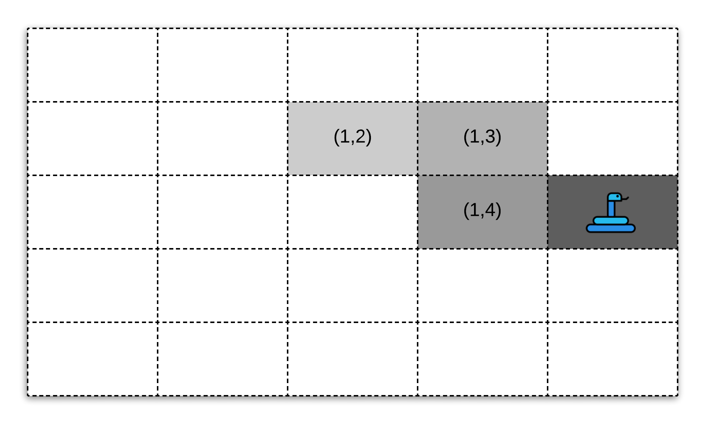

[TOC]

## Solution

---
### Overview

Who doesn't feel nostalgic while thinking about the famous `Snake` video game? It used to be (and still is) the goto video game on phones and other platforms for so many of us and there are countless variations of the game out there. The version that this problem talks about is the most basic one. And this being a design problem makes things more interesting!

Let's go over the details in the problem statement once.

* We're given the `width` and `height` of the grid over which the snake moves.
* Additionally, we are also given the list of grid positions where the food would appear one after the other. Just like the traditional snake, the next food item only appears once the current one is consumed.
* Consuming a piece of food increasses the length of the snake by one. In terms of our problem statement, the length of the snake is increased by one more `cell` from the grid with each cell being of unit length and width.
* The snake can move in four directions `U`, `D`, `L`, and `R`. Everytime the snake has to be moved, the `move()` function would be called and this is the only function we need to focus on in this question.
* The game ends when either of these conditions happens:
* The snake becomes too long to potentially fit inside the grid or
* The snake hits one of the boundaries which would happen in the previous case as well.
* The snake bites itself i.e. when the head of the snake collides with its body in the next move.

The problem statement doesn't have any follow up statements, but we're going to discuss a follow-up to this question where the wall becomes `infinite` i.e. the snake can move across walls and the only condition then for the game to end is when the `snake` crashes into itself on the grid.

<center>

</center>

---
### Approach: Queue and Hash Set

**Intuition**

Let's start by thinking about how we want to store the snake?

>In terms of the grid, a snake is just an **_ordered_** collection of cells.

We can technically use an array to store the cells representing a snake. However, we would need to instantiate an array the size of $width * height$ of the grid since a snake can be composed of all the the cells of the grid in the worst case. A spiral kind of a snake. Let's look at such a snake occupying the grid.

<center>

</center>

This structure is highly unlikely given the random nature of food items appearing on the grid. However, we would need an array the size of the grid to be able to hold this big a snake. The breaking point for an array is when we have to move the snake from one position to another. Let's see what happens to the snake when it moves by one in a direction. The result overall would be the same with some minor changes based on the direction.

<center>

</center>

In the above figure, we have a snake that occupies 4 cells across the grid or in other words, is of length 4. The snake can be represented by the following collection of cells: `[(1,1), (1,2), (1,3), (2,3)]`. Now say we have the snake move in the right direction i.e. `R`. The snake now would look like this across the grid.

<center>

</center>

Now here, after moving one step to the right, the snake is represented by the cells `[(1,2), (1,3), (2,3), (2,4)]`.

>In order to achieve this with an array, we would have to move all the cells around per move which is not exactly ideal. We can build some complicated logic around the movement of the snake in an array but that won't be worth the fixed space complexity that an array would occupy.

Let's see what data structure would naturally fit our requirements for the snake. There are two basic requirements we need to satisfy:

1. Dynamically add new cells to the snake's body and
2. Move the snake in constant amount of time across the grid.

Let's look at the snake representation between moves from the example above to understand what really is happening here and that will help us get to the data structure we need to use for solving this problem.

**Move with No Food**

We already have an example for such a move so we will simply be looking at the snake representation on the grid to understand what's really happening here.

Before the move, the snake was occupying the following cells of the grid in the specified order:

<pre>
(1,1), (1,2), (1,3), (2,3)
</pre>

and after the move, the snake was occupying the following positions on the grid:

<pre>
(1,2), (1,3), (2,3), (2,4)
</pre>

If you think about this from a **_sliding window_** perspective, we simply moves the window one step forward i.e. we removed the **_tail_** of the window and added a new **_head_** to the window. The tail in this case was `(1,2)` and the new head being `(2,4)`.

**Move with Food Consumption**

Now let's look at a move by the snake wherein they consume a food item and grow in length. Suppose the move was the same as before and the spot `(2,4)` contained a food item. The snake head from the previous example, was at `(2,3)` on the grid. So, a move to the right would cause them to consume this food item thus extending their overall length by one. So now, instead of occupying 4 cells on the grid, the snake would occupy 5 cells. Let's concretely look at the snake representations before and after the move.

Before the move, the snake was occupying the following cells of the grid in the specified order:

<pre>
(1,1), (1,2), (1,3), (2,3)
</pre>

and after the move, the snake was occupying the following positions on the grid:

<pre>
(1,1), (1,2), (1,3), (2,3), (2,4)
</pre>

Here, we simply added a new **_head_** to the snake with the head being the cell `(2,4)`. The tail remained the same in this case. These are the only two possibilities for moves that can happen other than the termination conditions for the game. Based on them, let's see what operations out data structure needs to support concretely for us to be able to perform these moves efficiently.

Our abstract data structure needs to support the following operations efficiently.

1. Grow in size dynamically. Note that we never **_shrink_** in size. The snake can stay the same size as before or grow in size due to the consumption of a food item on the grid. But they can't shrink in size.
2. Maintain a specified ordering of cells in order to represent the snake.
3. Extract the `tail` cell and potentially add a new `head` cell to the ordering of cells to represent the updated snake post a move. This is the most important operation of all and this points to a very specific data structure.

>Based on the third operation, we can see that the **_Queue_** would be a good data structure to use since we need to have quick access to the first and last elements of an ordered list and a queue gives us exactly that.

A queue is an abstract data structure with some specified properties which meets our requirements. It can be represented by an array or a linked list. For our purposes, since we need a data structure with dynamic sizing, we would go with a linked-list based implementation for a queue rather than an array since we don't want to pre-allocate any memory for the array and only allocate on the fly. A linked list would be a great fit here since we don't require random access to cells of the snake.

**Algorithm**

1. Initialize a queue containing a single cell `(0,0)` which is the initial position of the snake at the beginning of the game. Note that we will be doing this in the constructor of the class and not in the `move` function.
2. The fist thing we need to do inside the `move` function is to compute the **_new head_** based on the direction of the move. As we saw in the intuition section, irrespective of the kind of move, we will always get a new head. We need the new head position to determine if the snake has hit a boundary and hence, terminate the game.
3. Let's first discuss the termination conditions before moving on to the modifications we would make to our queue data structure.
      1. The first condition is if the snake cross either of the boundaries of the grid after the mode, then we terminate. So for this, we simply check if the new head ($\text{new}_{head}$) satisfies $\text{new}_{head}[0] < 0$ or $\text{new}_{head}[0] > height$ or $\text{new}_{head}[1] < 0$ or $\text{new}_{head}[1] > width$.
      2. The second condition is if the snake bites itself after the move. An important thing to remember here is that the current `tail` of the snake is **_not_** a part of the snake's body. If the move doesn't involve a food, then the tail gets updated (removed) as we have seen. If this is a food move, then the snake cannot bite itself because the food cannot appear on any of the cells occupied by the snake (according to the problem statement).

      In order to check if the snake bites itself we need to check if the new head already exists in our queue or not. This can turn out to be an $\mathcal{O}(N)$ operation and that would be costly. So, at the expense of memory, we can also use an additional dictionary data structure to keep the positions of the snake. This dictionary will only be used for this particular check. We can't do with _just_ a dictionary because a dictionary doesn't have an ordered list of elements and we need the ordering for our implementation.
4. If none of the termination conditions have been met, then we will continue to update our queue with the new head and potentially remove the old tail. If the new head lands on a position which contains food, then we simply add the new head to our queue representing the snake. We won't pop the tail in this case since the length of the snake has increased by 1.
5. After each move, we return the length of the snake if this was a valid move. Else, we return `-1` to indicate that the game is over.

```python
class SnakeGame:

    def __init__(self, width: int, height: int, food: List[List[int]]):
        """
        Initialize your data structure here.
        @param width - screen width
        @param height - screen height
        @param food - A list of food positions
        E.g food = [[1,1], [1,0]] means the first food is positioned at [1,1], the second is at [1,0].
        """
        self.snake = collections.deque([(0,0)])    # snake head is at the front
        self.snake_set = {(0,0) : 1}
        self.width = width
        self.height = height
        self.food = food
        self.food_index = 0
        self.movement = {'U': [-1, 0], 'L': [0, -1], 'R': [0, 1], 'D': [1, 0]}

    def move(self, direction: str) -> int:
        """
        Moves the snake.
        @param direction - 'U' = Up, 'L' = Left, 'R' = Right, 'D' = Down
        @return The game's score after the move. Return -1 if game over.
        Game over when snake crosses the screen boundary or bites its body.
        """

        newHead = (self.snake[0][0] + self.movement[direction][0],
                   self.snake[0][1] + self.movement[direction][1])

        # Boundary conditions.
        crosses_boundary1 = newHead[0] < 0 or newHead[0] >= self.height
        crosses_boundary2 = newHead[1] < 0 or newHead[1] >= self.width

        # Checking if the snake bites itself.
        bites_itself = newHead in self.snake_set and newHead != self.snake[-1]

        # If any of the terminal conditions are satisfied, then we exit with rcode -1.
        if crosses_boundary1 or crosses_boundary2 or bites_itself:
            return -1

        # Note the food list could be empty at this point.
        next_food_item = self.food[self.food_index] if self.food_index < len(self.food) else None

        # If there's an available food item and it is on the cell occupied by the snake after the move, eat it
        if self.food_index < len(self.food) and \
            next_food_item[0] == newHead[0] and \
                next_food_item[1] == newHead[1]:  # eat food
            self.food_index += 1
        else:    # not eating food: delete tail
            tail = self.snake.pop()
            del self.snake_set[tail]

        # A new head always gets added
        self.snake.appendleft(newHead)

        # Also add the head to the set
        self.snake_set[newHead] = 1

        return len(self.snake) - 1

# Your SnakeGame object will be instantiated and called as such:
# obj = SnakeGame(width, height, food)
# param_1 = obj.move(direction)
```

**Complexity Analysis**

Let $W$ represent the width of the grid and $H$ represent the height of the grid. Also, let $N$ represent the number of food items in the list.

- Time Complexity:
- The time complexity of the `move` function is $\mathcal{O}(1)$.
- The time taken to calculate $\text{bites}_{itself}$ is constant since we are using a dictionary to search for the element.
- The time taken to add and remove an element from the queue is also constant.
- Space Complexity:
- The space complexity is $\mathcal{O}(W \times H + N)$
- $\mathcal{O}(N)$ is used by the `food` data structure.
- $\mathcal{O}(W \times H)$ is used by the `snake` and the $\text{snake}_{set}$ data structures. At most, we can have snake that occupies all the cells of the grid as explained in the beginning of the article.

---