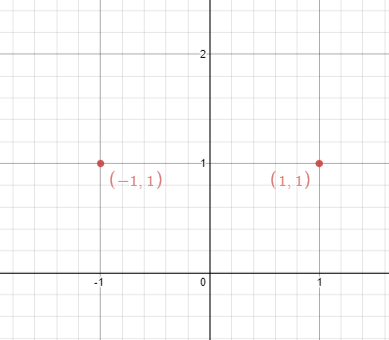
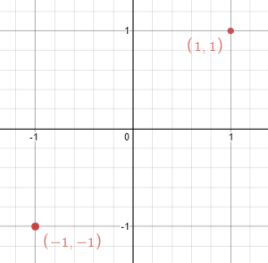

### 1. Description

Given `n` points on a 2D plane, find if there is such a line parallel to the y-axis that reflects the given points symmetrically.

In other words, answer whether or not if there exists a line that after reflecting all points over the given line, the original points' set is the same as the reflected ones.

### 2. Function Contract

**Inputs**

- `points`: The list of two-dimensional integer coordinate pairs, including possible duplicates.

**Return value**

Return `true` if reflection across some vertical line preserves the complete point set; otherwise return `false`.

### 3. Note

that there can be repeated points.

### 4. Examples

#### Example 1

- **Input:** $points = [[1,1],[-1,1]]$
- **Output:** `true`
- **Explanation:** We can choose the line x = 0.

#### Example 2

- **Input:** $points = [[1,1],[-1,-1]]$
- **Output:** `false`
- **Explanation:** We can't choose a line.

### 5. Constraints

- $n = \text{points.length}$

- $1 \le n \le 10^{4}$

- $-10^{8} \le \text{points}[i][j] \le 10^{8}$

**Follow up:** Could you do better than $O(n^{2})$?
