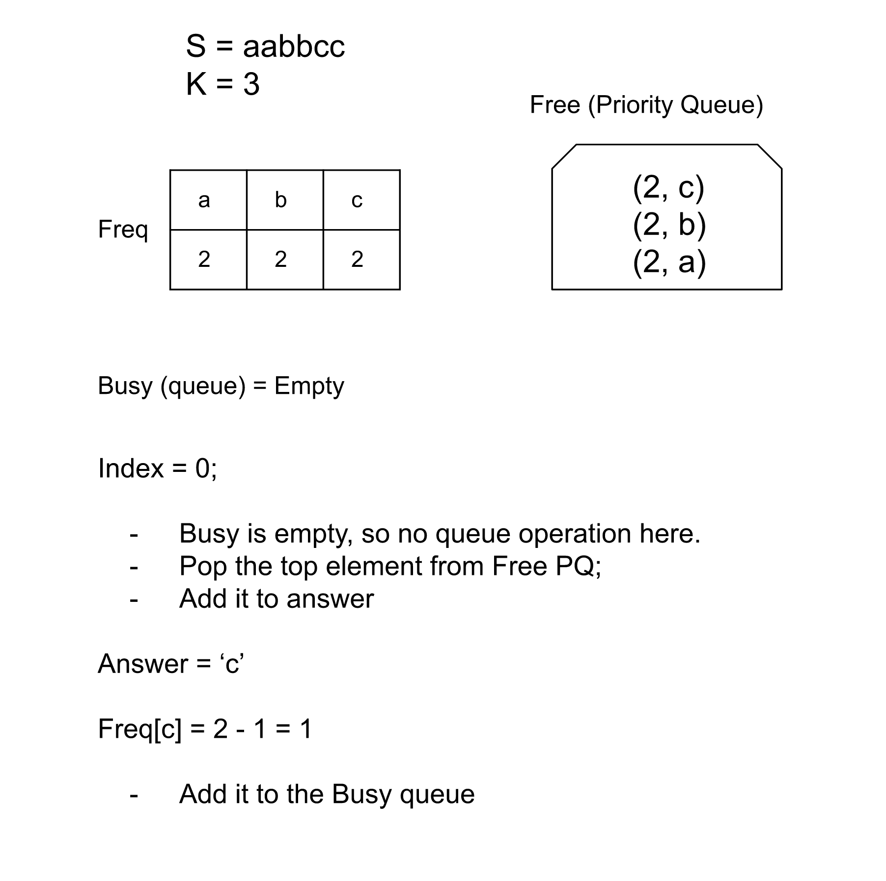
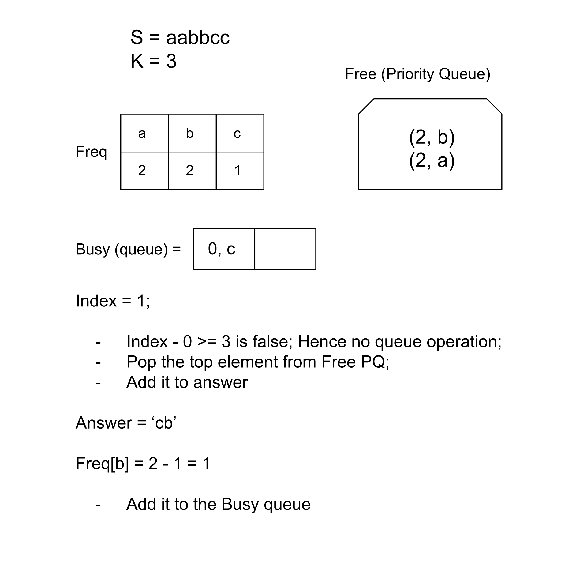
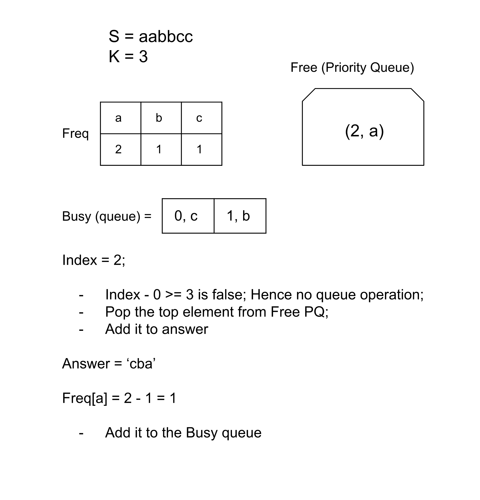
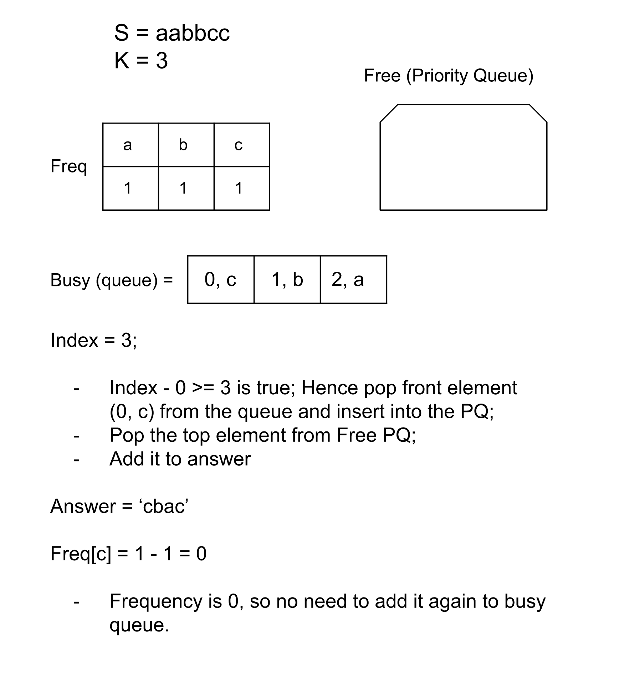
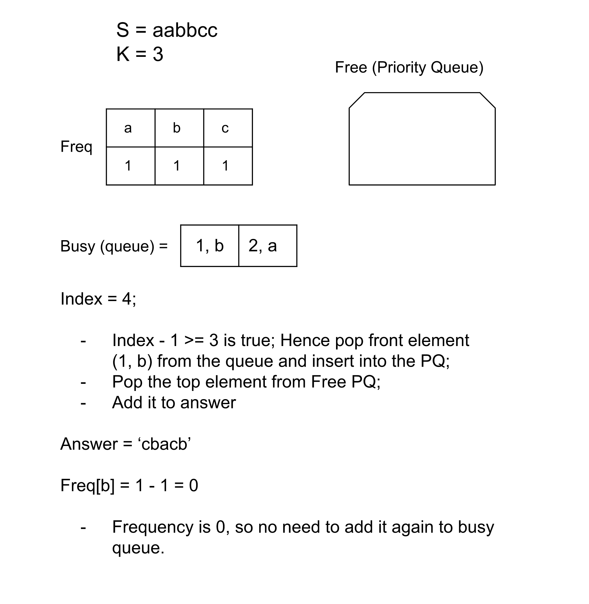
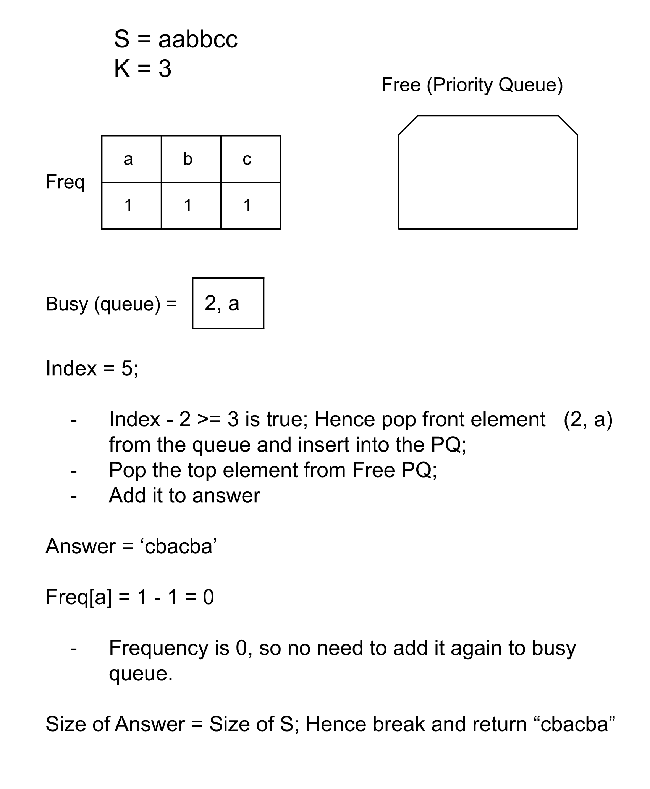
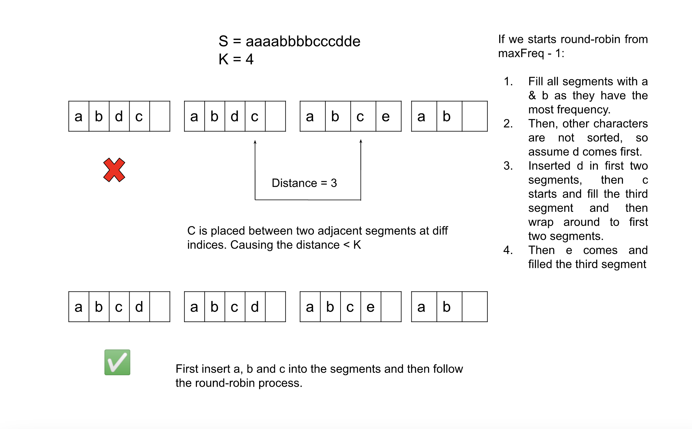

[TOC]

## Solution

---

### Approach 1: Priority Queue

**Intuition**

We are given a string $S$ with only lowercase English letters and an integer $K$; we need to rearrange the characters of $S$ so that the same characters are at least distance  $K$ from each other.

This implies that if we place a character at index, say $x$, the smallest index that this same character can be placed at next is index $x + K$. We can return any string as long as the above criteria are met.

But which character to start from? One observation we need to make here is that when we keep a character on indices, say $x$ and $x + K$, all characters between these indices must be unique; otherwise, there would be a pair of characters breaking the rule. From this observation, we can deduce that it might be better to start with characters that have high frequencies in the string $S$. This is because if we are left with high-frequency characters in the end, we might not be able to find enough different characters to place between the two same characters.

Therefore, for each index, we will find the character with the highest frequency (not used in the last K indices) and put it in the answer string. One might think of sorting the characters by their count to achieve this, but the frequencies will be changing continuously, and we will need to sort the characters again and again. To efficiently keep track of the maximum frequency, we can use a max heap, keeping the highest frequency character at the top.

Now, we know which character to place at the current index, but we cannot simply put the character back into the heap without ensuring that it won't come back before the following $K$ indices. For this, we will use a queue; when we pop the character from the heap and use it in the answer string, we will decrement its frequency and insert it into the queue. When the queue size becomes $K$, we will know that the character at the front can be reused, and there will be one entry in the queue for each character placed in the answer string.

Before popping out the character from the max heap, we will check if the size of the queue is $K$ or not; if yes, we will insert that character with its frequency in the heap. This way, the heap will only hold characters that are allowed to be used. Then we will pop the highest frequency character from the heap and use it for the answer string. In case the heap is empty; it would imply that no character is available now, i.e. placed before $K$ indices, and hence we will return an empty string in such cases as the problem requires.













 <br>

**Algorithm**

1. Create a map `freq` from character to integer (or integer to integer by converting char to ASCII values). This map will store the frequency of each character in the string $S$.
2. Create a max heap/priority queue `free`; this queue will have all the characters that can be placed next, with the character having the highest frequency at the top.
3. Initialize an empty queue `busy`, which will store the characters that cannot be used as they have been used within previous $K$ indices.
4. Do the following until the length of string `ans` becomes equal to the length of $S$:

1. Check if the size of `busy` is $K$; if yes, remove it from the front of the queue and add the element back to `free`.

2. If `free` is empty, there is no available character to place, and the task is impossible. Return an empty string.

3. Remove the top character from the heap and append it to `ans`. Decrement its frequency in `freq`. If the frequency is not zero, insert it into the `busy`.

5. Return `ans`.

**Implementation**

```cpp
class Solution {
public:
    string rearrangeString(string s, int k) {
        int freq[26] = {0};
        // Store the frequency for each character.
        for (int i = 0; i < s.size(); i++) {
            freq[s[i] - 'a']++;
        }

        priority_queue<pair<int, int>> free;
        // Insert the characters with their frequencies in the max heap.
        for (int i = 0; i < 26; i++) {
            if (freq[i]) {
                free.push({freq[i], i});
            }
        }

        string ans;
        // This queue stores the characters that cannot be used now.
        queue<pair<int, int>>  busy;
        while (ans.size() != s.size()) {
            int index = ans.size();

            // Insert the character that could be used now into the free heap.
            if (!busy.empty() && (index - busy.front().first) >= k) {
                auto q = busy.front(); busy.pop();
                free.push({freq[q.second], q.second});
            }

            // If the free heap is empty, it implies no character can be used at this index.
            if (free.empty()) {
                return "";
            }

            int currChar = free.top().second; free.pop();
            ans += currChar + 'a';

            // Insert the used character into busy queue with the current index.
            freq[currChar]--;
            if (freq[currChar] > 0) {
                busy.push({index, currChar});
            }
        }

        return ans;
    }
};
```

**Complexity Analysis**

Here, $N$ is the length of the string $S$, and $K$ is the number of unique characters in the string $S$.

* Time complexity: $O((N + K )\log K)$

  Creating a `freq` map will take $O(K)$ time, and initializing the heap `free` will take $O(K \log K)$. The main loop runs $N$ times, and for each character, the operations are of $O(K)$ as the heap size can be $K$ at max. Hence this would need $O(N \log K)$ time. Therefore, the total time complexity is equal to $O((N + K )\log K)$, but considering the problem constraints, the value of $K$ can be $26$ in the worst case; this can be simplified to $O(N)$ as well.

* Space complexity: $O(K)$

  The size of map `freq`,  heap `free` and the queue `busy` can be, at worst equal to $K$. Since the space to store the output is generally not considered part of space complexity, the total space complexity equals $O(K)$.
  <br/>

---

### Approach 2: Greedy

**Intuition**

As we observed in the previous approach, there should be at least $K$ characters between the two same characters. We can segment the string to enforce this. Let's say the most frequent character appears `maxFreq` times. Then there should be `maxFreq` segments where each of the `maxFreq` instances of the most frequent character is placed such that the distance between each of them is $K$. E.g., we can keep this character at the first index in each of the segments. Similarly, for each character having a frequency of `maxFreq`, we will place one instance of each in each segment at an assigned index. This way, we can handle the most frequent characters without violating the criteria. The size of each segment can vary, but there should be at least $K$ elements in the first $maxFreq - 1$ segments because then only we can say that the distance between the characters that are placed in two adjacent segments at the index is $K$.

Now, we will do the same thing for the characters with frequency $maxFreq - 1$, but only with the first $maxFreq - 1$ segments, as we can fit them all in these segments. We will insert one instance of each character in each segment. The remaining characters with frequency < $maxFreq - 1$ can be filled in the segments in a round-robin manner. We will iterate over the characters and insert them in different segments starting from the $segmentId = 0$, and keep incrementing it as $(segmentId + 1) \% (maxFreq - 1)$ as we need to wrap around to the first segment after the $segmentId = maxFreq - 1$.

It's essential to observe that we cannot follow the round robin filling for characters with frequency $maxFreq - 1$, as we aren't sorting the characters in the order of their frequency and hence any other character can come up without these characters. And hence when we will try to fill in the characters with $maxFreq - 1$, they might be inserted at different indices in the adjacent segments, which will violate the $K$ distance criteria.



In the end, we need can check if the first $maxFreq - 1$ segments have exactly $K$ elements in them; if not, we should return an empty string. Otherwise, join all the segments and return them.

**Algorithm**

1. Create a map `freqs` that maps the character to their frequencies. Also, store the highest frequency that a character has in the variable `maxFreq`.
2. Store all the characters with the frequency `maxFreq` in the hashset `mostChars` and the characters with frequency $maxFreq - 1$ in the hashset `secondChars`.
3. Create `maxFreq` strings, each representing a separate segment.
4. Iterate over the segments, and in each segment, insert one instance of each character in the set `mostChars`. Also insert one instance of each character in the set `secondChars` in all segments except the last one.
5. Initialize $segmentId = 0$ and iterate over the characters while skipping the characters in `mostChars` and `secondChars`. Keep inserting the characters in the segment at `segmentId`.
6. After each insertion, increment `segmentId` by `1` and take it modulo $maxFreq - 1$ to find the next segment.
7. Join all the segments and return them.

**Implementation**

```cpp
class Solution {
public:
    string rearrangeString(string s, int k) {
        unordered_map<char, int> freqs;
        int maxFreq = 0;
        // Store the frequency, and find the highest frequency.
        for (char c : s) {
            freqs[c]++;
            maxFreq = max(maxFreq, freqs[c]);
        }

        unordered_set<char> mostChars;
        unordered_set<char> secondChars;
        // Store all the characters with the highest and second highest frequency - 1.
        for (pair<char, int> charPair: freqs) {
            if (charPair.second == maxFreq) {
                mostChars.insert(charPair.first);
            } else if (charPair.second == maxFreq - 1) {
                secondChars.insert(charPair.first);
            }
        }

        // Create maxFreq number of different strings.
        string segments[maxFreq];
        // Insert one instance of characters with frequency maxFreq & maxFreq - 1 in each segment.
        for (int i = 0; i < maxFreq; i++) {
            for (char c: mostChars) {
                segments[i] += c;
            }

            // Skip the last segment as the frequency is only maxFreq - 1.
            if (i < maxFreq - 1) {
                for (char c: secondChars) {
                    segments[i] += c;
                }
            }
        }

        int segmentId = 0;
        // Iterate over the remaining characters, and for each, distribute the instances over the segments.
        for (pair<char, int> charPair: freqs) {
            char currChar = charPair.first;

            // Skip characters with maxFreq or maxFreq - 1
            // frequency as they have already been inserted.
            if (mostChars.find(currChar)  != mostChars.end()
                || secondChars.find(currChar) != secondChars.end()) {
                continue;
            }

            // Distribute the instances of these characters over the segments in a round-robin manner.
            for (int freq = freqs[currChar]; freq > 0; freq--) {
                segments[segmentId] += charPair.first;
                segmentId = (segmentId + 1) % (maxFreq - 1);
            }
        }

        // Each segment except the last should have exactly K elements; else, return "".
        for (int i = 0; i < maxFreq - 1; i++) {
            if (segments[i].size() < k) {
                return "";
            }
        }

        string ans;
        // Join all the segments and return them.
        for (string s : segments) {
            ans += s;
        }

        return ans;
    }
};
```

**Complexity Analysis**

Here, $N$ is the length of the string $S$, and $K$ is the number of unique characters in the string $S$.

* Time complexity: $O(N)$

  Creating map `freqs` and the hashset `mostChars` and `secondChars` can take at-max $O(N)$ time. Iterate over the characters and insert their instances over the different segments; this will again cannot take more than $O(N)$ time as the characters in `mostChars` and `secondChars` will be skipped. Hence, the total time complexity is $O(N)$.

* Space complexity: $O(K)$

  The map `freqs` and the hashset `mostChars` and `secondChars` will take $O(K)$ space. The rest of the space in the algorithm is used to store the output, which is not generally considered part of space complexity, and hence the space complexity is equal to $O(K)$.
  <br/>
---