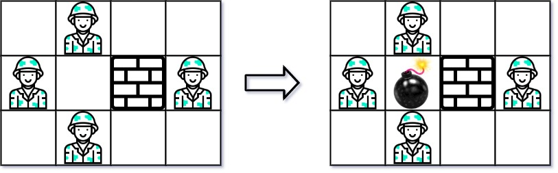
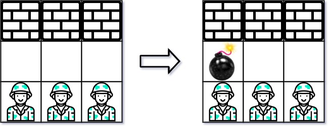

### 1. Description

Given an `m x n` matrix `grid` where each cell is either a wall `'W'`, an enemy `'E'` or empty `'0'`, return *the maximum enemies you can kill using one bomb*. You can only place the bomb in an empty cell.

The bomb kills all the enemies in the same row and column from the planted point until it hits the wall since it is too strong to be destroyed.

### 2. Function Contract

**Inputs**

- `grid`: A nonempty rectangular matrix whose cells are `"W"`, `"E"`, or `"0"`.

**Return value**

Return the maximum number of enemies visible horizontally or vertically from a single empty cell without crossing a wall.

### 3. Examples

#### Example 1

- **Input:** `grid = [["0","E","0","0"],["E","0","W","E"],["0","E","0","0"]]`
- **Output:** `3`

#### Example 2

- **Input:** `grid = [["W","W","W"],["0","0","0"],["E","E","E"]]`
- **Output:** `1`

### 4. Constraints

- $m = \text{grid.length}$

- $n = \text{grid}[i].length$

- $1 \le m, n \le 500$

- $\text{grid}[i][j]$ is either `'W'`, `'E'`, or `'0'`.
