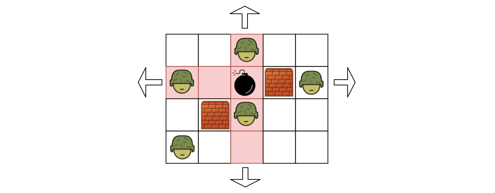
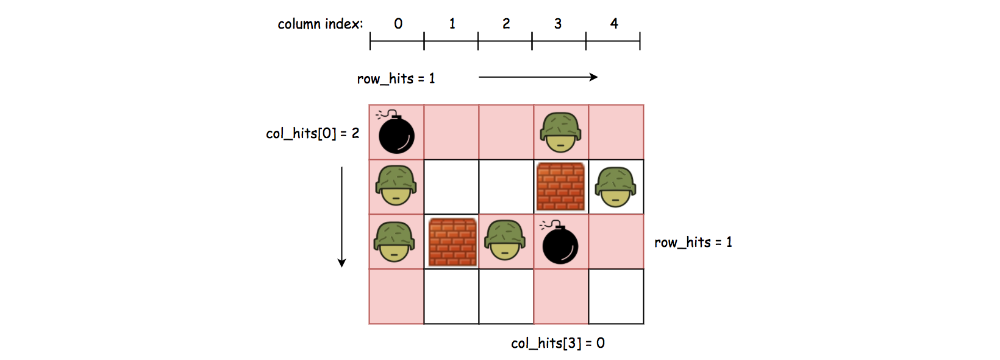

[TOC]

## Solution

---
### Approach 1: Brute-force Enumeration

**Intuition**

Arguably the most intuitive solution is to _try out_ all empty cells, _i.e._ placing a bomb on each empty to see how many enemies it will kill.



As naïve as it might sound, this approach can pass the test on the online judge.

**Algorithm**

- We enumerate each cell in the grid from left to right and from top to bottom.
For each **empty** cell, we calculate how many enemies it will kill if we place a bomb on the cell.

- We define a function named `killEnemies(row, col)` which returns the number of enemies we kill if we place a bomb on the coordinate of `(row, col)`.

- In order to implement the `killEnemies(row, col)` function, starting from the position of empty cell `(row, col)`, we move away from the cell in four directions (_i.e._ left, right, up, down), until we run into a wall or the boundary of the grid.

- At the end of enumeration, we return the maximum value among all the return values of `killEnemies(row, col)`.

```python
class Solution:
    def maxKilledEnemies(self, grid: List[List[str]]) -> int:
        if len(grid) == 0:
            return 0

        rows, cols = len(grid), len(grid[0])

        def killEnemies(row, col):
            enemy_count = 0
            row_ranges = [range(row - 1, -1, -1), range(row + 1, rows, 1)]
            for row_range in row_ranges:
                for r in row_range:
                    if grid[r][col] == 'W':
                        break
                    elif grid[r][col] == 'E':
                        enemy_count += 1

            col_ranges = [range(col - 1, -1, -1), range(col + 1, cols, 1)]
            for col_range in col_ranges:
                for c in col_range:
                    if grid[row][c] == 'W':
                        break
                    elif grid[row][c] == 'E':
                        enemy_count += 1

            return enemy_count

        max_count = 0
        for row in range(0, rows):
            for col in range(0, cols):
                if grid[row][col] == '0':
                    max_count = max(max_count, killEnemies(row, col))

        return max_count
```

**Complexity Analysis**

Let $W$ be the width of the grid and $H$ be the hight of the grid.

- Time Complexity: $\mathcal{O}\big(W \cdot H \cdot (W+H)\big)$
- We run an iteration over each element in the grid. In total, the number of iterations would be $W \cdot H$.

- Within each iteration, we need to calculate how many enemies we will kill if we place a bomb on the given cell.
    In the worst case where there is no wall in the grid, we need to check $(W - 1 + H - 1)$ number of cells.

- To sum up, in the worst case where all cells are empty, the number of checks we need to perform would be $W \cdot H \cdot (W-1+H-1)$.
    Hence the overall time complexity of the algorithm is $\mathcal{O}\big(W \cdot H \cdot (W+H)\big)$.

- Space Complexity: $\mathcal{O}(1)$

- The size of the variables that we used in the algorithm is constant, regardless of the input.

---
### Approach 2: Dynamic Programming

**Intuition**

As one might notice in the above brute-force approach, there are some **redundant calculations** during the iteration.
More specifically, for any row or column that does not have any wall in-between, the number of enemies that we can kill remains the same for any empty on that particular row or column.
While in our brute-force approach, we would iterate the same row or column over and over, regardless the situation of the cells.

In order to _reduce_ or even eliminate the redundant calculation, one might recall one of the well-known techniques called [Dynamic Programming](https://en.wikipedia.org/wiki/Dynamic_programming).

>The basic principal of **dynamic programming** is that we store the immediate results which are intended to be reused later, to avoid the recalculation.

However, the key to apply dynamic programming technique lies on how we can **_decompose_** the problem into a set of subproblems.
The solutions of subproblems would then be kept as intermediate results, in order to calculate the final result.

Now let us get back to our problem.
Given an empty cell located at `(row, col)`, if we place a bomb on the cell, as we know, its influence zone would extend over the same row and column.
Let us define the number of enemies that the bomb kills as $\text{total}_{hits}$, and the number of enemies it kills along the row and column as $\text{row}_{hits}$ and $\text{col}_{hits}$ respectively.
As one might figure, we can obtain the equation of $\text{total}_{hits} = \text{row}_{hits} + \text{col}_{hits}$.

It now boils down to how we calculate the $\text{row}_{hits}$ and $\text{col}_{hits}$ for each cell, and moreover how we can **_reuse_** the results.

Let us take a look at some examples.



In order to calculate the $\text{row}_{hits}$, we can break it down into two cases:

- **case 1).** if the cell is situated at the beginning of the row, we then can scan the entire row until we run into a wall or the boundary of the grid.
The number of enemies that we encounter along the scan would be the value for $\text{row}_{hits}$.
And the $\text{row}_{hits}$ value that we obtained would remain _**valid**_ until the next obstacle.
For example, as we can see the top-left cell in the above graph, its $\text{row}_{hits}$ would be one and it remains valid for the rest of the cells on the same row.

- **case 2).** if the cell is situated right after a wall, which indicates that the previous $\text{row}_{hits}$ that we calculated becomes invalid.
As a result, we need to recalculate the value for $\text{row}_{hits}$ starting from this cell.
For example, for the enemy cell that is located on the column of index `2`, right before the cell, there is a wall, which invalidates the previous $\text{row}_{hits}$ value.
As a result, we run another scan starting from this cell, to calculate the $\text{row}_{hits}$ value.

>We can calculate the value for $\text{col}_{hits}$ in the **same sprit**, but with one small difference.

For the $\text{row}_{hits}$ value, it suffices to use one variable for all the cells on the same row, since we iterate over the grid from left to right and we don't need to memorize the $\text{row}_{hits}$ value for the previous row.

As to the $\text{col}_{hits}$ value, we need to use an _**array**_ to keep track of all the $\text{col}_{hits}$ values, since we need to go over all the columns for each row.

**Algorithm**

The overall algorithm is rather similar with the brute-force approach, where we still run an iteration over each cell in the grid.

Rather than recalculating the hits for each cell, we **_store_** the intermediate results such as $\text{row}_{hits}$ and $\text{col}_{hits}$ and **_reuse_** them whenever possible.

Here are some sample implementations, which are inspired from the post by [StefanPochmann](https://leetcode.com/problems/bomb-enemy/discuss/83387/Short-$\mathcal{O}(mn)$-time-$\mathcal{O}(n)$-space-solution) in the discussion forum.

```python
class Solution:
    def maxKilledEnemies(self, grid: List[List[str]]) -> int:
        if len(grid) == 0:
            return 0

        rows, cols = len(grid), len(grid[0])

        max_count = 0
        row_hits = 0
        col_hits = [0] * cols

        for row in range(0, rows):
            for col in range(0, cols):
                # reset the hits on the row, if necessary.
                if col == 0 or grid[row][col - 1] == 'W':
                    row_hits = 0
                    for k in range(col, cols):
                        if grid[row][k] == 'W':
                            # stop the scan when we hit the wall.
                            break
                        elif grid[row][k] == 'E':
                            row_hits += 1

                # reset the hits on the col, if necessary.
                if row == 0 or grid[row - 1][col] == 'W':
                    col_hits[col] = 0
                    for k in range(row, rows):
                        if grid[k][col] == 'W':
                            break
                        elif grid[k][col] == 'E':
                            col_hits[col] += 1

                # count the hits for each empty cell.
                if grid[row][col] == '0':
                    total_hits = row_hits + col_hits[col]
                    max_count = max(max_count, total_hits)

        return max_count
```

**Complexity Analysis**

Let $W$ be the width of the grid and $H$ be the hight of the grid.

- Time Complexity: $\mathcal{O}(W \cdot H)$

- One might argue that the time complexity should be $\mathcal{O}\big(W \cdot H \cdot (W + H)\big)$, judging from the detail that we run nested loop for each cell in grid.
    If this is the case, then the time complexity of our dynamic programming approach would be the same as the brute-force approach.
    Yet this is contradicted to the fact that by applying the dynamic programming technique we reduce the redundant calculation.

- To estimate overall time complexity, let us take another perspective.
    Concerning each cell in the grid, we assert that it would be visited **exactly three times**.
    The first visit is the case where we iterate through each cell in the grid in the outer loop.
    The second visit would occur when we need to calculate the $\text{row}_{hits}$ that involves with the cell.
    And finally the third visit would occur when we calculate the value of $\text{col}_{hits}$ that involves with the cell.

- Based on the above analysis, we can say that the overall time complexity of this dynamic programming approach is $\mathcal{O}(3 \cdot W \cdot H) = \mathcal{O}(W \cdot H)$.

- Space Complexity: $\mathcal{O}(W)$

- In general, with the dynamic programming approach, we gain in terms of time complexity, in trade of a lost in space complexity.

- In our case, we allocate some variables to hold the intermediates results, namely $\text{row}_{hits}$ and $\text{col}_{hits}[*]$.
    Therefore, the overall space complexity of the algorithm is $\mathcal{O}(W)$, where $W$ is the number of columns in the grid.

---