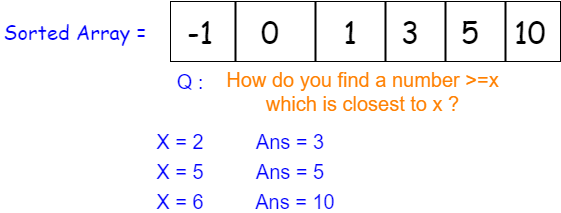
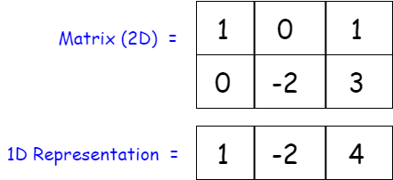

## Solution

---
### Overview

The first thing one might think of is a brute force solution. Since the numbers may be negative, there is no clever way to know if we should add more cells to get the best solution or not, hence we would need to enumerate all possible rectangles and get the best result. One might add a [prefix sum for a 2D array](https://leetcode.com/problems/range-sum-query-2d-immutable/solution/) to get the sum of a rectangle in $O(1)$, however this still has a time complexity of $O(m^2n^2)$ due to enumeration of all rectangles. Thus a brute force solution with prefix sums won't suffice and we need to figure out a more clever way to approach this.

### Approach 1: Prefix Sum on 1D Array using Sorted Container

**Intuition**

To understand this approach let's first try to simplify the question and instead of a matrix let's find the maximum sum of a sub-array for a 1D array with $sum \le k$.
How can we achieve this? Let's use the concept of prefix sums, at every index `i` we want to find the maximum possible sum of sub-array which ends at `i`.

Let's also understand what a sorted container is, which is used below. A sorted container maintains an order specified by the comparison function at all times and all operations on a sorted containers are of $O(\log n)$. Some examples are, [set](http://www.cplusplus.com/reference/set/set/) in c++, [SortedSet](https://docs.oracle.com/javase/8/docs/api/java/util/SortedSet.html) in Java and [SortedSet](http://www.grantjenks.com/docs/sortedcontainers/sortedset.html) in python.

At every index `i` we store the prefix sums in a sorted container, now let's say at index `i` current sum from `0..i-1` is `S`, to find the maximum possible $sum \le k$ we would want to find if there is a possible sub-array with sum `k` that ends at `i`, and if not then try to find a sub-array with possible sum `k-1` and so on.

Now to find a sub-array with sum `k` we have the equation $\text{S} - \text{X} = \text{k}$, where we know `S` and we know `k` and `X` is some sub-array sum that when subtracted from `S` gives us `k` which means the sum of sub-array from the occurrence of sum `X` to the occurrence of sum `S` is `k`. Since we know the values of the two variable we can rearrange the equation to find `X` as $\text{S} - \text{k} = \text{X}$. However, this only tells us if the sub-array with the sum exactly equal to `k` exists. What about the sub-array with sum $\text{k}-1..\text{k}-2$ and so on?



*Figure 1.*

Remember that we are storing the prefix sums in a sorted manner, which means that instead of searching for `X` we can search for the closest prefix sum that is $\ge X$ in $\log n$ using binary search. This will always give us the minimum possible value $\ge X$ so that the sub-array sum is as close to `k`, if $\text{S} - \text{X} = \text{k}$ then $\text{S} - (\text{X}+1) = \text{k}-1$ and so on.

The following visualization will help you understand how to get the result for a 1D array.

!?!../Documents/363/1D.json:1000,500!?!

*Visualization 1. Finding Max Sub-array $sum \le k$ for 1D Array*

<br />

Understanding the previous section is the hard part, now all we need to do is extend the procedure to work for a 2D array. This can be accomplished by converting each 2D matrix to a 1D array and then running the previous algorithm.  Each time the algorithm is run, we update the global maximum result.

How do we do this? Imagine we have a $3 \text{x} 5$ matrix. We will start by finding the maximum result for all $1 \text{x} 5$ arrays (each row of the matrix).  Next, we want to find the maximum possible result for all rectangles of height 2.   So, we first convert each $2 \text{x} 5$ sub-matrix into a $1 \text{x} 5$ array by summing each column, then we run the algorithm, and update the global maximum result. Finally, we will repeat this process for the entire $3 \text{x} 5$ matrix.

The picture below depicts how a $2 \text{x} 3$ matrix can be converted to a $1 \text{x} 3$ 1D array.



*Figure 2. Converting a 2D matrix to 1D Sum Array*

Now let's combine the two algorithms to get the required result for a matrix.

!?!../Documents/363/2D.json:1000,500!?!

*Visualization 2. Finding Max $sum \le K$ of a rectangle for a Matrix*

<br />

**Algorithm**

<style type="text/css">
    ol ol { list-style-type: lower-alpha; }
</style>
1. Let's define a function that gets us the result of the maximum possible sum of a sub-array with $sum \le k$ for a given 1D array.
   1. Let's initialize a variable for running sum with `0`. Let's call it `sum`.
   2. Initialize a sorted container to store prefix sums and add `0` to it.
   3. Iterate each number in the 1D array.
   4. Add current number to the running sum.
   5. Find the closest value of $sum - k$ greater than or equal to $sum - k$ in the sorted prefix sums using binary search. Let's call it `X`.
   6. If such a number is found store the maximum value of $sum - X$ until now in a global variable.
   7. Add the current running sum in the container for prefix sums.
   8. Repeat steps d to g for all numbers in the 1D array.
2. Initialize an array with length equal to the number of columns in the matrix. This will store 1D representation of the matrix, let's call it `rowSum`.
3. Run a loop from `0` to rows in the matrix. This represents the starting row of the matrix that we are aiming to find a result for.
4. At the beginning of this loop fill `rowSum` with `0`.
5. Run a nested loop that would again run from `0` to number of rows in the matrix. This represents the ending row of the matrix that we are aiming to find the result for.
6. Perform a column-wise sum of the ending row with the 1D representation `rowSum`. This will be the 1D representation of the matrix between `i..j`.
7. Run the algorithm to find the maximum possible sum of sub-array with $sum \le k$ for this row.
8. We repeat the steps 3 to 7 for all combinations of `i` and `j` where $\text{i} \le \text{j}$.

```cpp
class Solution {
public:
    int result = INT_MIN;
    void updateResult(vector<int>& nums, int k) {
        int sum = 0;

        // Container to store sorted prefix sums.
        set<int> sortedSum;
        set<int>::iterator it;

        // Add 0 as the prefix sum for an empty sub-array.
        sortedSum.insert(0);
        for (int& num : nums) {
            // Running Sum.
            sum += num;

            // Get X where Running sum - X <= k such that sum - X is closest to k.
            it = sortedSum.lower_bound(sum - k);

            // If such X is found in the prefix sums.
            // Get the sum of that sub array and update the global maximum resul.
            if (it != sortedSum.end())
                result = max(result, sum - *it);

            // Insert the current running sum to the prefix sums container.
            sortedSum.insert(sum);
        }
    }
    int maxSumSubmatrix(vector<vector<int>>& matrix, int k) {
        // Stores the 1D representation of the matrix.
        vector<int> rowSum(matrix[0].size());
        for (int i = 0; i < matrix.size(); i++) {
            // Initialize the 1D representation with 0s.
            fill(rowSum.begin(), rowSum.end(), 0);

            // We convert the matrix between rows i..row inclusive to 1D array
            for (int row = i; row < matrix.size(); row++) {
                // Add the current row to the previous row.
                // This converts the matrix between i..row to 1D array
                for (int col = 0; col < matrix[0].size(); col++)
                    rowSum[col] += matrix[row][col];

                // Run the 1D algorithm for `rowSum`
                updateResult(rowSum, k);

                // If result is k, this is the best possible answer, so return.
                if (result == k)
                    return result;
            }
        }
        return result;
    }
};
```

**Complexity Analysis**

Let $m$ be the number of rows and $n$ be the number of columns.

* Time complexity: $O(m^2n\log n)$. We iterate over each `i` and `j` where $0 \le i \le j <m$, within this we iterate over each `i` where $0 \le i<n$ and perform a binary search on the same number of elements.

* Space complexity: $O(n)$. We create a separate array of size `n` representing the 2D matrix and also store prefix sums for all indices.

<br />

---

### Approach 2: Follow-up - Larger Number of Rows than Columns

**Intuition**

The follow-up question asks if the number of rows is significantly larger, can we improve upon our solution? The answer is Yes!

You will notice that in the previous approach we take the most time $O(m^2)$ to iterate over each consecutive combination of rows and convert them to 1D array. It is obvious that if the number of rows increases the time will significantly increase as well. To get around this one may notice that there is no specific reason in the previous approach to perform a row-wise combination and converting them to a 1D array of size `n`, we can perform a column-wise combination and convert them to 1D array of size `m` and it would give us the same result.

Thus we can switch between the two based on the size of rows and columns. Let's try this approach.

We can also simply transpose the matrix when `m > n` and then solve it using approach 1.

**Algorithm**

We use the same idea as the previous approach but create the 1D vector column-wise if the number of rows is greater than the number of columns or do it row-wise otherwise, same as the previous approach. We can also reuse the function that gets the result for 1D vector.

```cpp
class Solution {
public:
    int result = INT_MIN;
    void updateResult(vector<int>& nums, int k) {
        int sum = 0;

        // Container to store sorted prefix sums.
        set<int> sortedSum;
        set<int>::iterator it;

        // Add 0 as the prefix sum for an empty sub-array.
        sortedSum.insert(0);
        for (int& num : nums) {
            // Running Sum.
            sum += num;

            // Get X where Running sum - X <= k such that sum - X is closest to k.
            it = sortedSum.lower_bound(sum - k);

            // If such X is found in the prefix sums.
            // Get the sum of that sub array and update the global maximum result.
            if (it != sortedSum.end())
                result = max(result, sum - *it);

            // Insert the current running sum to the prefix sums container.
            sortedSum.insert(sum);
        }
    }
    int maxSumSubmatrix(vector<vector<int>>& matrix, int k) {
        if (matrix[0].size() > matrix.size()) {
            // Stores the 1D representation of the matrix row wise.
            vector<int> rowSum(matrix[0].size());
            for (int i = 0; i < matrix.size(); i++) {
                // Initialize the 1D representation with 0s.
                fill(rowSum.begin(), rowSum.end(), 0);

                // We convert the matrix between rows i..row inclusive to 1D array
                for (int row = i; row < matrix.size(); row++) {
                    // Add the current row to the previous row.
                    // This converts the matrix between i..j to 1D array
                    for (int col = 0; col < matrix[0].size(); col++)
                        rowSum[col] += matrix[row][col];

                    // Run the 1D algorithm for `rowSum`
                    updateResult(rowSum, k);

                    // If result is k, this is the best possible answer, so return.
                    if (result == k)
                        return result;
                }
            }
        } else {
            // Stores the 1D representation of the matrix column wise.
            vector<int> colSum(matrix.size());
            for (int i = 0; i < matrix[0].size(); i++) {
                // Initialize the 1D representation with 0s.
                fill(colSum.begin(), colSum.end(), 0);

                // We convert the matrix between columns i..col inclusive to 1D array
                for (int col = i; col < matrix[0].size(); col++) {
                    // Add the current column to the previous column.
                    for (int row = 0; row < matrix.size(); row++)
                        colSum[row] += matrix[row][col];

                    // Run the 1D algorithm for `colSum`
                    updateResult(colSum, k);

                    // If Max is k, this is the best possible answer, so return.
                    if (result == k)
                        return result;
                }
            }
        }
        return result;
    }
};
```

**Complexity Analysis**

Let $m$ be the number of rows and $n$ be the number of columns.

* Time complexity: $O(\min(m,n)^2\max(m,n)\log \max(m,n))$. Using the same thought process as approach 1.

* Space complexity: $O(\max(m, n))$. Using the same thought process as approach 1.

---

### Approach 3: Combining it with Kadane's Algorithm

**Intuition**

[Kadane's algorithm](https://en.wikipedia.org/wiki/Maximum_subarray_problem#Kadane's_algorithm) gets the max possible sum of a sub-array in $O(n)$ time. [This](https://leetcode.com/problems/maximum-subarray/solution/) LeetCode article explains the algorithm beautifully.
Let's understand how this algorithm can be used to our advantage for this problem.

For each 1D array that we try to find the result for, we can first run Kadane's algorithm on it and get the maximum possible sum of any sub-array with it. If this result is $\le k$ we can simply skip running our initial $O(n\log n)$ algorithm as we already have the maximum possible result the 1D array can give. This will help us in significantly reducing the runtime of the algorithm as 1D arrays with max sub-array $sum \le k$ would take $O(n)$ time only.

**Algorithm**

We use the same idea as the previous approach but add an extra Kadane's algorithm in `updateResult` function before running the algorithm mentioned in previous approaches, if its result is $\le k$ we skip running the previous algorithm and return the same result, else we do the same thing as the previous approach.

```cpp
class Solution {
public:
    int result = INT_MIN;

    // Standard Kadane's algorithm.
    int getMaxKadane(vector<int>& nums) {
        int maxKadane = INT_MIN, currentMaxSum = 0;
        for (int& num : nums) {
            currentMaxSum = max(currentMaxSum + num, num);
            maxKadane = max(maxKadane, currentMaxSum);
        }
        return maxKadane;
    }
    void updateResult(vector<int>& nums, int k) {
        int kadaneSum = getMaxKadane(nums);

        // If max possible sum of any subarray of nums is <=k
        // use that result to compare with gobal maxium result and return
        if (kadaneSum <= k) {
            result = max(result, kadaneSum);
            return;
        }
        int sum = 0;

        // Container to store sorted prefix sums.
        set<int> sortedSum;
        set<int>::iterator it;

        // Add 0 as the prefix sum for an empty sub-array.
        sortedSum.insert(0);
        for (int& num : nums) {
            // Running Sum.
            sum += num;

            // Get X where Running sum - X <= k such that sum - X is closest to k.
            it = sortedSum.lower_bound(sum - k);

            // If such X is found in the prefix sums.
            // Get the sum of that sub array and update the global maximum result.
            if (it != sortedSum.end())
                result = max(result, sum - *it);

            // Insert the current running sum to the prefix sums container.
            sortedSum.insert(sum);
        }
    }
    int maxSumSubmatrix(vector<vector<int>>& matrix, int k) {
        if (matrix[0].size() > matrix.size()) {
            // Stores the 1D representation of the matrix row wise.
            vector<int> rowSum(matrix[0].size());
            for (int i = 0; i < matrix.size(); i++) {
                // Initialize the 1D representation with 0s.
                fill(rowSum.begin(), rowSum.end(), 0);

                // We convert the matrix between rows i..row inclusive to 1D array
                for (int row = i; row < matrix.size(); row++) {
                    // Add the current row to the previous row.
                    // This converts the matrix between i..j to 1D array
                    for (int col = 0; col < matrix[0].size(); col++)
                        rowSum[col] += matrix[row][col];

                    // Run the 1D algorithm for `rowSum`
                    updateResult(rowSum, k);

                    // If result is k, this is the best possible answer, so return.
                    if (result == k)
                        return result;
                }
            }
        } else {
            // Stores the 1D representation of the matrix column wise.
            vector<int> colSum(matrix.size());
            for (int i = 0; i < matrix[0].size(); i++) {
                // Initialize the 1D representation with 0s.
                fill(colSum.begin(), colSum.end(), 0);

                // We convert the matrix between columns i..col inclusive to 1D array
                for (int col = i; col < matrix[0].size(); col++) {
                    // Add the current column to the previous column.
                    for (int row = 0; row < matrix.size(); row++)
                        colSum[row] += matrix[row][col];

                    // Run the 1D algorithm for `colSum`
                    updateResult(colSum, k);

                    // If Max is k, this is the best possible answer, so return.
                    if (result == k)
                        return result;
                }
            }
        }
        return result;
    }
};
```

**Complexity Analysis**

Let $m$ be the number of rows and $n$ be the number of columns.

* Time complexity: $O(\min(m,n)^2\max(m,n)\log \max(m,n))$. Using the same thought process as approach 1 as in the worst case we end up running the algorithm from approach 1 for all 1D arrays.

* Space complexity: $O(\max(m, n))$. Using the same thought process as approach 1.

</br>