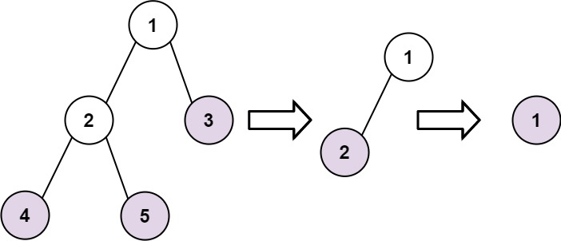

## Description

Given the `root` of a binary tree, collect a tree's nodes as if you were doing this:

- Collect all the leaf nodes.

- Remove all the leaf nodes.

- Repeat until the tree is empty.
### Function Contract

**Inputs**

- `root`: The root of a nonempty binary tree, represented by level-order values in cOde(n) cases and by `TreeNode` objects during execution.

**Return value**

Return one list of node values for each simultaneous leaf-removal round, beginning with the original leaves and ending with the original root. Values within the same round may appear in any order.

### Examples

#### Example 1

- **Input:** `root = [1,2,3,4,5]`
- **Output:** `[[4,5,3],[2],[1]]`
- **Explanation:**
[[3,5,4],[2],[1]] and [[3,4,5],[2],[1]] are also considered correct answers since per each level it does not matter the order on which elements are returned.
#### Example 2

- **Input:** `root = [1]`
- **Output:** `[[1]]`
### Constraints

- The number of nodes in the tree is in the range `[1, 100]`.

- $-100 \le \text{Node.val} \le 100$