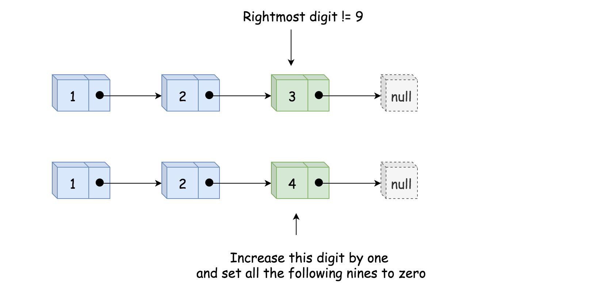
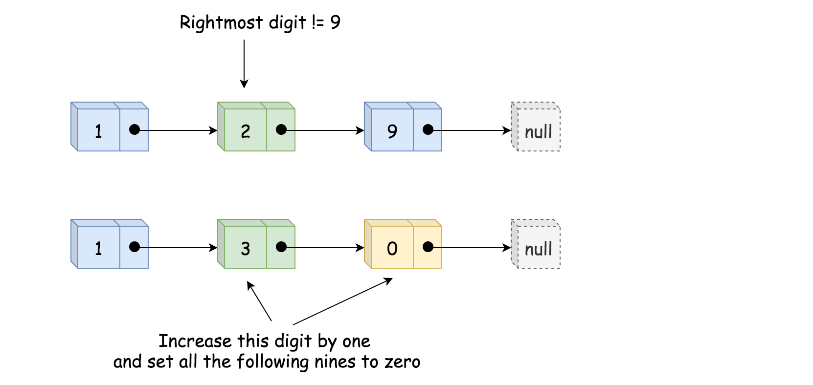
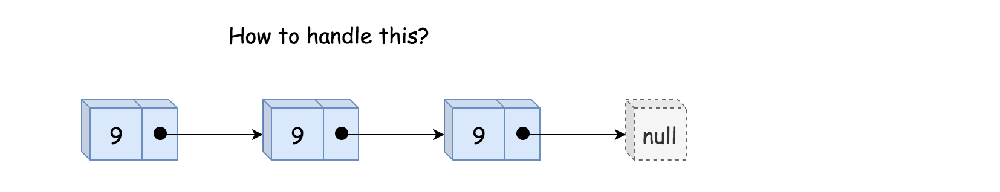
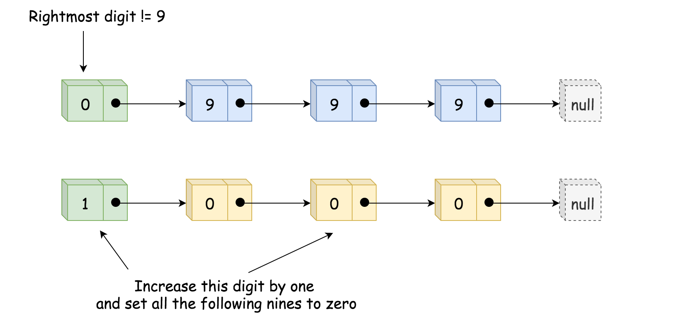

## Solution Article

---

### Overview.

"Plus One" is a subset of a problem set "Add Number", and the solution patterns are the same.

All these problems could be solved in linear time, and the question here is how to solve them without using addition operation or how to fit into constant space complexity.

The choice of algorithm should be based on the input format:

1. Integers.
Usually, addition operation is not allowed for such a case. Use the Bit Manipulation Approach. Here is an example: [Add Binary](https://leetcode.com/articles/add-binary/).

2. Strings.
Use schoolbook bit-by-bit computation. Note, that to fit into constant space is not possible for languages with immutable strings, for ex. for Java and Python. Here is an example: [Add Binary](https://leetcode.com/articles/add-binary/).

3. Arrays.
The same textbook addition. Here is an example: [Add to Array Form of Integer](https://leetcode.com/articles/add-to-array-form-of-integer/).

4. Linked Lists, current problem.
Sentinel Head + Textbook Addition.

Note, that the straightforward idea of converting everything into integers and then using addition could be risky for Java interviews because of possible overflow issues, [here is in more details](https://leetcode.com/articles/add-binary/).
<br />
<br />

---
### Approach 1: Sentinel Head + Textbook Addition.

**Textbook Addition**

Let's identify the rightmost digit which is not equal to nine and increase that digit by one. All the following nines should be set to zero.

Here is the simplest use case which works fine.



Here is the more difficult case that still passes.



And here is the case which breaks everything.



**Sentinel Head**

To handle the last use case, one needs the so-called [Sentinel Node](https://en.wikipedia.org/wiki/Sentinel_node). Sentinel nodes are widely used for trees and linked lists such as pseudo-heads, pseudo-tails, etc. They are purely functional and usually don't hold any data. Their main purpose is to standardize the situation to avoid edge case handling.

For example, here one could add a pseudo-head with zero value, and hence there will always be not-nine nodes.



**Algorithm**

- Initialize the sentinel node as `ListNode(0)` and set it to be the new head: $\text{sentinel.next} = head$.

- Find the rightmost digit not equal to nine.

- Increase that digit by one.

- Set all the following nines to zero.

- Return the sentinel node if it was set to 1, and head `sentinel.next` otherwise.

**Implementation**

```python
class Solution:
    def plusOne(self, head: ListNode) -> ListNode:
        # sentinel head
        sentinel = ListNode(0)
        sentinel.next = head
        not_nine = sentinel

        # find the rightmost not-nine digit
        while head:
            if head.val != 9:
                not_nine = head
            head = head.next

        # increase this rightmost not-nine digit by 1
        not_nine.val += 1
        not_nine = not_nine.next

        # set all the following nines to zeros
        while not_nine:
            not_nine.val = 0
            not_nine = not_nine.next

        return sentinel if sentinel.val else sentinel.next
```

**Complexity Analysis**

* Time complexity : $\mathcal{O}(N)$ since it's not more that two passes along the input list.

* Space complexity : $\mathcal{O}(1)$.