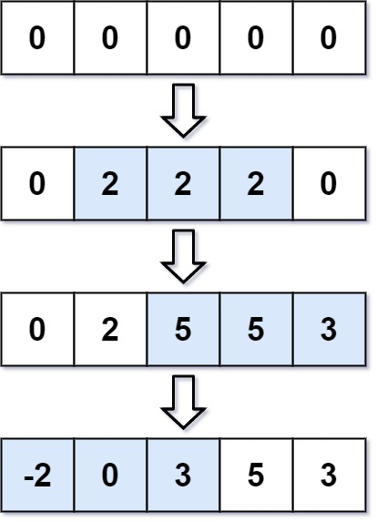

### 1. Description

You are given an integer `length` and an array `updates` where $\text{updates}[i] = [\text{startIdx}_{i}, \text{endIdx}_{i}, \text{inc}_{i}]$.

You have an array `arr` of length `length` with all zeros, and you have some operation to apply on `arr`. In the $$i^{\text{th}}$$ operation, you should increment all the elements $arr[\text{startIdx}_{i}], arr[\text{startIdx}_{i} + 1], ..., arr[\text{endIdx}_{i}]$ by $\text{inc}_{i}$.

Return `arr` *after applying all the* `updates`.

### 2. Function Contract

**Inputs**

- `length`: The positive length of the zero-initialized result array.
- `updates`: A list of inclusive range updates `[startIdx, endIdx, inc]`.

**Return value**

Return the length-`length` array after accumulating all additions, including overlaps and negative increments.

### 3. Examples

#### Example 1

- **Input:** $length = 5, updates = [[1,3,2],[2,4,3],[0,2,-2]]$
- **Output:** `[-2,0,3,5,3]`

#### Example 2

- **Input:** $length = 10, updates = [[2,4,6],[5,6,8],[1,9,-4]]$
- **Output:** `[0,-4,2,2,2,4,4,-4,-4,-4]`

### 4. Constraints

- $1 \le length \le 10^{5}$

- $0 \le \text{updates.length} \le 10^{4}$

- $0 \le \text{startIdx}_{i} \le \text{endIdx}_{i} < length$

- $-1000 \le \text{inc}_{i} \le 1000$
