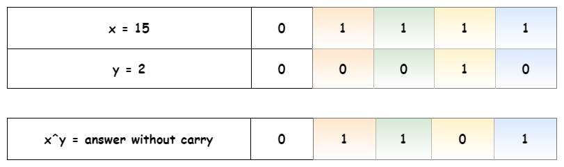
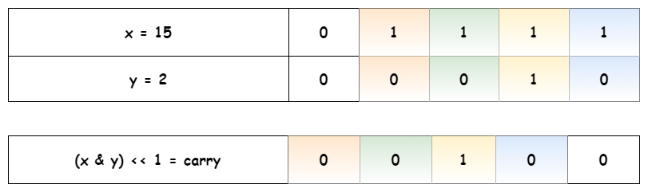
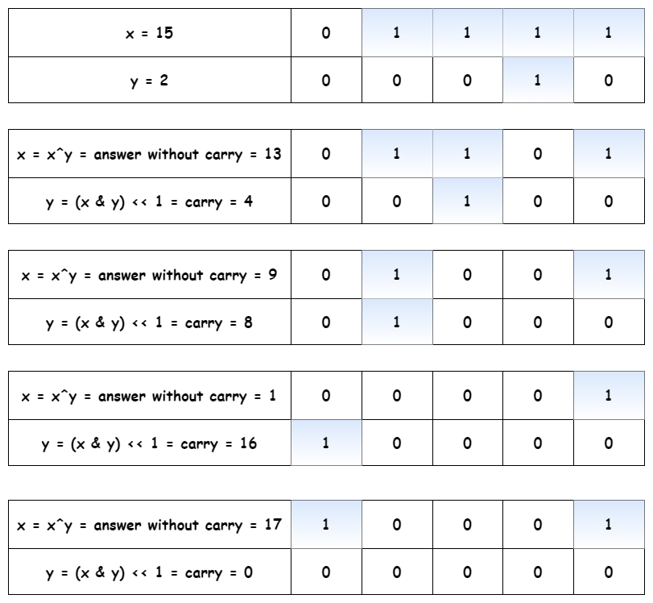
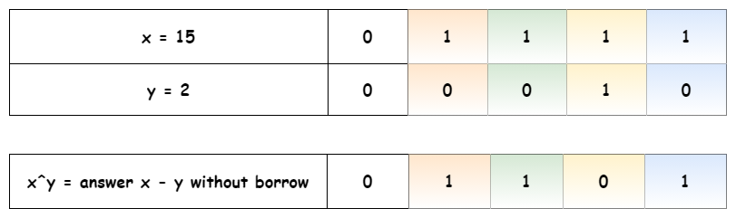
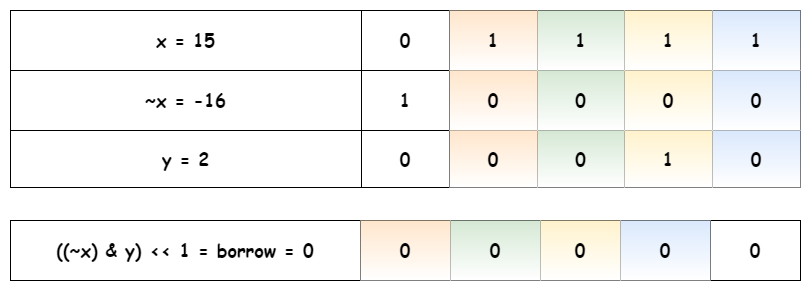
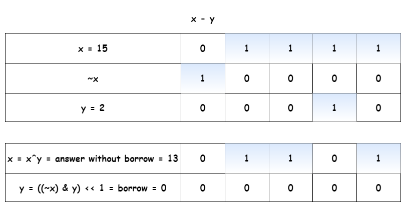

[TOC]

## Solution

---

### Overview

Approach 1 is a detailed explanation of bit manipulation basics. Approach 2 is a language-specific discussion of a possible follow-up and mainly written for fun.

### Approach 1: Bit Manipulation: Easy and Language-Independent

That's an extremely popular Facebook problem designed to check your knowledge of [bitwise operators](https://wiki.python.org/moin/BitwiseOperators):

$x \oplus y \qquad \textrm{that means} \qquad \textrm{bitwise XOR}$

$x \& y \qquad \textrm{that means} \qquad \textrm{bitwise AND}$

$\sim x \qquad \textrm{that means} \qquad \textrm{bitwise NOT}$

**Reduce the Number of Use Cases**

First of all, there are too many use cases here: both $a$ and $b$ could be positive or negative, `abs(a)` could be greater or less than `abs(b)`. In total, that results in $2 \times 2 \times 2 = 8$ use cases.

Let's start by reducing the problem down to two simple cases:

- Sum of two positive integers: $x + y$, where $x > y$.

- Difference of two positive integers: $x - y$, where $x > y$.

```python
class Solution:
    def getSum(self, a: int, b: int) -> int:
        x, y = abs(a), abs(b)
        # ensure that abs(a) >= abs(b)
        if x < y:
            return self.getSum(b, a)

        # abs(a) >= abs(b) -->
        # a determines the sign
        sign = 1 if a > 0 else -1

        if a * b >= 0:
            # sum of two positive integers x + y
            # where x > y

            # TODO
        else:
            # difference of two integers x - y
            # where x > y

            # TODO

        return x * sign
```

**Interview Tip for Bit Manipulation Problems: Use XOR**

How to start? There is an interview tip for bit manipulation problems: if you don't know how to start, start by computing XOR for your input data. Strangely, that helps out for quite a lot of problems, [Single Number II](https://leetcode.com/articles/single-number-ii/), [Single Number III](https://leetcode.com/articles/single-number-iii/), [Maximum XOR of Two Numbers in an Array](https://leetcode.com/articles/maximum-xor-of-two-numbers-in-an-array/), [Repeated DNA Sequences](https://leetcode.com/articles/repeated-dna-sequences/), [Maximum Product of Word Lengths](https://leetcode.com/articles/maximum-product-of-word-lengths/), etc.

> What is XOR?

XOR of zero and a bit results in that bit.

$0 \oplus x = x$

XOR of two equal bits (even if they are zeros) results in a zero.

$x \oplus x = 0$

**Sum of Two Positive Integers**

Now let's use this tip for the first use case: the sum of two positive integers. Here XOR is a key as well because it's a sum of two integers in the binary form without taking carry into account. In other words, XOR is a sum of bits of x and y where at least one of the bits is not set.



The next step is to find the carry. It contains the common set bits of x and y, shifted one bit to the left. _I.e._ it's logical AND of two input numbers, shifted one bit to the left: $\text{carry} = (x \& y) << 1$.



The problem is reduced to finding the sum of the answers without the carry. Technically, it's the same problem: to sum two numbers, and hence one could solve it in a loop with the condition statement "while carry is not equal to zero".



**Difference of Two Positive Integers**

As for addition, XOR is a difference of two integers without taking borrow into account.



The next step is to find the borrow. It contains common set bits of $y$ and unset bits of $x$, _i.e._ $\text{borrow} = ((\sim x) \& y) << 1$.



The problem is reduced down to the subtraction of the borrow from the answer without borrow. As for the sum, it could be solved recursively or in a loop with the condition statement "while borrow is not equal to zero".



**Algorithm**

- Simplify the problem down to two cases: sum or subtraction of two positive integers: $x \pm y$, where $x > y$. Save down the sign of the result.

- If one has to compute the sum:

- While carry is nonzero: $y \neq 0$:

- Current answer without carry is XOR of x and y: $answer = x^y$.

- Current carry is left-shifted AND of x and y: $carry = (x \& y) << 1$.

- Job is done, prepare the next loop: $x = answer$, $y = carry$.

- Return $x * sign$.

- If one has to compute the difference:

- While borrow is nonzero: $y \neq 0$:

- Current answer without borrow is XOR of x and y: $answer = x^y$.

- Current borrow is left-shifted AND of NOT x and y: $borrow = ((~x) \& y) << 1$.

- Job is done, prepare the next loop: $x = answer$, $y = borrow$.

- Return $x * sign$.

**Implementation**

```python
class Solution:
    def getSum(self, a: int, b: int) -> int:
        x, y = abs(a), abs(b)
        # ensure that abs(a) >= abs(b)
        if x < y:
            return self.getSum(b, a)

        # abs(a) >= abs(b) -->
        # a determines the sign
        sign = 1 if a > 0 else -1

        if a * b >= 0:
            # sum of two positive integers x + y
            # where x > y
            while y:
                answer = x ^ y
                carry = (x & y) << 1
                x, y = answer, carry
        else:
            # difference of two integers x - y
            # where x > y
            while y:
                answer = x ^ y
                borrow = ((~x) & y) << 1
                x, y = answer, borrow

        return x * sign
```

This solution could be written a bit shorter in Python:

```python
class Solution:
    def getSum(self, a: int, b: int) -> int:
        x, y = abs(a), abs(b)
        # ensure x >= y
        if x < y:
            return self.getSum(b, a)
        sign = 1 if a > 0 else -1

        if a * b >= 0:
            # sum of two positive integers
            while y:
                x, y = x ^ y, (x & y) << 1
        else:
            # difference of two positive integers
            while y:
                x, y = x ^ y, ((~x) & y) << 1

        return x * sign
```

**Complexity Analysis**

* Time complexity: $\mathcal{O}(1)$ because each integer contains $32$ bits.

* Space complexity: $\mathcal{O}(1)$ because we don't use any additional data structures.

<br />
<br />

---
### Approach 2: Bit Manipulation: Short Language-Specific Solution

Approach 1 is easy to attack during the follow-up:

> Please don't use multiplication to manage negative numbers and make a clean bitwise solution.

Let's be honest, it's a trap. Once you start to manage negative numbers using bit manipulation, your solution becomes _language-specific_.

**Different languages represent negative numbers differently.**

**Java**

For example, a Java integer is a number of 32 bits. 31 bits are used for the value. The first bit is used for the sign: if it's equal to 1, the number is negative, if it's equal to 0, the number is positive.

And now the fun starts. Does it mean that

$1 = (\underbrace{0}_\text{positive}\underbrace{00000..0}_\text{30 times}1)_2$

and

$-1 = (\underbrace{1}_\text{negative}\underbrace{00000..0}_\text{30 times}1)_2$?

No!

For the representation of a negative number Java uses the so-called "two's complement":

$-1 = (\underbrace{1}_\text{negative}\underbrace{11111..1}_\text{30 times}1)_2$

The idea is simple:

$(- 1 + 1) \& \underbrace{(111111..1)_2}_\text{32 1-bits} = 0$

$(- x + x) \& \underbrace{(111111..1)_2}_\text{32 1-bits} = 0$

The main goal of "two's complement" is to decrease the complexity of bit manipulations. How does Java compute "two's complement" and manage 32-bits limit? Here is how:

- After each operation we have an invisible `& mask`, where $mask = 0xFFFFFFFF$, _i.e._ bitmask of 32 1-bits.

- The overflow, _i.e._ the situation of `x > 0x7FFFFFFF` (a bitmask of 31 1-bits), is managed  as $x --> ~(x ^ 0xFFFFFFFF)$.

At this point, we could come back to approach 1 and, surprisingly, all management of negative numbers, signs, and subtractions Java already does for us. That simplifies the solution to the computation of a sum of two positive integers. That's how the magic of "two's complement" works!

```java
class Solution {
    public int getSum(int a, int b) {
        while (b != 0) {
            int answer = a ^ b;
            int carry = (a & b) << 1;
            a = answer;
            b = carry;
        }

        return a;
    }
}
```

**Python**

Now let's go back to real life. Python has no 32-bit limit, and hence its representation of negative integers is entirely different.

There is no Java magic by default, and if you need a magic - just do it:

- After each operation we have an invisible `& mask`, where $mask = 0xFFFFFFFF$, _i.e._ bitmask of 32 1-bits.

- The overflow, _i.e._ the situation of `x > 0x7FFFFFFF` (a bitmask of 31 1-bits), is managed  as $x --> ~(x ^ 0xFFFFFFFF)$.

```python
class Solution:
    def getSum(self, a: int, b: int) -> int:
        mask = 0xFFFFFFFF

        while b != 0:
            a, b = (a ^ b) & mask, ((a & b) << 1) & mask

        max_int = 0x7FFFFFFF
        return a if a < max_int else ~(a ^ mask)
```

**Implementation**

Each language has its beauty.

```python
class Solution:
    def getSum(self, a: int, b: int) -> int:
        mask = 0xFFFFFFFF

        while b != 0:
            a, b = (a ^ b) & mask, ((a & b) << 1) & mask

        max_int = 0x7FFFFFFF
        return a if a < max_int else ~(a ^ mask)
```

**Complexity Analysis**

* Time complexity: $\mathcal{O}(1)$.

* Space complexity: $\mathcal{O}(1)$.