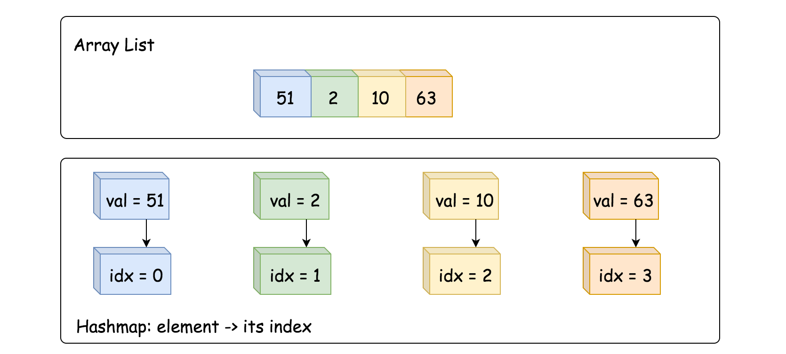
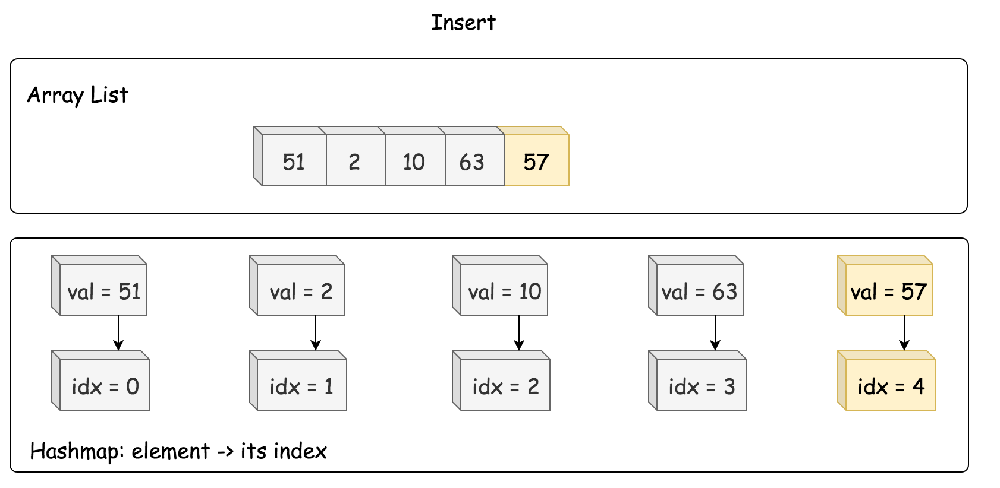
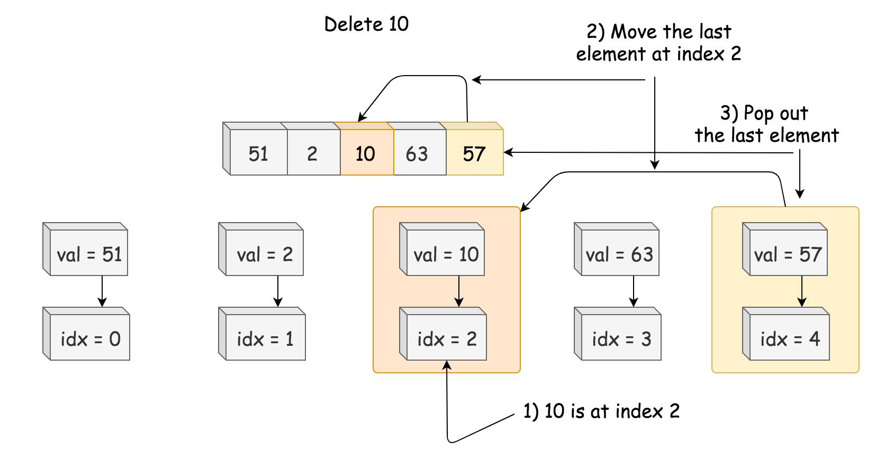

[TOC]

## Solution

---

### Overview

We're asked to implement the structure which provides the following operations in _average_ $\mathcal{O}(1)$ time:

- Insert

- Delete

- GetRandom

First of all - why this weird combination? The structure looks quite theoretical, but it's widely used in popular statistical algorithms like [Markov chain Monte Carlo](https://en.wikipedia.org/wiki/Markov_chain_Monte_Carlo) and [Metropolis–Hastings algorithm](https://en.wikipedia.org/wiki/Metropolis%E2%80%93Hastings_algorithm). These algorithms are for sampling from a probability distribution when it's difficult to compute the distribution itself.

Let's figure out how to implement such a structure. Starting from the Insert, we immediately have two good candidates with $\mathcal{O}(1)$ [average insert time](https://wiki.python.org/moin/TimeComplexity):

- Hashmap (or HashSet, the implementation is very similar): [Java HashMap](https://docs.oracle.com/javase/8/docs/api/java/util/HashMap.html) / [Python dictionary](https://docs.python.org/3/tutorial/datastructures.html#dictionaries)

- Array List: [Java ArrayList](https://docs.oracle.com/javase/8/docs/api/java/util/LinkedList.html) / [Python list](https://docs.python.org/3/tutorial/datastructures.html)

Let's consider them one by one.

> Hashmap provides Insert and Delete in average constant time, although has problems with GetRandom.

The idea of GetRandom is to choose a random index and then retrieve an element with that index. There are no indexes in the hashmap, and hence to get a true random value, one has first to convert hashmap keys in a list, which would take linear time. The solution here is to build a list of keys aside and use this list to compute GetRandom in constant time.

> Array List has indexes and could provide Insert and GetRandom in average constant time, though has problems with Delete.

Deleting a value at an arbitrary index takes linear time. The solution here is to always delete the last value:

- Swap the element to delete with the last one.

- Pop the last element out.

For that, one has to compute an index of each element in constant time and hence needs a hashmap which stores `element -> its index` dictionary.

Both ways converge into the same combination of data structures:

- Hashmap `element -> its index`.

- Array List of elements.


<br />
<br />

---
### Approach 1: HashMap + ArrayList

**Insert**

- Add value -> its index into dictionary, average $\mathcal{O}(1)$ time.

- Append value to array list, average $\mathcal{O}(1)$ time as well.



```python
def insert(self, val: int) -> bool:
    """
    Inserts a value to the set. Returns true if the set did not already contain the specified element.
    """
    if val in self.dict:
        return False
    self.dict[val] = len(self.list)
    self.list.append(val)
    return True
```

**Delete**

- Retrieve an index of element to delete from the hashmap.

- Move the last element to the place of the element to delete, $\mathcal{O}(1)$ time.

- Pop the last element out, $\mathcal{O}(1)$ time.



```python
def remove(self, val: int) -> bool:
    """
    Removes a value from the set. Returns true if the set contained the specified element.
    """
    if val in self.dict:
        # move the last element to the place idx of the element to delete
        last_element, idx = self.list[-1], self.dict[val]
        self.list[idx], self.dict[last_element] = last_element, idx
        # delete the last element
        self.list.pop()
        del self.dict[val]
        return True
    return False
```

**GetRandom**

GetRandom could be implemented in $\mathcal{O}(1)$ time with the help of standard `random.choice` in Python and `Random` object in Java.

```python
def getRandom(self) -> int:
    """
    Get a random element from the set.
    """
    return choice(self.list)
```

**Implementation**

```python
from random import choice
class RandomizedSet():
    def __init__(self):
        """
        Initialize your data structure here.
        """
        self.dict = {}
        self.list = []

    def insert(self, val: int) -> bool:
        """
        Inserts a value to the set. Returns true if the set did not already contain the specified element.
        """
        if val in self.dict:
            return False
        self.dict[val] = len(self.list)
        self.list.append(val)
        return True

    def remove(self, val: int) -> bool:
        """
        Removes a value from the set. Returns true if the set contained the specified element.
        """
        if val in self.dict:
            # move the last element to the place idx of the element to delete
            last_element, idx = self.list[-1], self.dict[val]
            self.list[idx], self.dict[last_element] = last_element, idx
            # delete the last element
            self.list.pop()
            del self.dict[val]
            return True
        return False

    def getRandom(self) -> int:
        """
        Get a random element from the set.
        """
        return choice(self.list)
```

**Complexity Analysis**

* Time complexity. GetRandom is always $\mathcal{O}(1)$. Insert and Delete both have $\mathcal{O}(1)$ average time complexity, and $\mathcal{O}(N)$ in the worst-case scenario when the operation exceeds the capacity of currently allocated array/hashmap and invokes space reallocation.

* Space complexity: $\mathcal{O}(N)$, to store N elements.