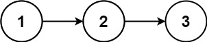

### 1. Description

Given a singly linked list, return a random node's value from the linked list. Each node must have the **same probability** of being chosen.

Implement the `Solution` class:

- `Solution(ListNode head)` Initializes the object with the head of the singly-linked list `head`.

- `int getRandom()` Chooses a node randomly from the list and returns its value. All the nodes of the list should be equally likely to be chosen.

### 2. Function Contract

**Inputs**

- `head`: The head of the nonempty singly linked list.
- `draws`: In cOde(n), the number of successive selections to perform.

**Return value**

The app adapter returns `draws` selected values. On LeetCode, construct `Solution(head)` and call `getRandom()` once for each desired selection.

### 3. Examples

#### Example 1



```
**Input**
["Solution", "getRandom", "getRandom", "getRandom", "getRandom", "getRandom"]
[[[1, 2, 3]], [], [], [], [], []]
**Output**
[null, 1, 3, 2, 2, 3]

**Explanation**
Solution solution = new Solution([1, 2, 3]);
solution.getRandom(); // return 1
solution.getRandom(); // return 3
solution.getRandom(); // return 2
solution.getRandom(); // return 2
solution.getRandom(); // return 3
// getRandom() should return either 1, 2, or 3 randomly. Each element should have equal probability of returning.
```

### 4. Constraints

- The number of nodes in the linked list will be in the range $[1, 10^{4}]$.

- $-10^{4} \le \text{Node.val} \le 10^{4}$

- At most $10^{4}$ calls will be made to `getRandom`.

**Follow up:**

- What if the linked list is extremely large and its length is unknown to you?

- Could you solve this efficiently without using extra space?
