[TOC]

## Video Solution
---

<div>
    <div class="video-container">
        <iframe src="https://player.vimeo.com/video/784616895" width="640" height="360" frameborder="0" allow="autoplay; fullscreen" allowfullscreen></iframe>
    </div>
</div>

<div>
</div>

## Solution Article

---

### Approach 1: Linear time solution

The best possible solution here could be of a linear time because to ensure that the character is unique you have to check the whole string anyway.

The idea is to go through the string and save in a hash map the number of times each character appears in the string. That would take $\mathcal{O}(N)$ time, where `N` is the number of characters in the string.

Then we go through the string the second time, this time we use the hash map as a reference to check if a character is unique or not. If the character is unique, one could just return its index. The complexity of the second iteration is $\mathcal{O}(N)$ as well.

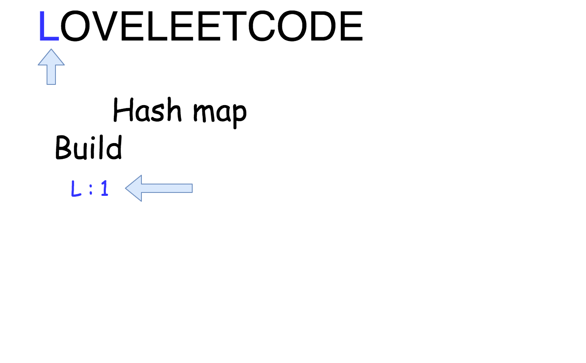

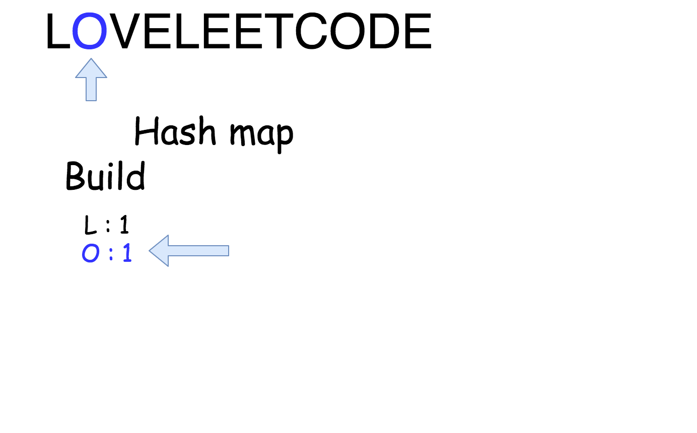

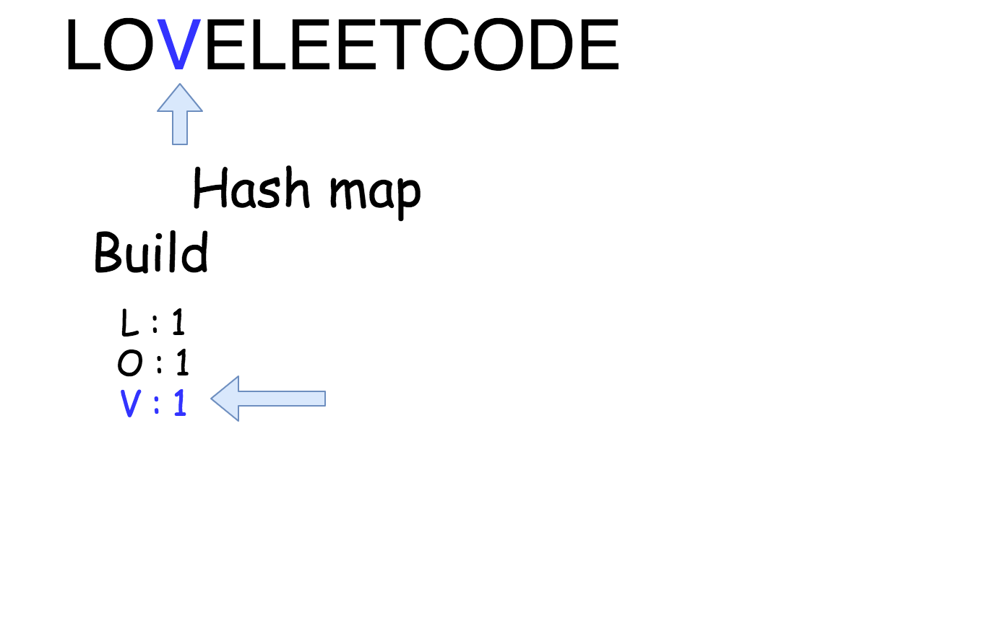

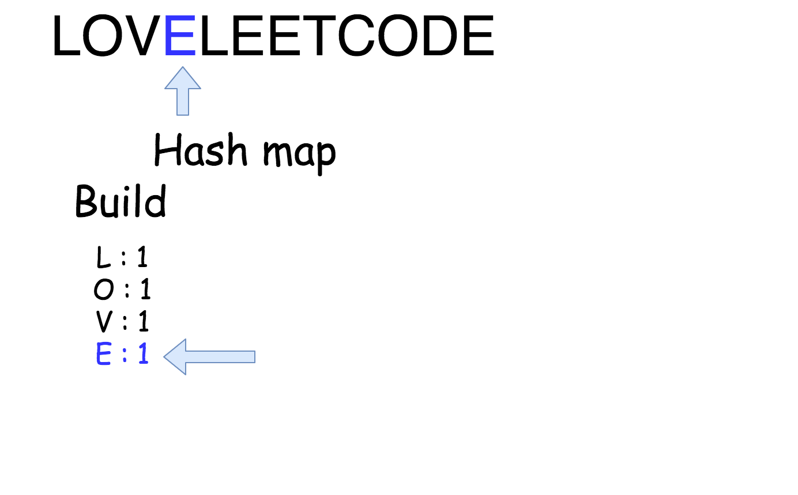

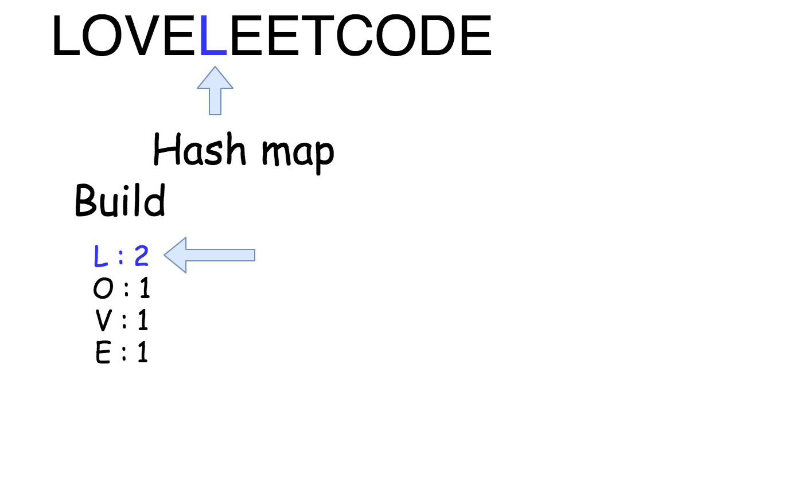

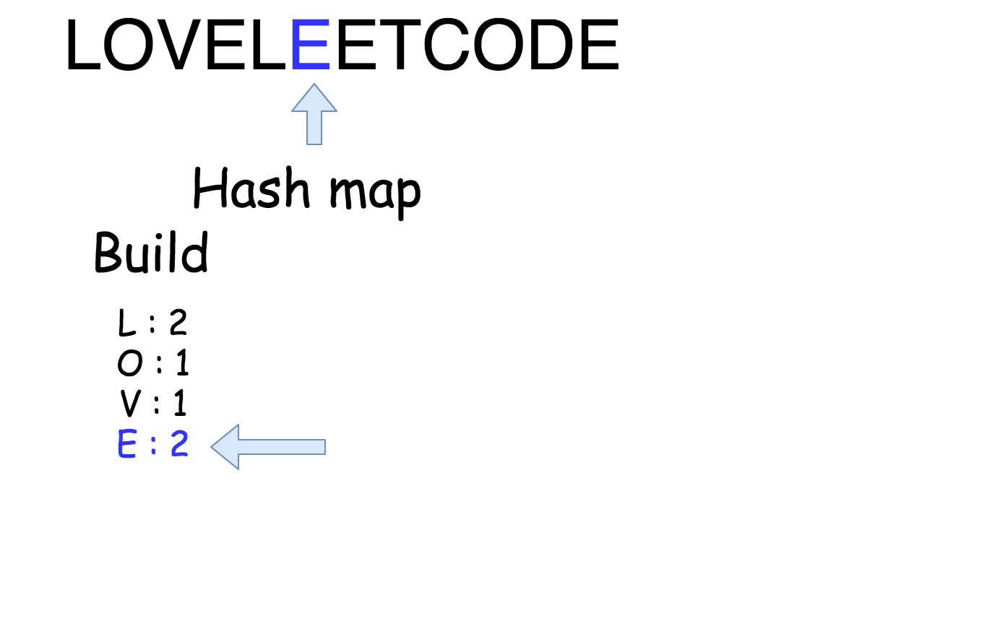


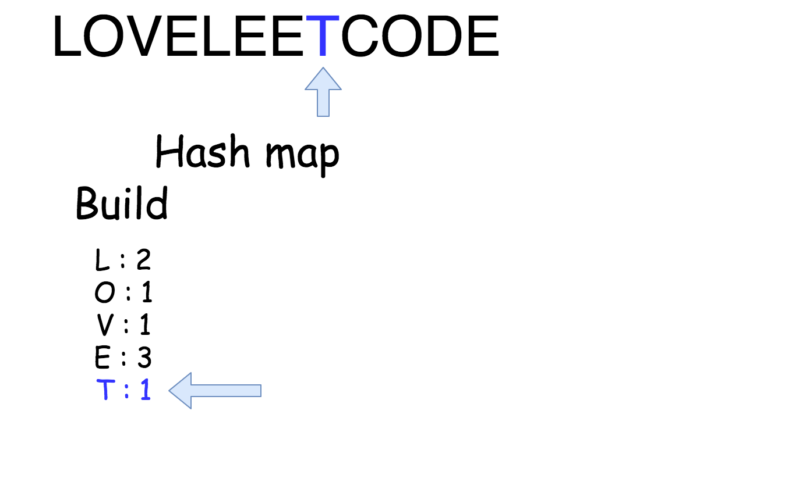

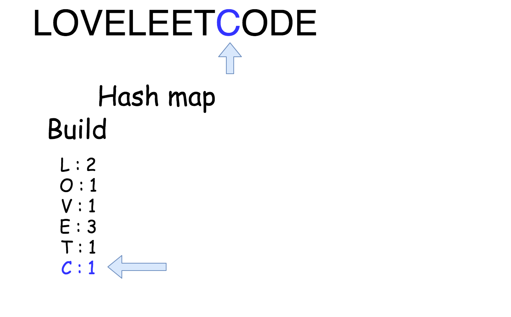

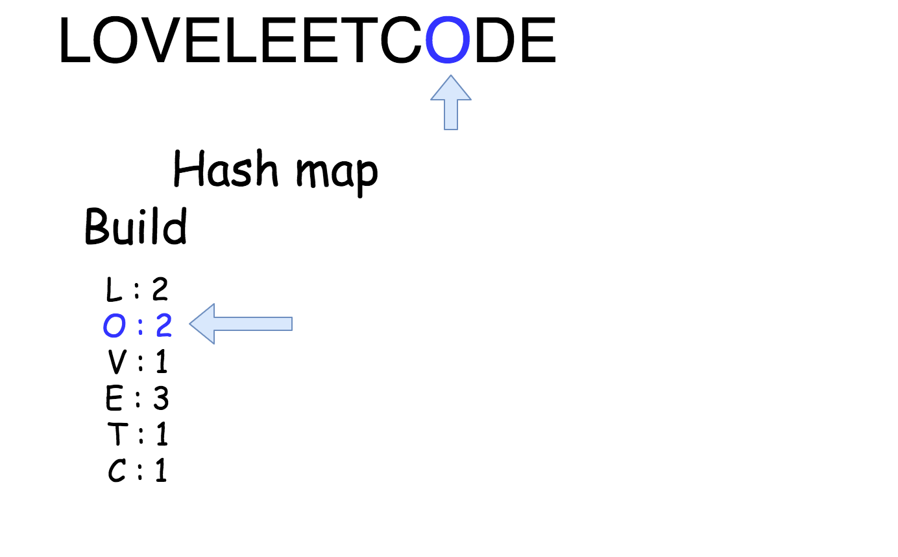

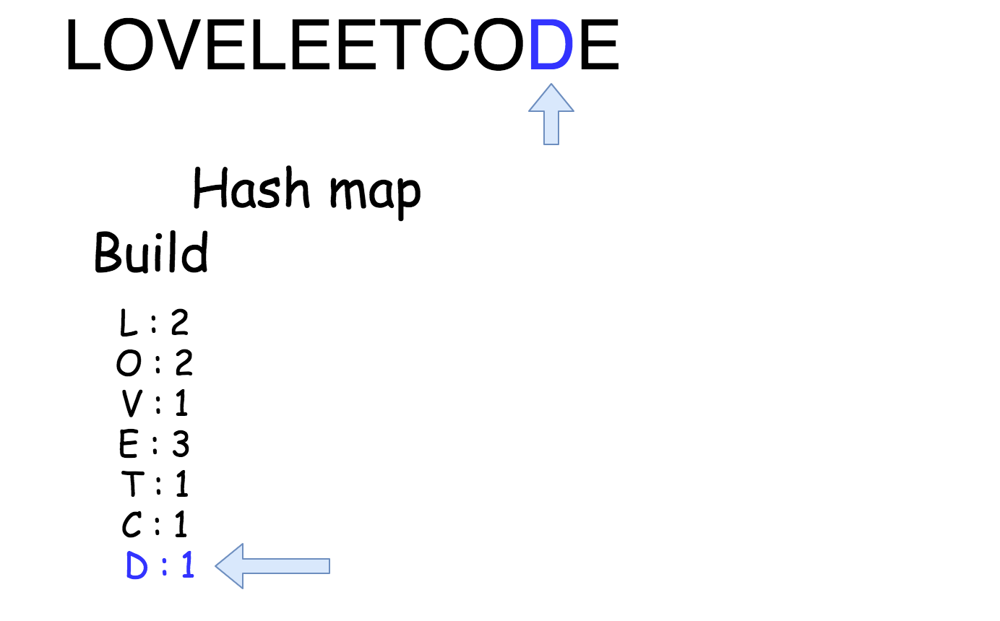

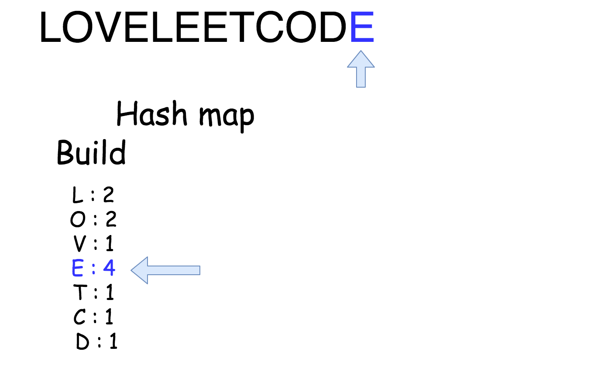

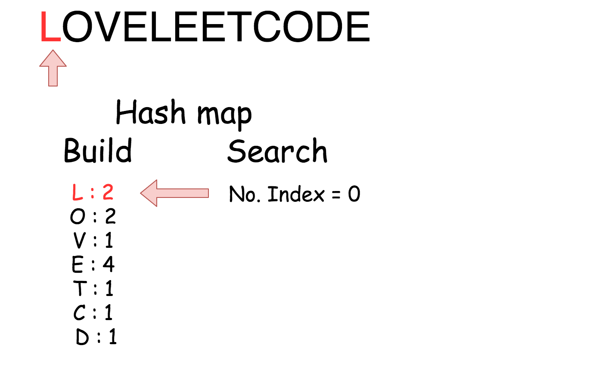

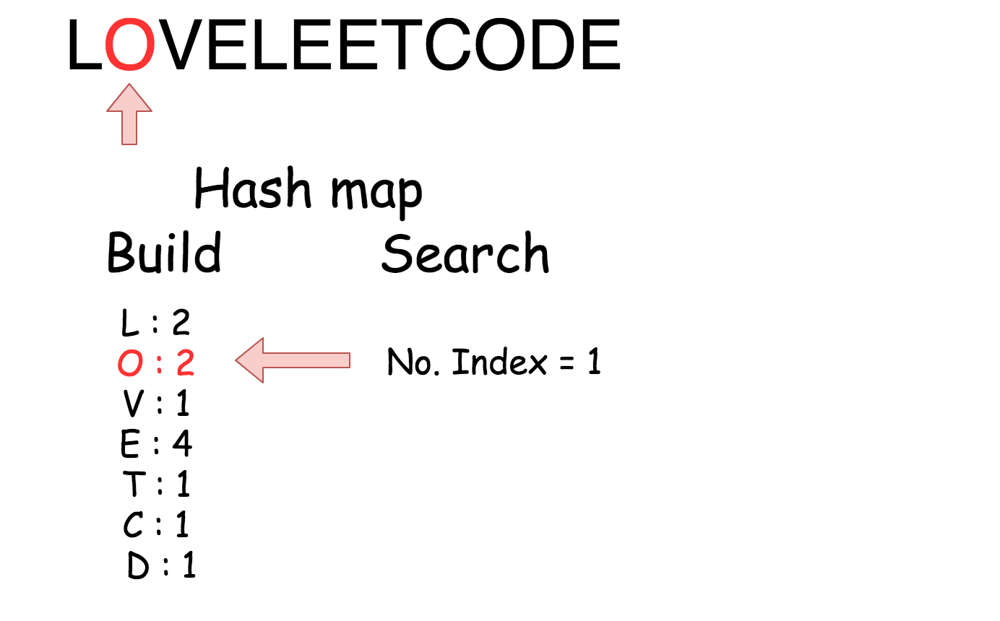

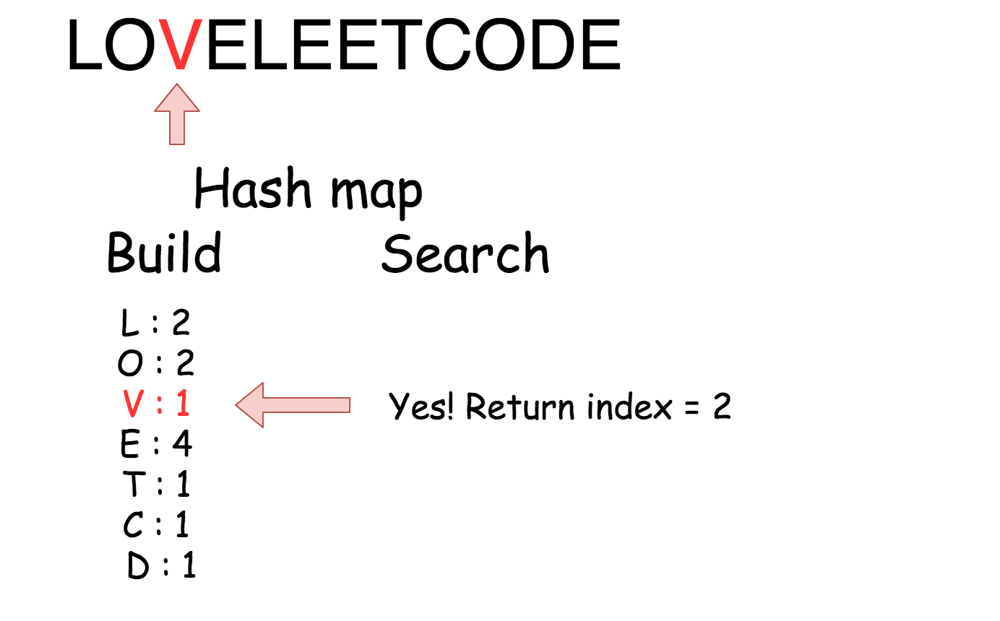

```python
class Solution:
    def firstUniqChar(self, s: str) -> int:
        """
        :type s: str
        :rtype: int
        """
        # build hash map: character and how often it appears
        count = collections.Counter(s)

        # find the index
        for idx, ch in enumerate(s):
            if count[ch] == 1:
                return idx
        return -1
```

**Complexity Analysis**

* Time complexity: $\mathcal{O}(N)$ since we go through the string of length `N` two times.
* Space complexity: $\mathcal{O}(1)$ because English alphabet contains 26 letters.