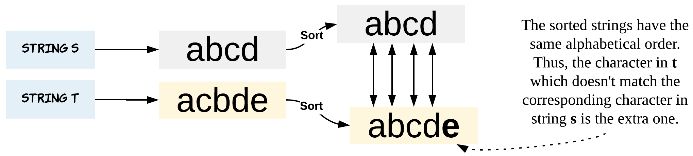
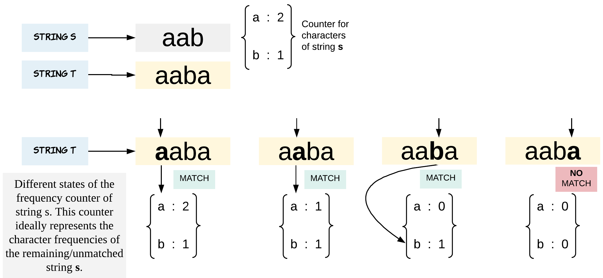
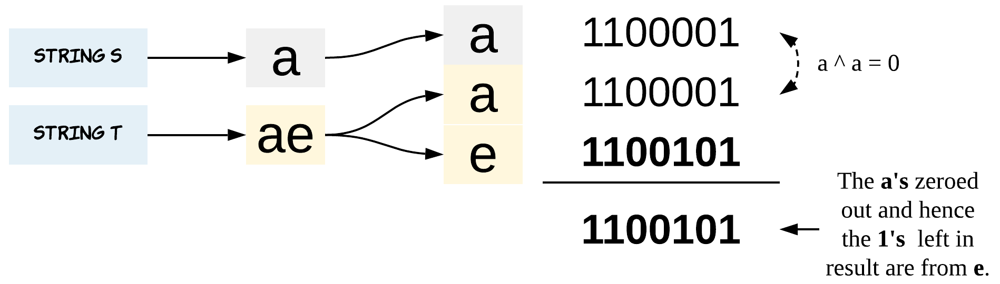

[TOC]

## Solution

---

Let's reiterate the problem in our head. String `t` is nothing but shuffled string `s` with one extra character. This means if length of string `s` is `N` length of string `t` would be $N + 1$.

> i.e. `String t` = **shuffled**(`String s` + `Any character`).

The shuffling is what stops us from doing a character by character comparison across the two strings.

This problem, even though pretty simple can have multiple ways of attacking it. That is what makes this problem an interesting one too. Let's look at some of the approaches and also try to understand how the complexity of different solution varies with just simple tricks applied.
<br/>
<br/>

---

### Approach 1: Sorting

**Intuition**

The obvious choice is sorting. Why obvious?

It's obvious because the first thing we might think of is, what if string `t` was not shuffled. If string `t` was not shuffled this problem would have been so easy.

And then next we might end up bringing the order between the two strings. What better than `sorting` both the strings.

> i.e. **sort**(`String t`) = **sort**(*shuffled*(`String s` + `Any character`)).

That said, this could be one of the `most` brute ways of solving this problem. (There are other brute ways too. The intent is not to challenge your brute instincts :P)

<center>

</center>
<br>

Have you played `Spot the Difference` games, where you match an orange to orange and rule out the possibility? That's exactly what we are doing after sorting the strings.

**Algorithm**

1. Sort the string `s` and string `t`.

2. Iterate through the length of strings and do a character by character comparison. This just checks if the current character in string `t` is present in string `s`.

3. Once we encounter a character which is in string `t` but not in string `s`, we have found the extra character string `t` was hiding all this while.

```python
class Solution:
    def findTheDifference(self, s: str, t: str) -> str:

        # Sort both the strings
        sorted_s = sorted(s)
        sorted_t = sorted(t)

        # Character by character comparison
        i = 0
        while i < len(s):
            if sorted_s[i] != sorted_t[i]:
                return sorted_t[i]
            i += 1

        return sorted_t[i]
```

**Complexity Analysis**

* Time Complexity: $O(Nlog(N))$, where $N$ is length of the strings. Sorting is the most expensive operation of this algorithm. Sorting would take $O(Nlog(N))$ time. Iterating both the strings for character by character comparison would take another $O(N)$ time.

* Space Complexity: $O(N)$. The sorted character arrays would take $O(N)$ each. An important thing to note here is that we are converting the String in `java` to an array first and then sorting it. That's what takes the additional space. In Python, we can just sort the given input inplace by using the `sort` method. If you can get around the conversion to a temporary array in Java as well, then we will have an $O(1)$ solution here.
<br/>
<br/>

---

### Approach 2: Using HashMap

This approach is also not very tricky. What is important is to analyze its complexity.

We might just think in worst case the string is of length `N` and each character has a frequency of 1. This would result in a hash map of $O(N)$ space. This is when your attention to detail comes to test.

> The problem states, string `s` and `t` consists of only lowercase letters.

The above statement implies we only have 26 characters i.e. `[a, z]`. Thus, we have a space complexity for just 26 characters.

It's always good to clarify this with the interviewer as now the space complexity would just be constant. Thus, this approach can also be implemented using array of length 26 as a hash table, where each index corresponds to a letter from [a, z].

**Algorithm**

1. Store all the characters of string `s` in a hash map called `counterS`. The `key` would be the character and `value` would be number of times the character appeared in the string.

2. Now, iterate through string `t` and for each character, check if it is present in the hash map `counterS`.

3. If the character is present in `counterS` then we just decrement the corresponding `value` by 1.

4. If the character is not present in `counterS` or has a frequency of zero in `counterS` it means we have found the extra character of string `t`.

<center>

</center>
<br>

Note - We are dropping the frequency of a character by 1 every time there is a match. This helps us find out the extra character which is present in both `s` and `t` but the number of occurrences vary. Thus keeping frequency is equally important.

```python
from collections import Counter

class Solution:
    def findTheDifference(self, s: str, t: str) -> str:
        # Prepare a counter for string s.
        # This holds the characters as keys and respective frequency as value.
        counter_s = Counter(s)

        # Iterate through string t and find the character which is not in s.
        for ch in t:
            if ch not in counter_s or counter_s[ch] == 0:
                return ch
            else:
                # Once a match is found we reduce frequency left.
                # This eliminates the possibility of a false match later.
                counter_s[ch] -= 1
```

**Complexity Analysis**

* Time Complexity: $O(N)$, where $N$ is length of the strings. Since, we iterate through both the strings once.

* Space Complexity: $O(1)$. The problem states string `s` and string `t` have lowercase letters. Thus, the total number of unique characters and eventually buckets in the hash map possible are just 26.
<br/>
<br/>

---

### Approach 3: Bit Manipulation

Don't be scared. This approach is as simple as scary it might sound.

The trick is simple. To use bitwise `XOR` operation on all the elements. `XOR` would help to eliminate the alike and only leave the odd duckling.

To understand how this works, let's brush up our `XOR` concepts first.

```
    0 ^ 0 = 0
    0 ^ 1 = 1
    1 ^ 0 = 1
    1 ^ 1 = 0
```

Look at how the similar ones just even out. This is what we would use to our advantage. When all the other similar `pairs` just even out or reduce to a zero, the different one would remain.

Thus, the left over bits after `XOR`ing all the characters from string `s` and string `t` would be from the extra character of string `t`.

<center>

</center>
<br>

`XOR` matches apples to apples and oranges to oranges and returns 0 when match happens. What is left, is the difference.

**Algorithm**

1. Initialize a variable `ch` which would hold the `XOR`ed results.

2. `XOR` all the characters with `ch` while iterating through string `s`.

3. `XOR` all the characters with `ch` while iterating through string `t`.
(Alternatively, we could have also combined steps `2` and `3`).

4. Return `ch` as the answer.

```python
class Solution:
    def findTheDifference(self, s: str, t: str) -> str:

        # Initialize ch with 0, because 0 ^ X = X
        # 0 when XORed with any bit would not change the bits value.
        ch = 0

        # XOR all the characters of both s and t.
        for char_ in s:
            ch ^= ord(char_)

        for char_ in t:
            ch ^= ord(char_)

        # What is left after XORing everything is the difference.
        return chr(ch)
```

**Complexity Analysis**

* Time Complexity: $O(N)$, where $N$ is length of the strings. Since, we iterate through both the strings once.

* Space Complexity: $O(1)$.
<br/>
<br/>