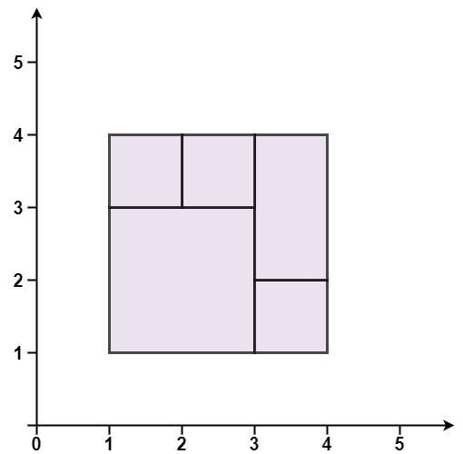
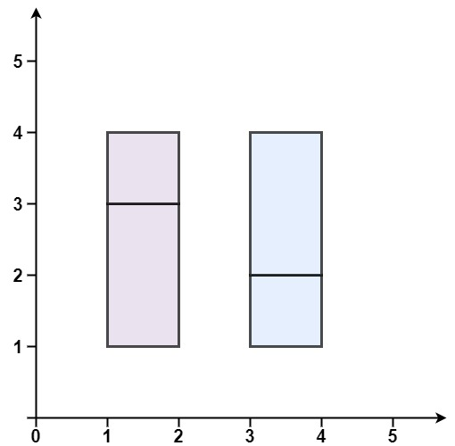
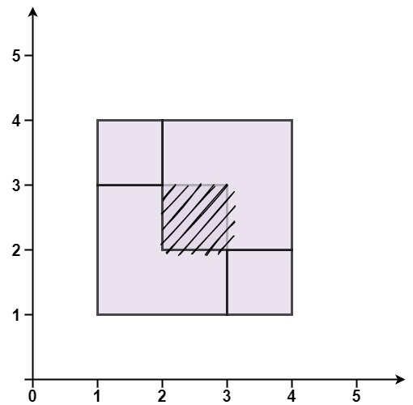

### 1. Description

Given an array `rectangles` where $\text{rectangles}[i] = [x_{i}, y_{i}, a_{i}, b_{i}]$ represents an axis-aligned rectangle. The bottom-left point of the rectangle is $(x_{i}, y_{i})$ and the top-right point of it is $(a_{i}, b_{i})$.

Return `true` *if all the rectangles together form an exact cover of a rectangular region*.

### 2. Function Contract

**Inputs**

- `rectangles`: A nonempty list of positive-area rectangles encoded by bottom-left and top-right coordinates.

**Return value**

Return `true` when the rectangles collectively cover one larger rectangle exactly once at every interior point; otherwise return `false`.

### 3. Examples

#### Example 1

- **Input:** $rectangles = [[1,1,3,3],[3,1,4,2],[3,2,4,4],[1,3,2,4],[2,3,3,4]]$
- **Output:** `true`
- **Explanation:** All 5 rectangles together form an exact cover of a rectangular region.

#### Example 2

- **Input:** $rectangles = [[1,1,2,3],[1,3,2,4],[3,1,4,2],[3,2,4,4]]$
- **Output:** `false`
- **Explanation:** Because there is a gap between the two rectangular regions.

#### Example 3

- **Input:** $rectangles = [[1,1,3,3],[3,1,4,2],[1,3,2,4],[2,2,4,4]]$
- **Output:** `false`
- **Explanation:** Because two of the rectangles overlap with each other.

### 4. Constraints

- $1 \le \text{rectangles.length} \le 2 * 10^{4}$

- $\text{rectangles}[i].length = 4$

- $-10^{5} \le x_{i} < a_{i} \le 10^{5}$

- $-10^{5} \le y_{i} < b_{i} \le 10^{5}$
