## Solution

---

### Approach 1: Greedy

**Intuition**

The problem is to reconstruct the queue.

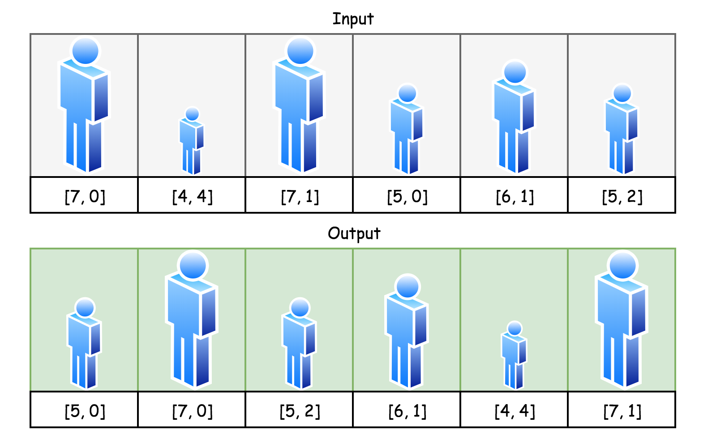

Let's start with the simplest case, when all guys (h, k) in the queue are of the same height h, and differ by their k values only (the number of people in front who have a greater or the same height). Then the solution is simple: each guy's index is equal to his k value. The guy with zero people in front takes the place number 0, the guy with 1 person in front takes the place number 1, and so on and so forth.

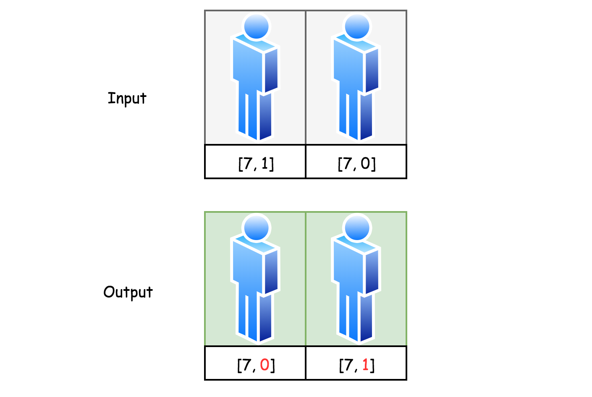

This strategy could be used even in the case when not all people are of the same height. The smaller persons are "invisible" to the taller ones, and hence one could first arrange the tallest guys as if there was no one else.

Let's now consider a queue with people of two different heights: 7 and 6. For simplicity, let's have just one 6-height guy. First, follow the strategy above and arrange guys of height 7. Now it's time to find a place for the guy of height 6. Since he is "invisible" to the 7-height guys, he could take whatever place without disturbing the 7-height guys' order. However, for him the others are visible, and hence he should take the position equal to his k-value, in order to have his proper place.

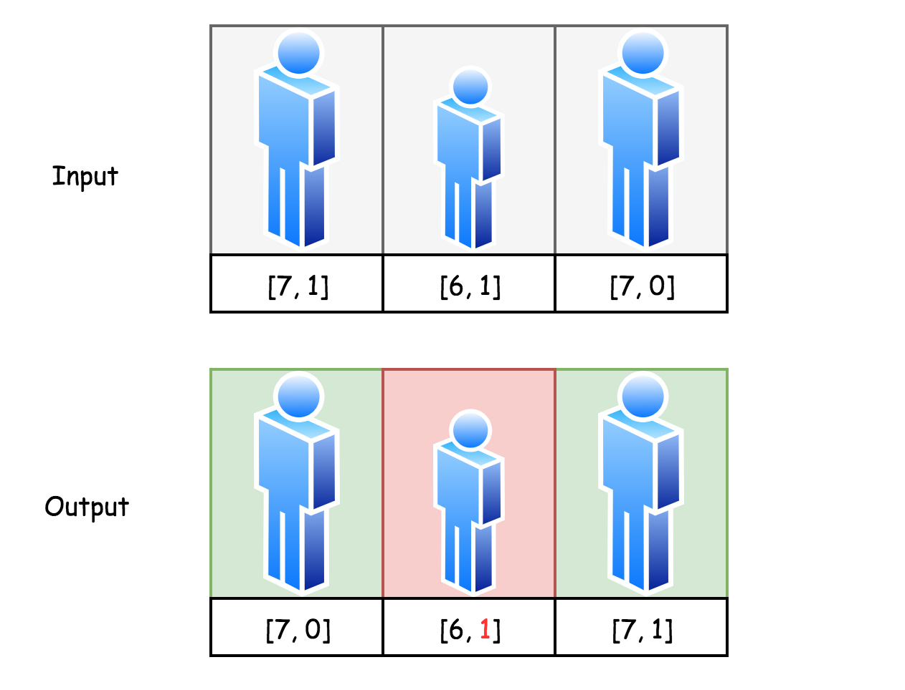

> This idea is easy to extend for the case of numerous guys of height 6. Just sort them by k-values, as it was done before for 7-height guys, and insert them one by one in the positions equal to their k-values.

The following strategy could be continued recursively:

- Sort the tallest guys in ascending order by k-values and then insert them one by one into the output queue at the indexes equal to their k-values.

- Take the next height in descending order. Sort the guys of that height in ascending order by k-values and then insert them one by one into the output queue at the indexes equal to their k-values.

- And so on and so forth.

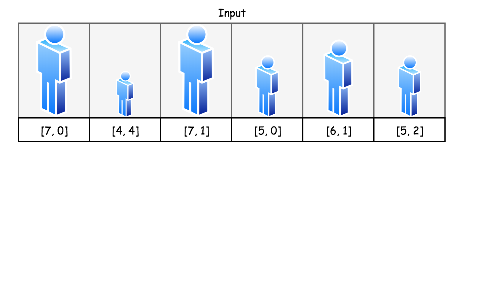

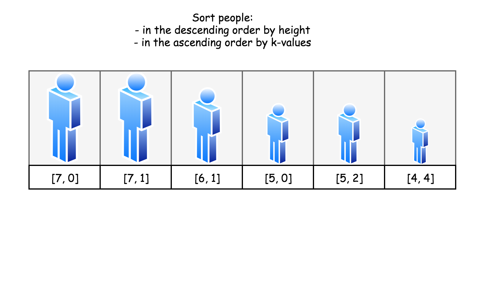

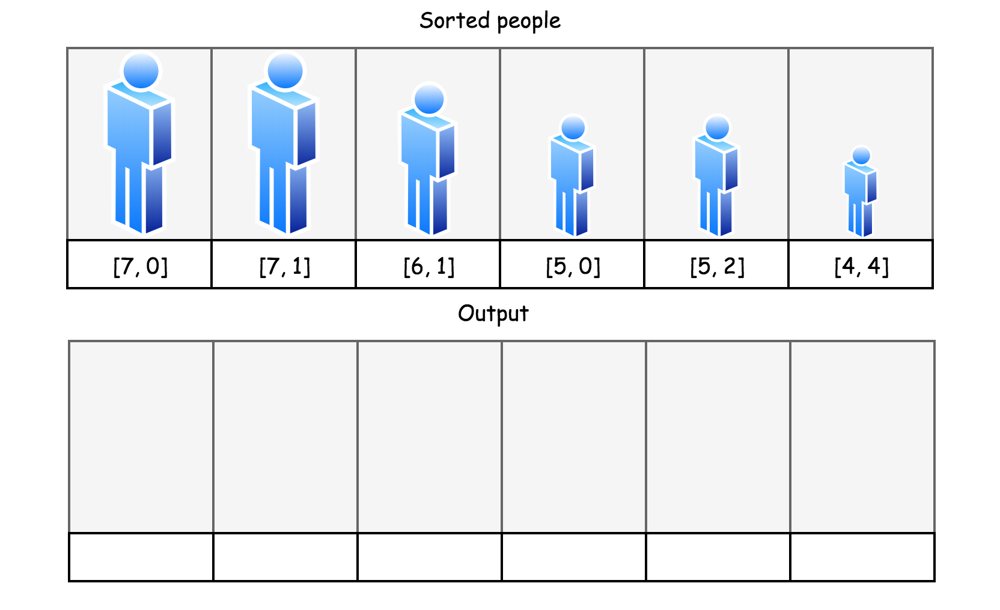

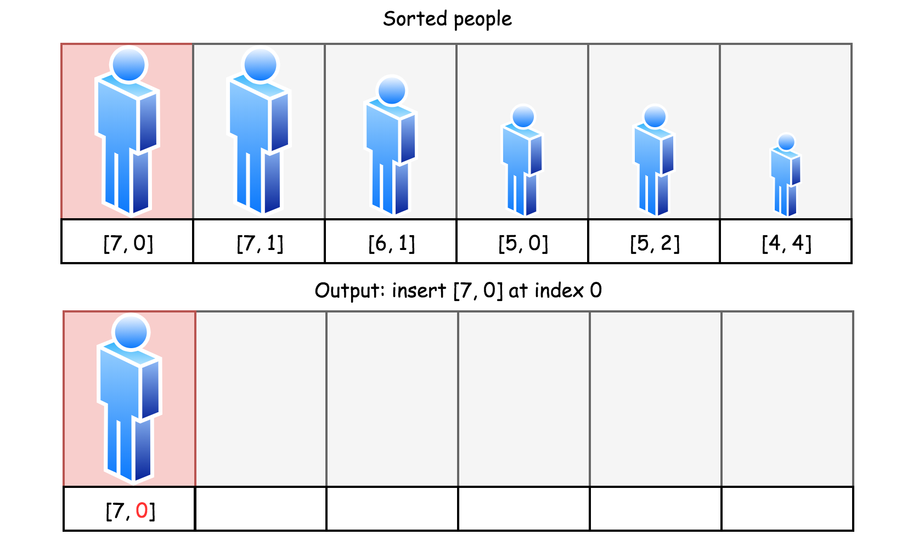

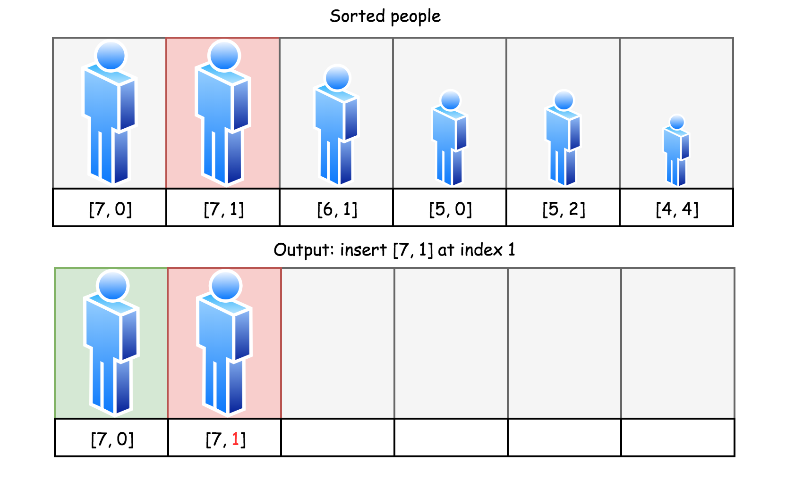

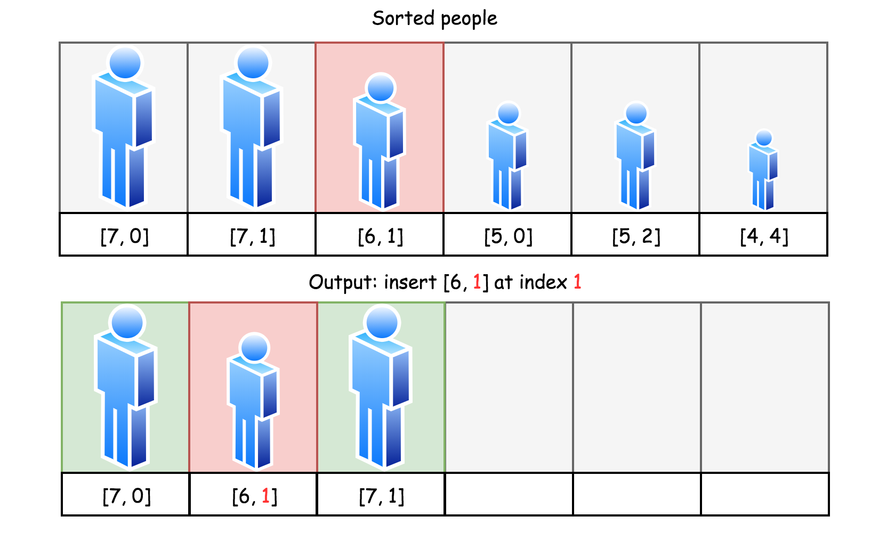

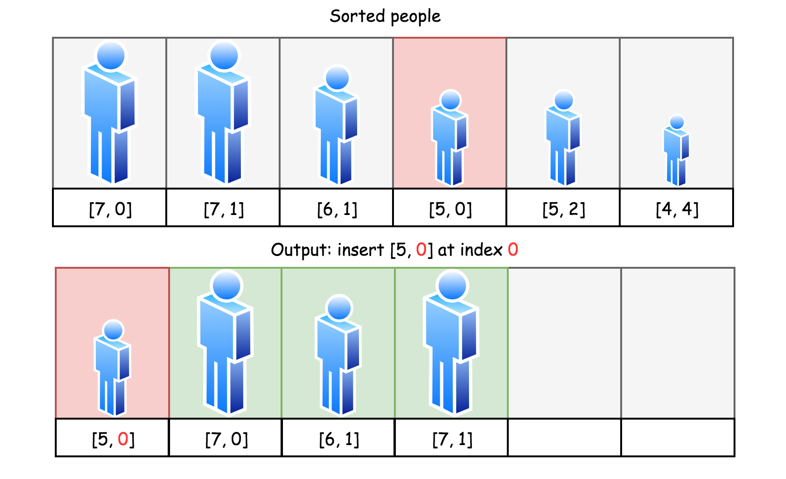

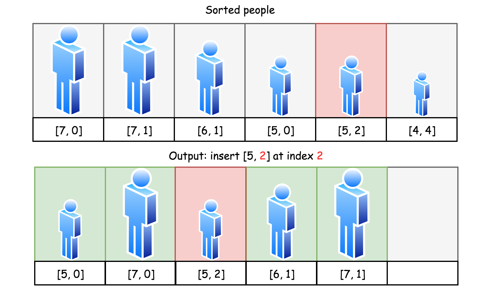

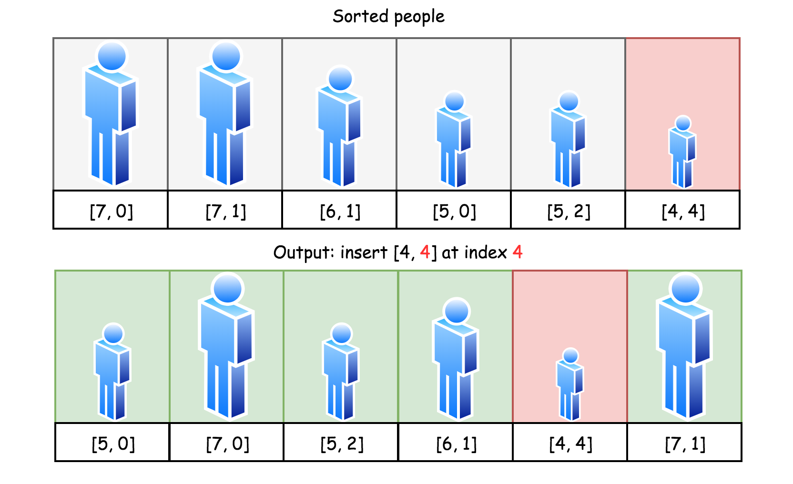

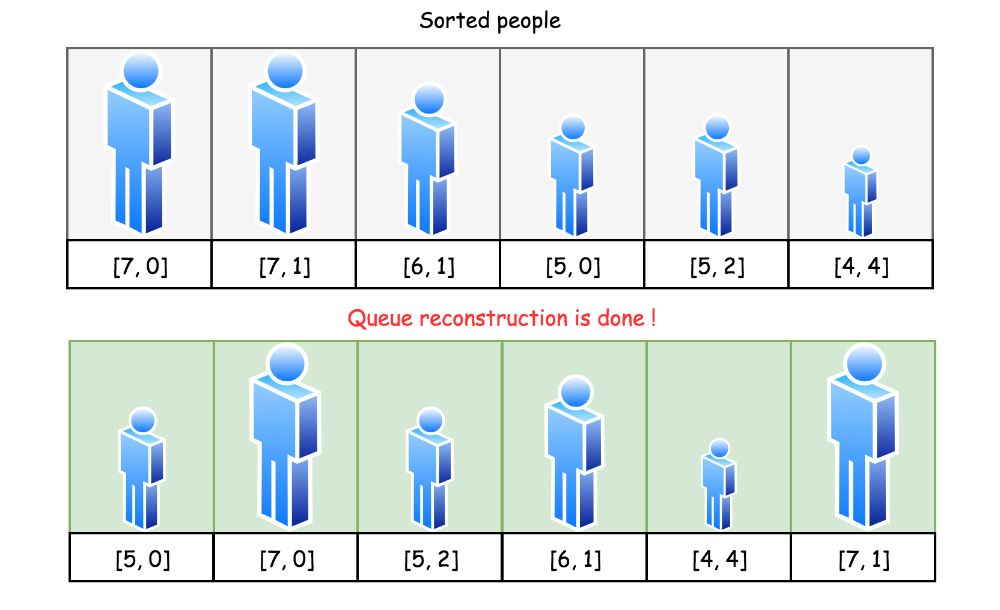

**Algorithm**

- Sort people:
- In descending order by height.
- Among the guys of the same height, in the ascending order by k-values.

- Take guys one by one, and place them in the output array at the indexes equal to their k-values.

- Return output array.

**Implementation**

```python
class Solution:
    def reconstructQueue(self, people: List[List[int]]) -> List[List[int]]:
        people.sort(key = lambda x: (-x[0], x[1]))
        output = []
        for p in people:
            output.insert(p[1], p)
        return output
```

**Complexity Analysis**

* Time complexity : $\mathcal{O}(N^2)$. To sort people takes $\mathcal{O}(N \log N)$ time. Then one proceeds to n insert operations, and each takes up to $\mathcal{O}(k)$ time, where k is a current number of elements in the list. In total, one needs up to $\mathcal{O}\left({\sum\limits_{k = 0}^{N - 1}{k}}\right)$ time, i.e. up to $\mathcal{O}(N^2)$ time.

* Space complexity : $\mathcal{O}(N)$ to keep the output.